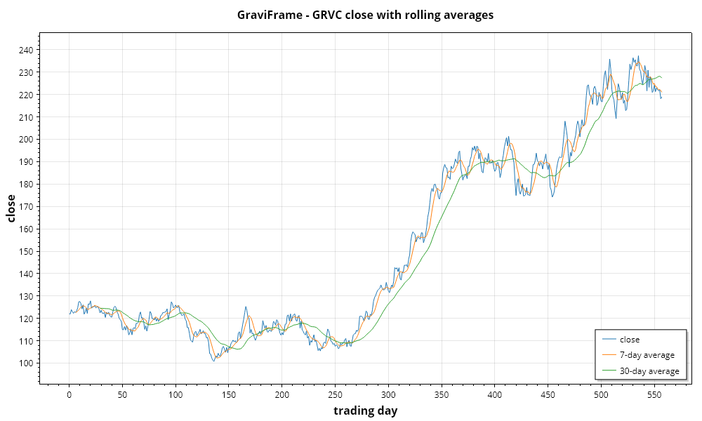

# GraviFrame

*[Bahasa Indonesia](id/GraviFrame.md)* · pandas for .NET — typed columns, group-by, joins and time series.

## The model

A `DataFrame` is an ordered list of `Series`, each backed by a single typed array. That columnar
layout is why column statistics and filters are fast: each one touches a contiguous buffer instead
of striding across row objects. Row-wise operations (filter, sort, join) build an index vector and
then ask every column to `Take` it — one pass per column, not per cell.

Frames are **immutable**. Every transformation returns a new frame; the underlying column arrays
are shared where possible.

## Column types

| Type | Backing store | Missing value |
|---|---|---|
| `NumericSeries` | `double[]` | `double.NaN` |
| `TextSeries` | `string?[]` | `null` |
| `BooleanSeries` | `bool?[]` | `null` |
| `DateTimeSeries` | `DateTime?[]` | `null` |

Using NaN as the numeric missing marker is what lets column arithmetic go straight to GraviNum's
SIMD kernels — no parallel null mask to check inside the hot loop, and IEEE rules propagate
missing-ness for free.

## Reading data

```csharp
var df = DataFrame.ReadCsv("data.csv");
var df2 = DataFrame.ParseCsv(csvString);
var big = DataFrame.ReadCsvMemoryMapped("huge.csv");   // when the file may not fit in RAM

ParquetIO.Write(df, "data.parquet");
var back = ParquetIO.Read("data.parquet");
var subset = ParquetIO.Read("data.parquet", ["value", "date"]);   // columns only
```

Types are inferred per column from the first 1,000 rows by default. Override when needed:

```csharp
var df = DataFrame.ReadCsv("data.csv", new CsvOptions
{
    Delimiter = ";",
    HasHeader = true,
    MissingTokens = { "N/A", "-", "?" },
    ColumnTypes = { ["zip"] = DataType.Text },   // stop a numeric-looking ID becoming a number
    MaxRows = 100_000,
});
```

Quoted fields, embedded delimiters and doubled escape quotes are handled.

## Inspecting

```csharp
df.Shape;              // (rows, columns)
df.ColumnNames;
Console.WriteLine(df);            // fixed-width table, first 10 rows
Console.WriteLine(df.ToString(50));
Console.WriteLine(df.Info());     // types and missing counts per column
Console.WriteLine(df.Describe()); // count, mean, std, quartiles per numeric column
```

## Selecting and filtering

```csharp
df["age"];                        // Series
df.Numeric("age");                // NumericSeries — throws with a clear message on a type mismatch
df.Text("name");  df.DateTimes("date");  df.Booleans("active");

df.Head(10);  df.Tail(10);  df.Rows(100, 50);  df.Sample(20, seed: 42);
df.SelectColumns("age", "fare");
df.Drop("deck", "embarked");
df.Rename("fare", "ticket_price");

df.FilterBy("age", v => v > 30);
df.Filter(row => row.String("sex") == "female" && row.Number("age") > 30);
df.Filter(df.Numeric("fare").Where(v => v > 100));   // boolean mask

df.SortBy("fare", ascending: false);
df.SortBy([("pclass", true), ("fare", false)]);      // lexicographic
```

## Adding columns

```csharp
df.WithColumn(new NumericSeries("ratio", values));
df.WithColumn("price_per_person", i => df.Numeric("fare")[i] / df.Numeric("size")[i]);
df.WithColumn(df.Numeric("age").Standardize().Rename("age_z"));
```

## Missing values

```csharp
df.MissingCounts();                   // per column
df.DropMissing();                     // any missing value in the row
df.DropMissing("all");                // only fully missing rows
df.DropMissing(subset: ["age"]);
df.FillMissing(0.0);
df.FillMissingWithMean();

var age = df.Numeric("age");
age.FillMissingWithMedian();
age.ForwardFill();  age.BackwardFill();
age.Interpolate();                    // linear between surrounding present values
```

## GroupBy

Grouping happens once, eagerly, so `Mean`, `Sum` and `Count` on the same `GroupBy` each cost one
pass over the values rather than re-bucketing the frame. Groups keep first-seen order.

```csharp
df.GroupBy("category").Mean("sales");
df.GroupBy("category", "region").Sum("sales");    // composite key
df.GroupBy("category").Count("n");

df.GroupBy("category").Aggregate("median", "sales");
df.GroupBy("category").Aggregate("sales", v => v.Max() - v.Min(), "range");
df.GroupBy("category").AggregateMany([("sales", "sum"), ("sales", "mean"), ("units", "max")]);
```

Named aggregates: `mean`, `sum`, `min`, `max`, `median`, `std`, `var`, `count`, `first`, `last`.

## Reshaping

```csharp
df.Pivot("date", "category", "sales");                  // long -> wide
df.Pivot("date", "category", "sales", aggregate: "sum");
df.Melt(["date"], ["a", "b"], "variable", "value");     // wide -> long

Reshaping.PivotTable(df, "date", "category", ["sales", "units"]);
Reshaping.OneHot(df, "category");                       // one indicator column per category
```

Missing combinations in a pivot come back as NaN rather than raising, which is what makes it
usable on ragged real data.

## Joining

The right side is hashed once and the left side scanned, so cost is linear rather than quadratic.
Duplicate keys on the right fan out into multiple rows, matching SQL and pandas.

```csharp
left.Join(right, "id");                              // inner
left.Join(right, "id", JoinKind.Left);               // Left, Right, Outer
left.Merge(right, leftOn: "user_id", rightOn: "id");
Joins.MergeOn(left, right, ["date", "region"]);      // several keys

DataFrame.Concat([a, b, c]);                         // stack rows
```

Colliding column names take a `_right` suffix.

## Time series

```csharp
var close = df.Numeric("close");

close.Shift(2);                    close.Diff();
close.PercentChange();             close.CumulativeSum();

close.Rolling(window: 7).Mean();   // incremental — O(1) per row regardless of width
close.Rolling(7).Sum();  .Std();  .Min();  .Max();
close.Rolling(7).Median();         // re-sorts each window; slower on wide windows
close.Rolling(7, minPeriods: 1).Mean();
close.Rolling(20).Apply(v => v.Max() - v.Min(), "range");

close.Expanding().Mean();          // cumulative
close.ExponentialMovingAverageBySpan(20);
```

### Resampling

Buckets come from the calendar, not from fixed tick counts, so a monthly resample lands on real
month boundaries regardless of month length or leap years.

```csharp
Resampling.Resample(df, "date", ResampleFrequency.Monthly, "mean");
Resampling.Resample(df, "date", ResampleFrequency.Weekly, "sum", ["sales"]);
```

Frequencies: `Hourly`, `Daily`, `Weekly`, `Monthly`, `Quarterly`, `Yearly`.

## Analytics and interop

```csharp
df.Describe();
df.CorrelationMatrix();

df.ToNdArray();                              // every numeric column
df.ToNdArray("age", "income", "score");      // named columns, in order
NumericSeries.FromNdArray("x", array);
DataFrame.FromMatrix(matrix, ["a", "b", "c"]);

var (codes, categories) = df.Text("category").Factorize();   // text -> integer codes
```

`ToNdArray` is the bridge into GraviLearn:

```csharp
var features = df.ToNdArray("age", "income");
var labels = df.Numeric("churn").ToNdArray();
model.Fit(features, labels);
```

## Common mistakes

| Symptom | Cause |
|---|---|
| `InvalidOperationException` on `Numeric(...)` | The column was inferred as text — check `Info()` |
| An ID column became a number | Force it with `ColumnTypes = { ["id"] = DataType.Text }` |
| A transformation seems to do nothing | Frames are immutable; use the returned value |
| Rolling median is slow | It re-sorts each window; use `Mean` where it will do |

## Window functions

Window functions evaluate within groups, which is what separates them from an ordinary aggregate.

```csharp
Windowing.Rank(frame, ["customer"], "amount", descending: true);
Windowing.CumulativeSum(frame, ["customer"], "amount");
Windowing.RollingMean(frame, ["customer"], "amount", window: 7);
Windowing.Lag(frame, ["customer"], "amount");
Windowing.Lead(frame, ["customer"], "amount");
```

The partition list is the whole point. A rolling mean computed over a frame holding several
customers mixes one customer's history into another's, and — worse — `Lag` without a partition makes
each group's first row reach back into the previous group's last. That is the kind of leak that
quietly inflates a model's score and is invisible in the output.

Two deliberate choices:

- **`RollingMean` leaves incomplete windows missing** rather than averaging over what is there.
  Filling them is the more common choice and the more misleading one: the first few values then
  carry far more variance than the rest, with nothing in the output to say so.
- **Ties in `Rank` follow the `dense` flag.** `false` leaves a gap after them (1, 2, 2, 4) and `true`
  does not (1, 2, 2, 3).

An empty partition list treats the whole frame as one group, which is what SQL does.

## As-of join

An ordinary join on a timestamp matches only where two systems recorded the identical instant, which
real clocks never do. `AsOfJoin` matches each left row to the most recent right row at or before its
key.

```csharp
Windowing.AsOfJoin(trades, quotes, on: "time");
Windowing.AsOfJoin(trades, quotes, on: "time", tolerance: 30);
```

**The direction is backward-only, deliberately.** Matching the *nearest* row in either direction is
easy to write and is look-ahead: it lets a value recorded after the event inform a row describing the
event, which is how a backtest ends up predicting the past. A left row before every right row comes
back missing rather than matched to the first future one.

`tolerance` is the furthest back a match may be. A quote ninety seconds stale is often worse than no
quote, and this is how to say so. The join sorts the right frame itself rather than demanding sorted
input, because demanding it is an easy way to get silently wrong answers.

## Categorical columns

`CategoricalSeries` stores text as integer codes into a shared dictionary.

```csharp
var sizes = CategoricalSeries.FromValues(
    "size", values, categories: ["low", "medium", "high"], ordered: true);

sizes.ArgSort();                    // by declared rank, not alphabetically
sizes.CategoryCounts();             // including categories with no rows
sizes.OneHot(dropFirst: true);
sizes.ToCodes();                    // missing becomes NaN, not -1
sizes.ReorderCategories(["low", "medium", "high"]);
sizes.RemoveUnusedCategories();
```

There are two reasons to use it and they are independent. The first is size: a column holding a
country name per row stores the same few dozen strings hundreds of thousands of times, and encoding
turns it into an `int[]` where grouping and joining become integer comparisons.

The second is **ordering**. A `TextSeries` can only sort alphabetically, which puts "high" before
"low" before "medium" — a real and easily missed wrong answer for ordinal data. An ordered
categorical sorts by the category order the caller declared.

**The categories are part of the column's type, not a summary of its contents.** A category with no
rows still exists, which is what makes a group-by produce an empty group rather than silently
omitting it. `Take` therefore keeps every category — filtering rows must not change the column's
type — and `RemoveUnusedCategories` is the explicit way to drop them. For the same reason, assigning
a value outside the category set throws rather than widening the dictionary: that would make the
column's type depend on the order writes happened in.

`ToCodes` maps missing to `NaN` rather than -1, because -1 would read as a category ranked below
every other one, which is exactly the wrong thing to hand a model.

## SQL

`SqlReader` and `SqlWriter` are written against `System.Data.Common`, so they work with SQL Server,
PostgreSQL, SQLite, MySQL or anything else that ships a `DbConnection` — and take no package
dependency to do it. The caller brings the connection, which keeps connection strings, pooling and
credentials where they belong.

```csharp
using var connection = new SqliteConnection("Data Source=data.db");

var frame = SqlReader.Read(connection,
    "SELECT id, name, score FROM people WHERE score > $floor",
    new Dictionary<string, object?> { ["$floor"] = 85.0 });

SqlWriter.Write(frame, connection, "metrics");
```

**Pass values through `parameters`, never by building the SQL string.** Interpolating user input into
the query text is how SQL injection happens, and the fact that it works in testing is exactly what
makes it dangerous.

Column types come from the provider rather than being inferred, which is the main reason to prefer
this over exporting to CSV and reading that back: the database already knows a column is a date and
not a string that looks like one. Duplicate column names — legal in SQL, illegal in a frame — are
suffixed rather than silently overwriting each other, and the connection is left in the state it was
found.

A table name cannot be parameterised, so `SqlWriter` interpolates it and refuses anything that is not
a plain identifier. Writes are batched into transactions and roll back on failure: half-written data
is worse than none, because nothing in the table says which half.

## Excel

`ExcelReader` and `ExcelWriter` handle `.xlsx` without a spreadsheet library. The format is a zip
archive of XML parts, all of which the BCL can already open.

```csharp
ExcelReader.SheetNames("report.xlsx");
var frame = ExcelReader.Read("report.xlsx", new ExcelOptions { SheetName = "Results" });
ExcelWriter.Write(frame, "output.xlsx", sheetName: "Cities");
```

Three things about the format bite anyone writing a reader for the first time, and each is handled:

- **Empty cells are absent, not blank.** A row records only the cells that hold something, so a row's
  third `<c>` element is not necessarily column C. The cell's own `r` reference is what says where it
  belongs, and reading positionally silently shifts every value after a gap.
- **Dates are numbers.** Excel stores them as days since 1899-12-30 and marks them only through a
  number format, so a date column arrives looking like five-digit integers.
- **The 1900 leap-year bug.** Excel believes 1900 was a leap year, for compatibility with Lotus 1-2-3.
  The epoch is 1899-12-30 rather than 1899-12-31, which is what makes every date from 1900-03-01
  onwards come out right.

The worksheet is streamed with `XmlReader` rather than loaded as a document, since it is the one part
of a workbook that can be genuinely large. Formulas are not evaluated; a formula cell yields its
cached result, which is what the file records and almost always what the caller wanted.

---

## Visualisations

Rendered by `samples/GraviFrame.Console`; `notebooks/GraviFrame.Notebook.ipynb` adds a rolling
volatility chart built with the v0.4 window functions.



---

*Dibuat oleh Gravicode Studios, dipimpin oleh Kang Fadhil*
