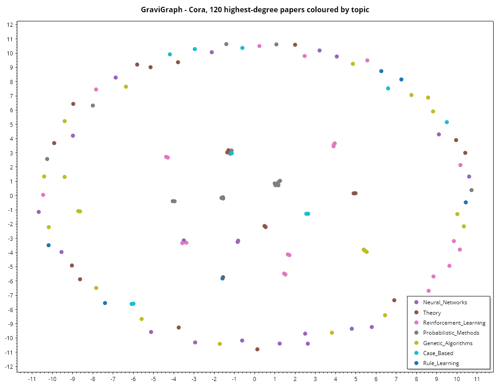

# GraviGraph

*[Bahasa Indonesia](id/GraviGraph.md)* · Graph ML for .NET — structures, algorithms, node embeddings and GNNs.

## Graph structures

The primary representation is an adjacency list, because graph work is overwhelmingly
neighbourhood-local: PageRank, BFS and message passing all iterate a node's neighbours, which
costs `O(degree)` here and `O(nodes)` on a dense matrix. Real networks are sparse — Cora has 2,708
nodes and 5,429 edges, so a dense matrix would be 99.9% zeros.

```csharp
using Gravicode.Science.GraviGraph;

var g = new Graph(directed: false);
g.AddNode("paper-1", label: 0);
g.AddEdge(0, 1, weight: 2.5);

g.NodeCount;  g.EdgeCount;  g.Density;
g.Neighbors(0);  g.Predecessors(0);
g.Degree(0);  g.InDegree(0);  g.OutDegree(0);  g.WeightedDegree(0);
g.HasEdge(0, 1);  g.Edges();  g.Degrees();

g.NodeFeatures = matrix;      // (nodes, features)
g.NodeLabels;  g.NodeNames;  g.Classes;
```

### Matrix views

```csharp
g.ToSparseAdjacency();                                            // CSR
g.ToSparseAdjacency(addSelfLoops: true, symmetricNormalize: true); // the GCN propagation matrix
g.ToDenseAdjacency();                                             // guarded — throws above ~50M entries
g.Laplacian();                                                    // D - A
```

### Transformations and generators

```csharp
g.Subgraph([1, 5, 9]);        // induced, renumbered from zero
g.AsUndirected();             // every edge traversable both ways

Graph.Random(nodes: 100, p: 0.05, seed: 42);
Graph.ScaleFree(nodes: 1000, edgesPerNode: 3);   // preferential attachment — power-law degrees
Graph.Communities(communities: 3, sizePerCommunity: 50, internalP: 0.4, externalP: 0.01);
Graph.Cycle(10);  Graph.Complete(10);
```

### Loading and saving

```csharp
var cora = Graph.Load("datasets/cora_graph.json");
g.Save("graph.json", name: "mine", description: "...");
Graph.LoadEdgeList("edges.txt", directed: false);
```

Node features are stored as the **indices of the non-zero entries**. Cora's features are
1,433-dimensional but average about eighteen non-zeros, so the sparse form is roughly eighty times
smaller and loads correspondingly faster.

## Algorithms

```csharp
using Gravicode.Science.GraviGraph.Algorithms;

GraphAlgorithms.BreadthFirstSearch(g, start);
GraphAlgorithms.DepthFirstSearch(g, start);
GraphAlgorithms.HopDistances(g, start);              // -1 for unreachable

GraphAlgorithms.ShortestPaths(g, start);             // Dijkstra, binary heap
GraphAlgorithms.ShortestPath(g, start, end);

GraphAlgorithms.PageRank(g, damping: 0.85);
GraphAlgorithms.PersonalizedPageRank(g, seeds: [42]);

GraphAlgorithms.DegreeCentrality(g);
GraphAlgorithms.ClosenessCentrality(g);
GraphAlgorithms.BetweennessCentrality(g);            // Brandes, O(VE)
GraphAlgorithms.EigenvectorCentrality(g);

GraphAlgorithms.ConnectedComponents(g);              // weak on a directed graph
GraphAlgorithms.StronglyConnectedComponents(g);      // Kosaraju
GraphAlgorithms.TriangleCounts(g);
GraphAlgorithms.ClusteringCoefficients(g);
GraphAlgorithms.TopologicalSort(dag);                // empty when a cycle exists
GraphAlgorithms.LabelPropagation(g);
GraphAlgorithms.Modularity(g, communities);
```

### Two things worth knowing

**PageRank redistributes dangling mass.** A node with no outgoing edges would otherwise leak
probability out of the system and stop the scores summing to one. That detail is the difference
between a correct implementation and one whose scores quietly shrink.

**Connectivity on a directed graph means *weak* connectivity.** `ConnectedComponents` follows
edges in both directions. Following only out-edges would split Cora into more than 1,500
fragments simply because citations point one way; with both directions the largest component holds
**2,485 of 2,708 nodes**, which is the published figure. Use `StronglyConnectedComponents` when
mutual reachability is what you actually want.

`BetweennessCentrality` is `O(VE)` even with Brandes' algorithm — an algorithmic limit, not an
implementation one. Restrict it to a subgraph on large networks.

## Node embeddings

```csharp
using Gravicode.Science.GraviGraph.Embeddings;

var deepWalk = new DeepWalk(dimensions: 128, walksPerNode: 10, walkLength: 80, epochs: 5)
    .Train(graph.AsUndirected());

var node2vec = new Node2Vec(dimensions: 128, p: 1.0, q: 0.5, walksPerNode: 10)
    .Train(graph.AsUndirected());

embeddings.Similarity(a, b);
embeddings.MostSimilar(node, top: 10);
embeddings.LinkScore(source, target);      // link prediction
embeddings.Save("nodes.vec");

RandomWalks.Uniform(g, walksPerNode: 10, walkLength: 80);
RandomWalks.Biased(g, p: 1.0, q: 0.5, walksPerNode: 10, walkLength: 80);
```

DeepWalk's insight is that node sequences from random walks have the same power-law statistics as
natural language, so a word embedding model applies directly. node2vec adds a second-order bias:

| | Effect |
|---|---|
| `q < 1` | Walks push outward — depth-first — and embeddings capture **communities** |
| `q > 1` | Walks stay local — breadth-first — and embeddings capture **structural roles** |
| `p` | How eagerly the walk backtracks |

**Use `AsUndirected()` first on a citation or follower graph.** Walking only along the direction of
citation strands most walks after a step or two.

## Graph neural networks

```csharp
using Gravicode.Science.GraviGraph.Neural;

var gcn = new GraphConvolutionalNetwork(hiddenSize: 16, learningRate: 0.01, epochs: 200,
        dropout: 0.5, weightDecay: 5e-4, seed: 42)
    .Train(graph, trainMask, validationMask);

gcn.Predict();  gcn.PredictProbabilities();  gcn.NodeEmbeddings();
gcn.Score(graph, testMask);
gcn.History;    // loss and accuracy per epoch

new GraphSage(hiddenSize: 16, epochs: 200).Train(graph, trainMask);
new GraphAttentionNetwork(hiddenSize: 8, heads: 4, epochs: 200).Train(graph, trainMask);
```

All three are **fully trained**, and all three get their gradients from the
[autodiff tape](GraviNum.md#automatic-differentiation): each layer is written forwards and the
backward pass is derived from it. GAT's attention parameters are genuinely learned, including
through the softmax over each node's incident edges — the one derivation in this library that was
hardest to do by hand, and is now not done by hand at all.

### Writing your own layer

The tape is what makes a fourth architecture cheap: write the forward pass and the gradient
follows.

```csharp
using Gravicode.Science.GraviGraph.Neural;
using Gravicode.Science.GraviNum.Autodiff;

var propagation = graph.ToSparseAdjacency(addSelfLoops: true, symmetricNormalize: true);

var w = Tensor.Parameter(GnnMath.Glorot(features, classes, rng));
var adam = new TapeAdam(w, weightDecay: 5e-4);

for (var epoch = 0; epoch < 200; epoch++)
{
    var logits = GnnTape.Convolve(propagation, Tensor.Constant(x), w, bias);
    var loss = TensorOps.SoftmaxCrossEntropy(logits, graph.NodeLabels, trainMask);

    loss.Backward();      // no derivation anywhere
    adam.Step(0.01);
}
```

`GnnTape` supplies `Convolve`, `SageLayer`, `AttentionLayer`, `SegmentSoftmax`, `Dropout`,
`MeanAggregator`, `EdgeList` and `Descend`. Underneath them sit the graph-shaped tape operations:
`SparseMatMul` for message passing, `Gather` and `SegmentSum` for edge-level work, plus
`ConcatColumns`, `LeakyRelu` and a masked `SoftmaxCrossEntropy`. Check any new gradient with
`GradientCheck` before trusting it.

`Gather` and `SegmentSum` are adjoints of one another — gathering forwards is summing backwards —
which is why attention needs no bespoke kernel. `SegmentSoftmax` is *composed* from them rather
than written as its own operation, so it inherits their verified gradients instead of needing the
softmax Jacobian derived again.

> **A hand-derived gradient was wrong for the entire life of the GCN.** The backward pass omitted
> the dropout mask on the hidden layer, so with dropout active the gradient was about **40%**
> off — and the model still trained to a plausible 71% on Cora, which is exactly why it went
> unnoticed. The tape found it immediately, because a forward pass has nowhere to hide a missing
> term. Test accuracy with the corrected gradient is 69.3%; the older, higher number came from
> a broken gradient that happened to act as an odd regulariser.

### How they differ

| | Neighbour weighting | Setting |
|---|---|---|
| **GCN** | Fixed: `1/sqrt(d_i d_j)` — structure only | Transductive |
| **GraphSAGE** | Learned separately for self and neighbourhood mean | **Inductive** |
| **GAT** | Learned from content: `softmax(LeakyReLU(a·[Wh_i ‖ Wh_j]))` | Transductive |

GraphSAGE keeps `[h_self ; mean(h_neighbours)]` in separate halves of the layer input, which lets
it weight "what I am" against "what surrounds me" independently — and because the aggregator is
defined per node rather than over a fixed normalised adjacency matrix, the same weights apply to
nodes never seen during training:

```csharp
var predictions = sage.PredictInductive(unseenGraph, unseenFeatures);
```

Two layers is the usual depth. Each layer mixes in one more hop, and beyond about three hops every
node's representation converges toward the graph average — the over-smoothing problem.

Training is transductive for GCN and GAT: the whole graph is seen every epoch, but the loss is
computed only on the labelled nodes in `trainMask`. On Cora with 140 labelled papers (20 per class)
and 60 epochs, against a 30.2% majority baseline:

| | Test accuracy |
|---|---:|
| GCN | 69.3% |
| GraphSAGE | 70.3% |
| **GAT** | **72.1%** |

The published GCN figure is ~81%. The remaining gap is the absent learning-rate schedule, no early
stopping, and 60 epochs — not the gradient, which is now checked against finite differences.
Attention earning its keep over a fixed degree normalisation is the expected ordering, and it is
reassuring to see it after the move to the tape rather than before.

## Common mistakes

| Symptom | Cause |
|---|---|
| Thousands of "components" on a citation graph | Expected for strong connectivity — use `ConnectedComponents` for weak |
| Random walks return almost immediately | The graph is directed; call `AsUndirected()` |
| `ToDenseAdjacency` throws | The graph is too large — use `ToSparseAdjacency` |
| GNN training does nothing | The graph has no `NodeFeatures`; pass them explicitly |

## Heterogeneous graphs

Most real graphs are not homogeneous. A recommendation graph has users and items; a citation graph
has papers, authors and venues. Flattening them into one node set loses the thing that made them
informative: that "user 3 bought item 7" and "item 7 is in category 2" are different kinds of
evidence and should not be averaged together.

```csharp
var graph = new HeterogeneousGraph();
graph.AddEdge("user", "watched", "film", 0, 1);
graph.AddEdge("user", "rated", "film", 1, 2, weight: 5.0);
graph.SetFeatures("user", userFeatures);       // each type may have a different width
graph.SetFeatures("film", filmFeatures);
graph.AddReverseEdges(new EdgeType("user", "watched", "film"));
```

**Node indices are local to their type** — user 0 and film 0 are different nodes — which is what
allows each type its own feature dimension. And an edge type is the *triple*, not the relation name:
`(user, rates, film)` and `(critic, rates, film)` are different relations that happen to share a
verb, and a model that conflates them learns one set of weights for two behaviours.

Message passing only moves along edge direction, so a bipartite graph with edges only from users to
films gives films no way to inform users. `AddReverseEdges` is how information flows both ways, and
it adds a *separate* relation with its own name because "user rates film" and "film is rated by
user" deserve different weights.

`RelationalConvolution` is R-GCN: one weight matrix per relation, summed at the destination.

```csharp
var layer = new RelationalConvolution(graph, inputSizes, outputSize: 64);
var next = layer.Forward(graph, representations);
```

Normalising by in-degree **per relation** rather than overall is deliberate. A node with a thousand
`viewed` edges and three `bought` edges would otherwise have the purchases drowned out entirely —
and purchases are the informative signal. A self-loop weight per node type keeps a node's own
features alive through a layer; without it an isolated node's representation is exactly zero and it
becomes indistinguishable from every other isolated node.

## Edge features

A weight is the one-dimensional case. Once there is more than one number to say about an edge — a
rating's score, a transaction's amount, a timestamp — folding it into a scalar throws the rest away.

```csharp
graph.SetEdgeFeatures(new EdgeType("user", "rated", "film"), scoresAndTimes);
```

## Temporal graphs

A transaction network, a message log and a citation record are all sequences of events, and
collapsing them into one adjacency matrix destroys the ordering. That matters more than it looks: in
a static graph an edge `a→b` and an edge `b→c` imply a path from `a` to `c`, but if `b→c` happened
*before* `a→b`, nothing could have travelled that way. Information, money and disease all obey that
ordering, and a static analysis systematically overstates what is reachable.

```csharp
var graph = TemporalGraph.LoadCsv("events.csv");

graph.TemporallyReachable(source, maxGap: 3600);   // respects edge ordering
graph.Snapshot(from, to);                          // a static view of one window
graph.SnapshotUpTo(cutoff);                        // what a model may see at that moment
graph.Windows(count);
graph.TemporalEfficiency();                        // how much a static view overstates
graph.TimeDecayedFeatures(features, asOf, halfLife: 30);
```

`TemporallyReachable` is computed by one pass over the time-sorted edges. Because they are processed
in time order, any edge that can extend a path has already had its source's earliest arrival
finalised — which is what makes a single pass sufficient where a static graph would need a traversal.
`maxGap` caps how long a path may wait between consecutive edges.

`SnapshotUpTo` is the cut that stops a link predictor from being trained on its own test set.
`TimeDecayedFeatures` is the cheapest useful temporal embedding: a recent interaction should say more
about a node than one from a year ago, and a static aggregation weights them identically — which is
why a model trained on a collapsed graph keeps recommending what someone liked once, long ago.

## Graph classification

Node classification has one representation per node and needs no readout. Graph classification — is
this molecule toxic, is this program malicious — needs a single vector per graph, and graphs have
different numbers of nodes.

```csharp
GraphPooling.Pool(nodeFeatures, PoolingKind.MeanMax);
GraphPooling.AttentionPool(nodeFeatures, gate);

var classifier = new GraphClassifier(inputSize: 2, hiddenSize: 32, layers: 2).Fit(graphs, labels);
classifier.Predict(graph);
classifier.Accuracy(testGraphs, testLabels);
```

**The readout must not depend on node order.** Graph nodes have no canonical numbering, so a readout
sensitive to permutation makes the model's output depend on how the file happened to be written.
Every pooling function here is a symmetric aggregate for exactly that reason, and it is why
concatenating node vectors — the obvious way to get a fixed size — is not an option.

The choice between them is a real modelling decision. **Mean** is invariant to graph size, which is
right when a large molecule and a small one should be judged on composition; **sum** is not, which is
right when size itself is informative. **Max** asks whether a feature appears at all, which detects a
single unusual substructure that an average would dilute away. `AttentionPool` learns which nodes to
listen to, and its weights are readable afterwards — they say which part of the graph drove the
prediction.

Message passing here uses fixed random projections with only the final classifier trained. That is a
real architecture, not a shortcut: it is the graph analogue of a random-features model, trains in
closed form, and is a genuinely strong baseline — a learned GNN that cannot beat it is not learning
anything the structure did not already give away. A fully trained version belongs on the autodiff
tape alongside `GnnTape`.

Each round of message passing widens a node's receptive field by one hop; beyond three or four the
representations tend to converge on each other, which is over-smoothing and shows up as accuracy
falling with depth.

## Neighbourhood sampling

Full-batch message passing computes every node's representation in every layer, so one step needs the
whole graph. That is fine for Cora and impossible for a social network.

```csharp
foreach (var batch in NeighborSampler.Batches(trainNodes, batchSize: 512, rng))
{
    var block = NeighborSampler.Sample(graph, batch, fanOut: [10, 5], rng);
    var features = NeighborSampler.GatherFeatures(block, allFeatures);
    var output = NeighborSampler.Aggregate(block, features, weights);
}
```

The problem it actually solves is not memory but **neighbourhood explosion**. A two-layer GNN on a
graph with average degree 100 touches ten thousand nodes per target; three layers touches a million.
Capping the fan-out per hop — GraphSAGE's contribution — makes the cost per target bounded and
independent of the graph's size.

**Sampling changes the estimator, not just the speed.** Each node's aggregate is now a stochastic
estimate of the full-neighbourhood one, unbiased for a mean aggregator and noisier for a small
fan-out. Very small samples make training unstable rather than merely approximate.

The block is built outward from the targets and then reversed, because the layer that must run first
is the one furthest from them. `Aggregate` keeps a node's own contribution separate from the
neighbourhood average rather than including it in the mean — that is what lets the model tell a node
apart from its surroundings, and it is the difference between SAGE and a plain GCN. **A SAGE layer
therefore takes twice its feature width**, because self and neighbourhood are concatenated before
projection.

Shuffling matters more here than in ordinary mini-batching. Node ids in a real graph are rarely
arbitrary — they often follow crawl order, so consecutive ids are neighbours — and an unshuffled
batch is then a single dense region rather than a sample of the graph.

---

## Visualisations

Rendered by `samples/GraviGraph.Console`. `notebooks/GraviGraph.Notebook.ipynb` adds a chart of how
fast a sampled neighbourhood grows with the fan-out — the argument for bounding it.



---

*Dibuat oleh Gravicode Studios, dipimpin oleh Kang Fadhil*
