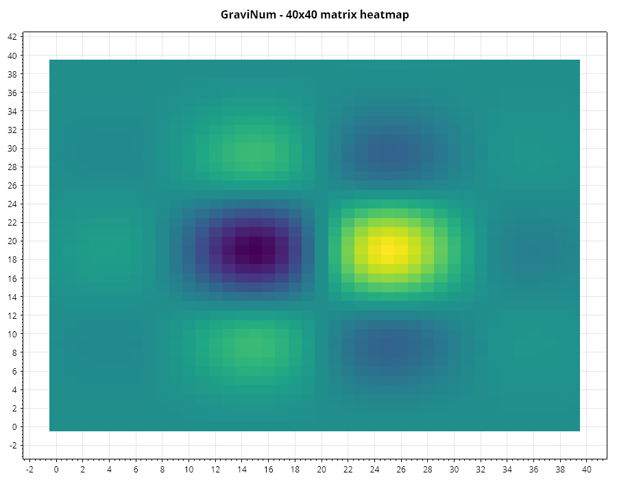
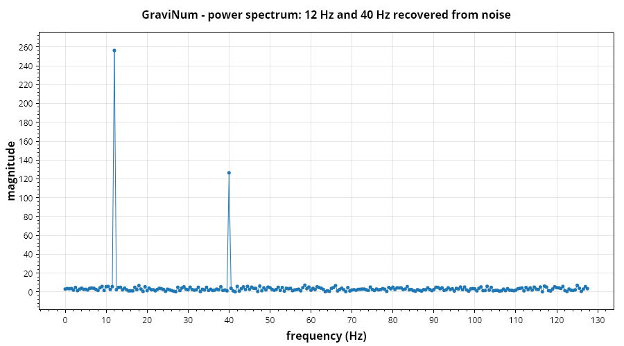

# GraviNum

*[Bahasa Indonesia](id/GraviNum.md)* · NumPy for .NET — the numerical foundation everything else builds on.

## NdArray

An `NdArray` is a shared `double[]` buffer plus a shape, strides and an offset. Reshaping,
transposing and slicing produce **views**, so they cost a small header allocation and never move
data. Only `Copy()` and `AsContiguous()` allocate.

```csharp
var a = NdArray.Arange(12).Reshape(3, 4);

a[1, 2];              // 6
a.T[2, 1];            // 6 — the same element, through a view
a.Shape;              // [3, 4]
a.IsContiguous;       // true
```

Because a view aliases the original buffer, writing through one is visible in the other:

```csharp
a.T[0, 1] = 99.0;
Console.WriteLine(a[1, 0]);   // 99
```

### Creation

```csharp
NdArray.Zeros(3, 4);                    NdArray.Ones(2, 2);
NdArray.Full(7.5, 10);                  NdArray.Eye(4);
NdArray.Arange(0, 10, 2);               NdArray.Linspace(0, 1, 11);
NdArray.FromValues([1.0, 2.0, 3.0]);    NdArray.FromArray(new double[,] { { 1, 2 }, { 3, 4 } });
```

### Slicing

`Slice.At` picks one index and **drops** the axis; `Slice.Range` keeps it.

```csharp
a.Slice(Slice.All, Slice.Range(1, 3));   // 3x2 view
a.Slice(Slice.At(1), Slice.All);         // rank 1 — axis 0 removed
a.Slice(Slice.Range(0, 10, 2));          // every second element
a.Slice(Slice.Reversed);                 // reversed view
a.Row(1);  a.Column(2);                  // zero-copy row and column
```

### Reshaping and joining

```csharp
a.Reshape(2, -1);        // one dimension inferred
a.Ravel();               // flat view (or copy when strided)
a.Transpose(1, 0);       // permute axes
a.ExpandDims(0);         // insert a length-1 axis
a.Squeeze();             // drop every length-1 axis
a.BroadcastTo(5, 3, 4);  // stretch without copying

NdArray.Concatenate([x, y], axis: 0);
NdArray.Stack([x, y]);           // new leading axis
NdArray.VStack(x, y);  NdArray.HStack(x, y);
```

## Broadcasting

Shapes are aligned from the right; a dimension of 1 stretches to match.

```csharp
NdArray.Ones(3, 4) + NdArray.Arange(4);    // (3,4) + (4,) -> (3,4)
NdArray.Ones(3, 1) * NdArray.Ones(1, 5);   // (3,1) * (1,5) -> (3,5)
```

Incompatible shapes throw `InvalidOperationException` naming both shapes, rather than producing a
silently wrong result.

## Element-wise maths

`UFunc` dispatches through three tiers automatically: a `Vector<double>` SIMD loop when both
operands are contiguous and identically shaped, a threaded version of that loop above ~24,000
elements, and a strided broadcast walk otherwise.

```csharp
a + b;   a - b;   a * b;   a / b;      // element-wise, with broadcasting
a * 2.0; 1.0 / a;                      // scalars
a.Sqrt(); a.Exp(); a.Log(); a.Abs(); a.Pow(3);
a.Sigmoid(); a.Relu(); a.Tanh();
a.Clip(0, 1);
a.Map(x => x * x + 1);                 // arbitrary function

UFunc.AllClose(x, y, tolerance: 1e-9);
UFunc.Minimum(x, y);  UFunc.Maximum(x, y);
```

> `*` is the **Hadamard** (element-wise) product, matching NumPy. Use `LinAlg.Dot` or `a.Dot(b)`
> for a matrix product.

## Linear algebra

```csharp
LinAlg.Dot(a, b);           // matrix·matrix, matrix·vector, vector·vector
LinAlg.Inner(x, y);         // scalar dot product
LinAlg.Outer(x, y);

LinAlg.Determinant(m);      LinAlg.Trace(m);      LinAlg.Diagonal(m);
LinAlg.Inverse(m);          LinAlg.Solve(a, b);
LinAlg.PseudoInverse(m);    LinAlg.LeastSquares(a, b);
LinAlg.MatrixRank(m);       LinAlg.ConditionNumber(m);
LinAlg.Norm(v);             LinAlg.Norm(v, p: 1);
LinAlg.MatrixPower(m, 5);   LinAlg.Kron(a, b);
```

`Solve` and `Inverse` use LU with partial pivoting. `LeastSquares` goes through the SVD-based
pseudo-inverse, which stays well behaved when features are collinear — the case where the normal
equations quietly return nonsense.

### Decompositions

```csharp
var lu    = Decomposition.Lu(m);              // P A = L U
var qr    = Decomposition.Qr(m);              // A = Q R, Householder
var chol  = Decomposition.Cholesky(spd);      // A = L L'
var svd   = Decomposition.Svd(m);             // A = U diag(S) V'
var eigen = Decomposition.SymmetricEigen(s);  // descending eigenvalues
var (re, im) = Decomposition.Eigenvalues(m);  // general, possibly complex

lu.Solve(b);  qr.Solve(b);  svd.Reconstruct();
```

`Cholesky` throws when the input is not positive definite rather than returning NaNs, so it
doubles as a positive-definiteness check.

**Ask for only the factors you need.** A full SVD spends most of its time accumulating `U`, one
row per input row. When that is not what you are after, say so:

```csharp
var (values, v) = Decomposition.SvdRightVectors(m);  // skips U — what PCA needs
var s           = Decomposition.SingularValues(m);   // skips both — rank, condition number
```

The singular values are identical to the last bit either way; the rotations that produce them run
regardless. On a 20 000×20 matrix, skipping `U` is most of the runtime.

**On the algorithms.** `Svd` reduces to bidiagonal form with Householder reflections and then runs
an implicit shifted QR iteration (Golub–Kahan–Reinsch); `SymmetricEigen` tridiagonalises and runs
an implicit QL iteration with Wilkinson shifts. `SvdJacobi` and `SymmetricEigenJacobi` compute the
same factorisations by rotating column pairs until nothing changes — far slower, but an entirely
different route to the same answer, which is what makes them useful as the reference the tests
check against.

## Going faster

Three optional paths sit behind `LinAlg.Dot`, chosen automatically. All of them are checked against
the managed kernel, which stays in place as the reference.

### A native BLAS, if the machine has one

```csharp
using Gravicode.Science.GraviNum.Compute;

NativeBlas.Describe();      // what was found, or "none found"
NativeBlas.IsAvailable;
NativeBlas.Enabled = false; // force the managed path, for comparison
```

**Nothing is bundled.** A tuned BLAS is a large platform-specific binary, and shipping one per
runtime identifier would cost every user megabytes they did not ask for. So this looks for one the
machine already has — OpenBLAS, MKL, Accelerate — and keeps silently to the managed kernels when it
finds none. Point it somewhere specific with the `GRAVICODE_BLAS` environment variable.

Measured with the OpenBLAS that ships inside numpy:

| Size | Managed | Native | |
|---:|---:|---:|---|
| 256 | 1.28 ms | 0.36 ms | **3.6×** |
| 512 | 9.05 ms | 1.90 ms | **4.8×** |
| 1024 | 74.2 ms | 18.7 ms | **4.0×** |

Both integer widths are handled. A stock OpenBLAS exports `cblas_dgemm` with 32-bit indices; an
ILP64 build exports `cblas_dgemm64_` with 64-bit ones. They are not interchangeable — calling one
through the other's signature reads the wrong bytes as a dimension — so the width is detected from
which symbol resolves. numpy and scipy also rename every symbol with a `scipy_` prefix to avoid
collisions, which is handled too, and is usually the only BLAS on a data-science machine.

### The factorisations, if there is a LAPACK

`NativeLapack` binds `dgesv`, `dgeqrf`/`dorgqr`, `dgesvd`, `dsyev`, `dgetrf` and `dpotrf` through
the same probe, so `LinAlg.Solve`, `LinAlg.Inverse`, `Decomposition.Lu`, `Cholesky`, `Qr`, `Svd`,
`SingularValues` and `SymmetricEigen` all pick it up.

| | Managed | Native | |
|---|---:|---:|---|
| solve, 512×512, many RHS | 887 ms | 17.4 ms | **51×** |
| QR, 256×256 | 151 ms | 10.7 ms | **14×** |
| LU, 256×256 | 77.9 ms | 4.5 ms | **17×** |
| Cholesky, 256×256 | 14.4 ms | 1.6 ms | **9×** |
| symmetric eigen, 256×256 | 120 ms | 45.6 ms | 2.6× |
| SVD, 256×256 | 331 ms | 176 ms | 1.9× |

The **LAPACKE** interface is bound rather than the Fortran one: LAPACKE takes a layout argument, so
row-major matrices pass straight through, while the Fortran entry points are column-major and every
call would need a transpose in and another out.

Four conventions differ and are converted rather than assumed:

- Eigenvalues come back **ascending**; this library promises descending.
- `dgesvd` returns `V^T`; `SvdResult` carries `V`.
- With a row-major layout LAPACKE already presents eigenvector *j* in column *j*. Transposing it —
  as Fortran habits suggest — breaks `A V = V Λ` while leaving the eigenvalues perfectly correct,
  which is exactly the kind of half-right result that survives a weak test.
- `dgetrf` reports a **sequence of row swaps**, not a finished permutation: at step *i*, row *i*
  was exchanged with row `ipiv[i]`. `LuResult.Pivot` is the permutation itself, so the swaps are
  replayed. Reading one as the other yields a valid-looking L and U that reconstructs the wrong
  matrix.

`dpotrf` also writes only the triangle it was asked for and leaves the other holding the input, so
the caller clears it; a non-positive-definite matrix comes back as a positive `info` and is turned
into the same exception the managed routine throws.

> Every native path is checked against the *defining property* of its factorisation — `A = QR`,
> `A V = V Λ`, `A x = b` recovering a known `x` — not against the managed routine. Two
> implementations agreeing shows only that they share an assumption.

### A packed kernel, when there is no BLAS

`LinAlg.Dot` packs both operands into tile-contiguous buffers above roughly eight million
multiply-adds. The copy costs one pass and is repaid many times, because the packed panel is then
read by every row block instead of being re-strided out of main memory.

| Size | Simple | Packed | |
|---:|---:|---:|---|
| 256 | 1.45 ms | 0.88 ms | 1.65× |
| 1024 | 83.9 ms | 42.7 ms | 1.96× |
| 2048 | 759 ms | 365 ms | **2.08×** |

Below the threshold it loses — packing is a fixed cost — so the threshold is set conservatively
above the noisy region. `PackedMatMul.Enabled = false` forces the simple kernel.

> Measuring this taught a lesson worth repeating: an early run showed a 192-cube taking *eight
> times longer* than a 224-cube, which is physically impossible. The cause was tiered JIT — the
> first sizes were still running unoptimised. Two warm-up calls are not enough; a hot method is
> recompiled after about thirty.

## Single precision, generically

`NdArray<T>` is the same design as `NdArray` — a view over a shared buffer — over any IEEE
floating-point element type. One implementation serves both widths, because `Vector<T>` is itself
generic and compiles to four lanes for `double` and eight for `float`.

```csharp
using Gravicode.Science.GraviNum.Generic;

var a = NdArrayConvert.ToSingle(features);     // copies, and loses precision
var b = NdArrayConvert.To<float>(weights);

UFunc<float>.Dot(a, b);
UFunc<float>.Add(a, b);
NdArrayConvert.ToDouble(result);               // widening back is exact
```

Two questions had to be answered before this was worth keeping, and the second matters more:

| | `NdArray` | `NdArray<double>` | `NdArray<float>` | Generic overhead | Float gain |
|---|---:|---:|---:|---:|---:|
| element-wise add, 1M | 2.56 ms | 2.56 ms | 1.19 ms | 1.00× | **2.16×** |
| element-wise add, 10M | 32.7 ms | 31.5 ms | 16.6 ms | 0.96× | **1.89×** |
| 512-cube product | 15.1 ms | 13.7 ms | 7.80 ms | 0.91× | **1.75×** |
| 1024-cube product | 89.0 ms | 92.6 ms | 47.1 ms | 1.04× | **1.96×** |

**Genericising costs nothing** — the overhead column sits inside measurement noise, which is what
makes migrating the rest of the library a viable option rather than a trade. And **float pays**,
by 1.7–2.2×, for the two separate reasons the columns hint at: twice the SIMD lanes helps
compute-bound work, half the bytes helps bandwidth-bound work.

The cost is precision. A 1000-cube product comes out with a relative error of **1.3e-6** — float32
carrying about seven significant digits against double's sixteen. `NdArrayConvert.ComparisonTolerance<T>()`
gives a threshold appropriate to the width, because one written for `double` silently over-asserts
on `float`.

**The six libraries still use `NdArray`.** Migrating them so that it becomes `NdArray<double>` is a
separate change; what is here is the proven core, checked against the `double` path element by
element. `Single.SingleKernels` remains as the original hand-written prototype the generic version
was measured against.

Two deliberate differences from the `double` `UFunc`: the generic kernels do **not** broadcast, and
say so rather than guessing at a shape; and `Sum` is pairwise, which matters much more in `float` —
a naive running total over a million values of `0.1f` drifts visibly, while pairwise summation
keeps the error logarithmic in the count.

## Reading ONNX weights

```csharp
using Gravicode.Science.GraviNum.Io;

var weights = OnnxReader.ReadWeightsByName("model.onnx");
weights["encoder.weight"].ToNdArray();
```

A weight reader, not a runtime: it extracts the graph's *initializers* — the named constant tensors
holding trained parameters — and stops there. That is the half that matters here, because this
library has the layers and lacks the numbers.

Dependency-free by design. ONNX Runtime is a large native package, and pulling it in to read a few
arrays would be a poor trade; only the protobuf wire format is needed, and only a handful of its
fields. Float32, float64, float16, int8/16/32/64 all decode and widen to `double`. A tensor whose
type is not decodable, or whose data does not match its declared shape, is **skipped rather than
guessed at** — returning wrong numbers silently is far worse than returning fewer of them.

Verified against files written by the official Python `onnx` library, not against a fixture written
to match the reader.

## Fourier transforms

```csharp
using Gravicode.Science.GraviNum.Signal;

Fft.ForwardReal(signal);          // n/2+1 distinct bins — a real spectrum is symmetric
Fft.Magnitude(signal);            // just the magnitudes
Fft.FrequencyBins(n, sampleRate); // what frequency each bin means

Fft.Forward(complex);  Fft.Inverse(complex);
Fft.InverseReal(spectrum, length);
Fft.Convolve(a, b);               // linear convolution, O(N log N)
```

**Any length works.** A power of two uses iterative radix-2 Cooley-Tukey; everything else uses
**Bluestein's algorithm**, which re-expresses the DFT as a convolution and evaluates that with a
power-of-two transform — still `O(n log n)`, even for a prime length.

That matters more than it sounds. Most hand-rolled FFTs handle only powers of two and leave the
caller to zero-pad, but padding is not neutral: it changes the spectrum, smearing each peak across
neighbouring bins. Silently padding would return a plausible answer to a question nobody asked.
Pad when *you* want to, in your own code.

| n | Path | Time | vs the direct `O(n²)` DFT |
|---:|---|---:|---:|
| 256 | radix-2 | 0.012 ms | 109× |
| 257 | Bluestein | 0.105 ms | 12× |
| 4096 | radix-2 | 0.094 ms | 3,536× |
| 4099 | Bluestein | 1.67 ms | 206× |
| 65536 | radix-2 | 2.02 ms | — |

Bluestein costs roughly an order of magnitude more than radix-2 at a comparable size, because it
runs three transforms of a larger padded array. It is still vastly better than the quadratic
alternative — and if you control the length, a power of two is worth choosing.

Two conventions, stated because both are arbitrary and both matter:

- **The `1/n` scaling lives on the inverse**, not split as `1/√n` across both. That is NumPy's
  choice; a spectrum's amplitudes mean different things under each.
- **`Convolve` is linear, not circular.** Both inputs are padded to `n + m - 1` first, without
  which the tail of the result wraps around and corrupts the start — the classic bug in an
  FFT-based convolution.

> Verified against **NumPy's `rfft`** (pocketfft, an entirely separate implementation) at lengths
> 64, 100, 101, 360 and 1531 — agreement to **5e-14 relative** or better. In the test suite the
> reference is a direct `O(n²)` DFT plus closed forms: a constant puts all its energy in bin zero,
> an impulse has a flat spectrum, and a tone at an exact bin frequency leaks nowhere.

## Automatic differentiation

`Gravicode.Science.GraviNum.Autodiff` is a reverse-mode tape. Write the forward computation once
and the derivatives come back from one backward pass — no hand-derived backward passes.

```csharp
using Gravicode.Science.GraviNum.Autodiff;

var w = Tensor.Parameter(NdArray.Zeros(2, 1));
var b = Tensor.Parameter(NdArray.Zeros(1));

var error = Tensor.Constant(x).MatMul(w) + b - Tensor.Constant(y);
var loss  = (error * error).Mean();

loss.Backward();
w.Gradient;   // dLoss/dw, same shape as w
b.Gradient;   // summed over the batch, because b was broadcast
```

`Parameter` accumulates a gradient; `Constant` stops one. Operations cover arithmetic, `Exp`,
`Log`, `Sqrt`, `Pow`, `Tanh`, `Sigmoid`, `Relu`, `Abs`, `Softplus`, `Sum`, `Mean`, `LogSumExp`,
`MatMul`, `Transpose` and `Reshape`. `LogSumExp` shifts out the maximum, so it survives inputs
around 1000 where the naive `log(sum(exp(x)))` returns infinity.

**Check every new gradient.** `GradientCheck` compares the tape against central finite differences,
which share none of its code:

```csharp
var result = GradientCheck.Check(t => (t.Sigmoid() * t.Tanh()).Log().Sum(), NdArray.FromValues([0.8, 1.4]));
result.Passed(1e-6);   // false prints which entry disagreed and by how much
```

### Two things worth knowing

**Broadcast gradients sum.** A bias of shape `[3]` added to a batch `[64, 3]` influenced 64
outputs, so its gradient is the *sum* over the batch — not one row, not the mean. This is the
single most common way a hand-written backward pass goes wrong, and it fails quietly: the gradient
is off by exactly the batch size and the model still appears to train.

**It is a tape, not a framework.** No graph optimiser, no fused kernels, no device placement. It
exists so a new layer or a new log density can be written once, forwards. Reverse mode costs one
backward pass regardless of parameter count, while finite differences cost `2d` extra forward
evaluations — but the tape allocates a node per operation, so on a *small* model the finite
differences are genuinely faster. Measured on the log posterior of a Bayesian model, the crossover
sits near 50 parameters. Below that, the tape is buying you correctness and convenience, not speed.

## Random numbers

`GraviRandom` is xoshiro256++ seeded through SplitMix64: fast, statistically solid and
reproducible from a seed on every platform.

```csharp
var rng = new GraviRandom(seed: 42);

rng.NextDouble();                       rng.Next(10);
rng.Normal(mean: 0, stdDev: 1);         rng.Uniform(-1, 1);
rng.Gamma(shape: 2, scale: 3);          rng.Beta(2, 5);
rng.Binomial(trials: 100, probability: 0.3);
rng.Poisson(lambda: 4.5);               rng.Exponential(rate: 2);

rng.StandardNormal(1000, 20);           // array overloads
rng.Normal(100, 15, 50_000);
rng.MultivariateNormal(mean, covariance, samples: 1000);

rng.Permutation(100);                   rng.Shuffle(list);
rng.Choice(n: 100, count: 20, replace: false);
```

Sampling uses exact algorithms rather than normal approximations — Marsaglia-Tsang for gamma,
recursive beta-splitting for binomial, transformed rejection for large-λ Poisson — so the tails
stay correct.

## Statistics

```csharp
Statistics.Mean(a);        Statistics.Median(a);      Statistics.Mode(a);
Statistics.Var(a, ddof: 1);  Statistics.Std(a);
Statistics.Percentile(a, 95);  Statistics.Quantile(a, 0.95);
Statistics.Skewness(a);    Statistics.Kurtosis(a);
Statistics.Describe(a);    // count, mean, std, min, quartiles, max

Statistics.Sum(a, axis: 0);      // axis reductions
Statistics.Mean(a, axis: 1);
Statistics.ArgMax(a, axis: 0);

Statistics.Correlation(x, y);          Statistics.SpearmanCorrelation(x, y);
Statistics.CovarianceMatrix(data);     Statistics.CorrelationMatrix(data);
Statistics.Histogram(a, bins: 20);
Statistics.Standardize(a);             Statistics.MinMaxScale(a);
```

`Sum` uses pairwise summation and `Var` uses Welford's algorithm, so neither loses precision on
long or badly scaled inputs.

## Sparse matrices

CSR stores only the non-zeros plus one row pointer per row.

```csharp
var sparse = SparseMatrix.FromDense(dense, threshold: 0);
var built  = SparseMatrix.FromTriplets(rows, cols, triplets);   // duplicates are summed
var viaBuilder = new SparseBuilder(rows, cols).Add(0, 1, 2.5).Build();

sparse.Multiply(vector);                       // sparse · dense vector
sparse.Multiply(matrix, denseIsMatrix: true);  // sparse · dense matrix
sparse.Transpose();  sparse.RowSums();  sparse.ToDense();
sparse.NonZeroCount;  sparse.Density;
```

Below about 10% density this is a clear win; above roughly 25% the index indirection costs more
than the skipped zeros.

## IO

```csharp
NdIO.SaveCsv(a, "matrix.csv");        NdIO.LoadCsv("matrix.csv");
NdIO.SaveBinary(a, "matrix.gnb");     NdIO.LoadBinary("matrix.gnb");
NdIO.SaveJson(a, "matrix.json");      NdIO.ToJson(a);
```

### Memory-mapped arrays

For data that will not fit in RAM. The OS pages in only the regions actually touched.

```csharp
using var mapped = MemoryMappedArray.Create("big.gmm", 1_000_000, 100);
mapped.Set(row: 5, column: 3, value: 42.0);
mapped.Flush();

using var opened = MemoryMappedArray.Open("big.gmm");
opened.ReadRow(42);                       // one row, without loading the file
foreach (var chunk in opened.Chunks(1 << 16)) { /* stream */ }
```

## Compute backends

```csharp
using Gravicode.Science.GraviNum.Compute;

Compute.DescribeDevices();       // what this machine has
Compute.IsGpuAvailable;

Compute.Dot(a, b);               // routed — CPU unless you opt in
Compute.Dot(a, b, Compute.Gpu);  // forced
```

**Automatic GPU dispatch is off by default.** Every array here is `double`, and integrated GPUs
run float64 at a fraction of their float32 rate — measured on an Intel UHD 620, the GPU is 5–8×
*slower* than the CPU for this workload. Benchmark your own hardware, then opt in:

```csharp
Compute.AutomaticGpuDispatch = true;
```

See [benchmarks.md](benchmarks.md) for the measurements.

## Common mistakes

| Symptom | Cause |
|---|---|
| `*` gives the wrong answer for matrices | `*` is element-wise; use `Dot` |
| Modifying one array changes another | They are views over one buffer; use `Copy()` |
| `AsSpan()` throws | The array is strided; call `AsContiguous()` first |
| GPU is slower than CPU | Expected for float64 on integrated hardware — see above |

## Einstein summation

`Einsum` gives one notation for transposing, tracing, contracting and outer products. A subscript
string names each operand's axes with letters; the output names the axes to keep, and every letter
that appears in the inputs but not the output is summed over.

```csharp
Einsum.Evaluate("ij,jk->ik", a, b);        // matrix product
Einsum.Evaluate("ji,jk->ik", a, b);        // the same as Dot(a.T, b), but the axes are written down
Einsum.Evaluate("ij->ji", a);              // transpose
Einsum.Evaluate("ii->i", a);               // diagonal
Einsum.Evaluate("ii->", a);                // trace
Einsum.Evaluate("ij,ij->", a, b);          // Frobenius inner product
Einsum.Evaluate("bij,bjk->bik", a, b);     // batched matrix product
Einsum.Evaluate("ij,jk", a, b);            // output inferred: letters appearing once, alphabetical
```

The value is that the intent is written down. `LinAlg.Dot(a.T, b)` makes the reader reconstruct
which axes met; `"ji,jk->ik"` says so. That matters most for operations with no name — a contraction
over two axes of a rank-4 tensor is unreadable as a sequence of transposes and reshapes.

This is a straightforward nested-loop evaluator, not an optimising one: it does not reorder a chain
of operands to minimise intermediate size. For two operands — nearly every real use — there is no
ordering choice to make. A repeated letter *within* one operand selects the diagonal, which falls
out of the assignment rule rather than being a special case.

Mismatched axis lengths are rejected. If `j` is 5 in one operand and 4 in another the contraction is
meaningless, and without the check it would quietly run over whichever came first.

## Complex arrays

`ComplexNdArray` is the companion to `NdArray` for work that is naturally complex: spectra, transfer
functions, the eigenvalues of a non-symmetric matrix. Splitting a complex problem into two real
arrays works and is miserable to read — every multiplication becomes four, and the sign on one of
them is the bug everyone writes at least once.

```csharp
var z = ComplexNdArray.FromParts(real, imaginary);

z.Magnitude();              // element-wise |z|, via Complex.Abs so nothing overflows
z.Phase();                  // arg(z) on (-pi, pi]
z.Power();                  // |z|^2, without the round trip through a square root
z.Conjugate();

ComplexNdArray.Dot(a, b);           // matrix product
ComplexNdArray.Inner(a, b);         // Hermitian inner product: sum conj(a_i) b_i
a.ConjugateTranspose();             // A^H — what nearly every formula means

z.Fft();  z.Ifft();                 // 1-D transform
z.Fft2(); z.Ifft2();                // separable 2-D transform
```

**`ConjugateTranspose` is the one to reach for, not `Transpose`.** `A^H A` is positive semi-definite
with a real diagonal; `A^T A` is neither, so a plain transpose gives a matrix that looks plausible
and has complex "variances" on its diagonal. Both are provided because the two are easy to confuse,
and having only one under the name "transpose" is how the wrong one gets used.

The Hermitian inner product conjugates its *first* operand. That is what makes `<a, a>` a real,
non-negative number equal to the squared norm — without it, the "norm" of `[i]` comes out as -1.

Storage is a flat `Complex` buffer, so the layout is contiguous interleaved real/imaginary pairs —
the same as FFTW and NumPy, which is what lets the buffer go to `Fft` without a repack. Unlike
`NdArray`, reshaping and transposing **copy** rather than returning views: complex arithmetic does
six flops per element, so the copy is no longer what dominates.

## Slice ergonomics

`Slice` and `NdArray.Assign` already cover views and broadcast assignment. `SliceOps` adds what was
missing around them.

```csharp
grid.Slice(Sel.Range(1, 3)).Assign(0.0);      // writes into grid, because Slice returns a view
grid.Slice(Sel.All, Sel.Range(2, 4)).Assign(replacement);

array.SliceEllipsis([], [Sel.At(0)]);          // the last axis, without counting the leading ones
array.TakeAlong([3, 0], axis: 1);              // select columns; indices may repeat or reorder
array.AxisAt(1, 2);                            // one position of an axis, that axis dropped (a view)
array.AxisRange(1, 1, 3);                      // a span of an axis, keeping it (a view)

SliceOps.Select(condition, ifTrue, ifFalse);   // element-wise choice, keeping the shape
array.SetWhere(v => v > 2, -1);                // masked write, in place
array.IndicesWhere(v => v > 4);                // positions, not values
array.FilterRows(row => row.At(0) > 4);        // whole rows, copied
array.Clip(0, 6);
```

The rule to keep in mind: **everything returning an array returns a copy; everything that writes,
writes through the view into the original buffer.** `a.Slice(...).Assign(b)` changes `a`;
`a.Slice(...).Copy()` does not.

`SliceEllipsis` exists so a trailing axis can be named without counting the leading ones. Taking the
last channel of a batch is `SliceEllipsis(array, [], [Sel.At(0)])` and stays correct if the batch
gains an axis, where `Slice(Sel.All, Sel.All, Sel.All, Sel.At(0))` does not.

`SliceOps.Select` is distinct from `NdArray.Where`, which filters and returns only the survivors.
`Select` keeps the shape, which is what makes it composable — clipping, masking a loss, replacing a
sentinel.

Shorthands read better than a bare negative index at the call site:

```csharp
values.Slice(SliceShorthand.Last(3));
values.Slice(SliceShorthand.First(2));
values.Slice(SliceShorthand.Every(2));
values.Slice(SliceShorthand.DropLast(2));
values.Slice(1..3);                            // System.Range converts implicitly
```

---

## Visualisations

Both images are rendered by `samples/GraviNum.Console` and reproduced inline by
`notebooks/GraviNum.Notebook.ipynb`.



A smooth two-dimensional function as a heatmap, so the structure is visible rather than noise.



Two tones at 12 Hz and 40 Hz, buried under noise in the time domain and unmistakable in the
frequency domain. `Fft` handles any length — this one is a power of two, but a prime length costs
the same asymptotically because of the Bluestein path.

---

*Dibuat oleh Gravicode Studios, dipimpin oleh Kang Fadhil*
