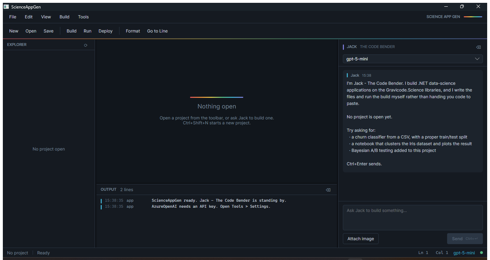
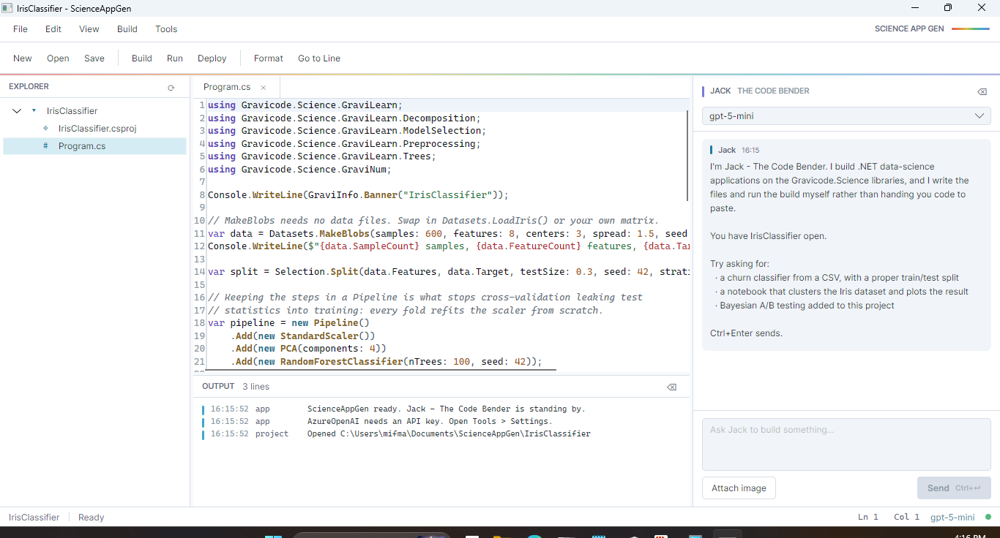
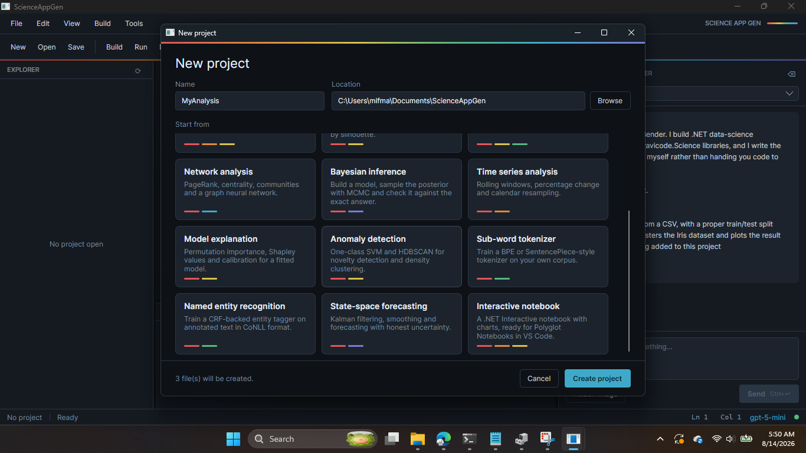
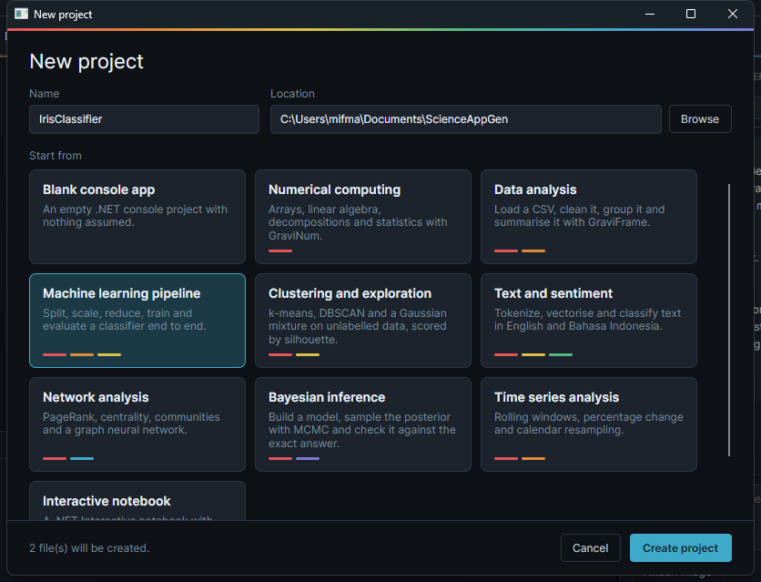
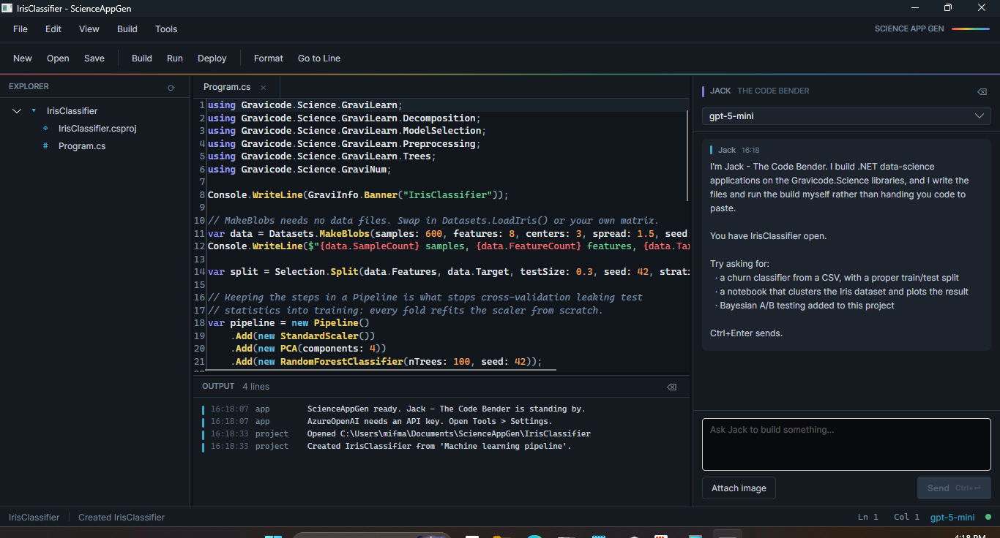
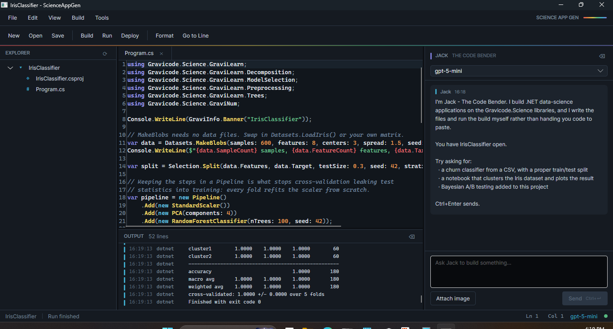

# ScienceAppGen

*[Bahasa Indonesia](id/ScienceAppGen.md)* · A code editor that builds data-science applications from a prompt.



ScienceAppGen is a desktop IDE built with Avalonia. The distinguishing part is the assistant:
**Jack, the Code Bender** does not print code into the chat for you to copy — it creates the
project, writes the files, runs the build, reads the compiler errors and fixes them.

```bash
dotnet run --project tools/ScienceAppGen
```

---

## The window

| Region | What it does |
|---|---|
| **Left** | Project explorer, VS Code style. Double-click opens a file; `bin`, `obj` and `.git` are hidden. |
| **Centre** | Editor with line numbers, syntax highlighting and tabs. |
| **Bottom** | Output panel: build output, tool calls and errors, colour-coded by severity. |
| **Right** | Chat with Jack. Resizable, hideable, with a model picker at the top. |
| **Status bar** | Open project, current operation, caret position, active model. |

The six-colour spectrum through the interface is a system, not decoration: one band per
Gravicode library, reused for log severity and file types, so a colour always means the same thing.

### Syntax colours

The same six wavelengths colour the code, lifted for the dark ground and deepened for the light
one. AvaloniaEdit's bundled definitions assume a white page — `MethodCall` is MidnightBlue and
`NumberLiteral` is DarkBlue, both effectively invisible on a dark editor — so `SyntaxTheme` remaps
their named colours onto the palette in `Themes/Tokens.axaml` instead of forking the `.xshd` files.

| Role | Wavelength | Dark | Light |
|---|---|---|---|
| Keyword | GraviProb violet | `#9B9BEA` 7.2:1 | `#5A45B8` 7.1:1 |
| Type | GraviGraph cyan | `#62BEDC` 8.6:1 | `#0E6E8C` 5.8:1 |
| Method | GraviLearn yellow | `#E6D06A` 11.8:1 | `#7E610F` 5.8:1 |
| String | GraviText green | `#74C99A` 9.1:1 | `#1E7A45` 5.4:1 |
| Number | GraviFrame orange | `#EBA05C` 8.4:1 | `#A6520B` 5.5:1 |
| Preprocessor, exceptions | GraviNum red | `#EC7378` 6.3:1 | `#B3272C` 6.5:1 |
| Comment | slate, italic | `#7C8EA1` 5.4:1 | `#5F7183` 5.0:1 |
| Punctuation | slate | `#97A4B4` 7.2:1 | `#47535F` 7.9:1 |

Every role clears WCAG AA (4.5:1) against its own editor ground in both themes, and most clear AAA.
The same file in the light theme:



### Keyboard

| | |
|---|---|
| `Ctrl+Shift+N` | New project |
| `Ctrl+O` | Open project |
| `Ctrl+S` / `Ctrl+Shift+S` | Save / save all |
| `Ctrl+G` | Go to line |
| `Ctrl+K` | Format code |
| `Ctrl+B` / `Ctrl+L` | Toggle chat / logs |
| `F6` / `F5` | Build / run |
| `Ctrl+,` | Settings |
| `Ctrl+Enter` | Send chat message |

---

## Configuration

Everything lives in `app.config` and is editable from **Tools → Settings**. The UI writes changes
back to the same file, so hand edits and UI edits are equivalent.

```xml
<add key="llm.provider" value="AzureOpenAI" />
<add key="llm.model" value="gpt-5-mini" />
<add key="llm.apiKey" value="" />
<add key="llm.endpoint" value="https://your-resource.openai.azure.com/" />
<add key="llm.temperature" value="0.3" />
<add key="tools.tavilyApiKey" value="" />
```

Keys are blank in source control. Supply them through Settings, or through environment variables,
which always win over the file:

```
SCIENCEAPPGEN_APIKEY      SCIENCEAPPGEN_ENDPOINT      TAVILY_API_KEY
```

### Providers

| Provider | Needs | Notes |
|---|---|---|
| **AzureOpenAI** | key + endpoint | `llm.model` is the **deployment** name |
| **OpenAI** | key | Leave the endpoint blank unless using a compatible gateway |
| **Anthropic** | key | See below |
| **Google** | key | Gemini |
| **Ollama** | endpoint | No key. Usually `http://localhost:11434`; the model must be pulled |

**Anthropic has no official Semantic Kernel connector.** Claude is served by
`Services/AnthropicChatCompletionService.cs`, written against the Messages API directly. Three
things differ from the OpenAI shape and are handled explicitly: the system prompt is a top-level
`system` field rather than a message, consecutive same-role messages are merged because the API
rejects them, and `max_tokens` is required rather than optional.

**Reasoning models change the request contract.** The o1, o3, o4 and gpt-5 families reject
`max_tokens` outright and demand `max_completion_tokens`, and most accept only the default
temperature. `AssistantService.UsesCompletionTokenLimit` detects them and adjusts the request.
This was found by running against a real endpoint, not by reading documentation.

---

## Templates

**File → New Project** offers nineteen templates. All of them build *and run* as written — that
claim is checked by generating every one, building it and executing it, not asserted.

| Template | Produces |
|---|---|
| `blank` | An empty console project |
| `numerics` | Arrays, linear algebra, decompositions, statistics |
| `dataframe` | CSV loading, group-by, pivot, describe |
| `ml-pipeline` | Split → scale → PCA → random forest, with a classification report |
| `clustering` | k-means, DBSCAN and a Gaussian mixture, scored by silhouette |
| `nlp` | Bilingual tokenization, stemming, sentiment |
| `graph` | PageRank, communities and a trained GCN |
| `bayesian` | An MCMC posterior checked against the exact conjugate answer |
| `timeseries` | Rolling windows, percentage change, calendar resampling |
| `notebook` | A .NET Interactive notebook with charts |
| `explainability` | Permutation importance, Shapley values and calibration for a fitted model |
| `anomaly` | One-class SVM novelty detection and HDBSCAN density clustering |
| `tokenizer` | Trains BPE and SentencePiece-style tokenizers on your own corpus |
| `ner` | A CRF-backed entity tagger trained on CoNLL-format annotations |
| `forecasting` | Kalman filtering, smoothing and forecasting with honest uncertainty |
| `arrow` | Arrow IPC exchange with pandas, and out-of-core aggregation over a chunked CSV |
| `sparse-text` | TF-IDF to a CSR matrix, then a linear classifier trained without densifying it |
| `distributed` | Sharding, weighted gradient averaging and a bit-identical distributed forest |
| `pretrained` | Loading an exported BERT checkpoint into a `TransformerModel` |

The five added in v0.4 and the four added in v0.5 join the categories that already existed —
*Data science*, *Machine learning* and *Natural language* — so the picker groups them by what they
do rather than by when they were written.

Two of them generate their own data (`distributed` builds blobs, `arrow` writes 20,000 rows out
before reading them back in chunks) because a template that needs the repository's `datasets/`
folder throws the moment it is created anywhere else. `pretrained` is the exception and says so:
no weights ship with this repository, so it prints the `torch.onnx.export` call to run first and
exits rather than failing.

Templates are held in code rather than as loose files, so one cannot go missing from an installed
copy and the project name is substituted properly rather than by find-and-replace. The generated
`.csproj` gets an absolute path to the Gravicode.Science sources, so a project created outside the
repository still builds.

### A template, start to finish

The pictures below are one uninterrupted run: `ml-pipeline` chosen in the dialog, then built and
run from the toolbar, with nothing typed in between.

The picker shows what each template is made of — one band per library it uses, in that library's
colour, so `ml-pipeline` reads as GraviNum + GraviFrame + GraviLearn at a glance.



Scrolled down, the five templates added in v0.4. The bands do the same work here: `ner` and
`tokenizer` read as GraviNum + GraviText, `forecasting` as GraviNum + GraviProb.



The project opens straight away with `Program.cs` in the editor and the log recording what was
created and where.



**Run** compiles and executes it in place. The output panel is the real thing — a classification
report and a five-fold cross-validation score from the pipeline the template wrote.



---

## Jack's tools

The assistant has 16 kernel functions. Function calling is what makes this an app builder rather
than a chat window: the model decides to create a project, write files and build them, and
Semantic Kernel executes those calls and feeds the results back.

### Project (`ProjectPlugin`)

| Function | Purpose |
|---|---|
| `CreateProject` | Creates from a template and opens it |
| `ListTemplates` | What is available |
| `WriteFile` / `ReadFile` / `DeleteFile` | File access inside the project |
| `ListFiles` | Orientation before making changes |
| `BuildProject` | Builds and returns the **compiler output**, so errors come back for fixing |
| `RunProject` | Builds then runs, and returns the program's output |
| `GetProjectInfo` | Current state |

Every path is resolved against the open project root and then checked to be inside it. That check
is the security boundary of the whole tool surface: the model can name any path it likes, and a
traversal like `../../../etc` is refused rather than followed.

### Common tools (`CommonToolsPlugin`)

| Function | Purpose |
|---|---|
| `SearchInternet` | Tavily web search, for anything past the knowledge cutoff |
| `ScrapeWebPage` | Fetches a page and strips the markup |
| `MathCalculation` | Exact arithmetic — `sqrt`, `pow`, `log`, `min`, `max` and friends |
| `GetCurrentDateTime` | The clock, with time-zone support |
| `CalculateDateDifference` | Date spans and shifts |

These exist because a language model is unreliable at exactly these things: it cannot know today's
date, it is a poor calculator, and its knowledge has a cutoff.

### API reference (`GravicodeReferencePlugin`)

| Function | Purpose |
|---|---|
| `GravicodeReference` | The real API surface of a library, with its gotchas |
| `GravicodeExample` | A complete working program for a common task |

Without this the model writes plausible-looking calls that do not exist. A curated reference is
cheaper than a build-fix-rebuild cycle and more reliable than hoping the library was in the
training data.

---

## Verified end to end

`tools/ScienceAppGen` has been run against a live Azure OpenAI endpoint. The test does not check
what the assistant *said*; it checks what ended up on disk:

```
=== 1. Local kernel functions ===
  PASS  MathCalculation          sqrt(2) * 100 / (3 + 4) = 20.2030508910442
  PASS  MathCalculation nested   pow(2, 10) + max(3, 7) = 1031
  PASS  GetCurrentDateTime
  PASS  CalculateDateDifference
  PASS  GravicodeReference
  PASS  GravicodeExample

=== 2. Templates ===
  PASS  Template count (15)
  PASS  Template materialises
  PASS  Name substitution

=== 3. Path traversal is refused ===
  PASS  Traversal refused
  PASS  Normal path allowed

=== 4. Live LLM: end-to-end app generation ===
  PASS  Kernel configured (16 tools)
  PASS  Project directory created
  PASS  Program.cs exists
  PASS  Generated project builds
  PASS  Generated project runs

----- program output -----
Total revenue by region:
North: 2180.70
South: 1956.00
East: 670.75

Best-selling product overall: Widget (2611.65)

=== 5. Tavily search ===
  PASS  SearchInternet returns results
```

From the prompt *"create a console project called SalesReport, define a Sale record, print revenue
per region sorted highest first and the best-selling product, then build it"*, Jack created the
project, wrote `Program.cs`, and built it — and the harness independently rebuilt and ran the
result to confirm the output was correct.

The template path was driven separately through the UI itself — the run pictured above — which is
how the `.csproj` reference bug was found: it had a path relative to the repository, so every
project created anywhere else failed to build.

---

## Architecture

```
tools/ScienceAppGen/
  Models/AppSettings.cs           strongly typed app.config
  Services/
    ConfigurationService.cs       XML read/write that preserves comments
    ProjectService.cs             file access + dotnet CLI, with the path guard
    TemplateService.cs            the ten templates
    AssistantService.cs           Semantic Kernel wiring, streaming, tool surfacing
    AnthropicChatCompletionService.cs   Claude, since SK has no connector
    LogService.cs                 the shared log sink
  Plugins/                        the 16 kernel functions
  ViewModels/                     shell, explorer, editor, chat
  Views/                          AXAML + code-behind
  Themes/Tokens.axaml             colour, type and spacing tokens
  Themes/Controls.axaml           control styles
```

Two implementation notes worth knowing before editing:

- **`ConfigurationService` writes XML directly** rather than through `ConfigurationManager`, which
  can read `appSettings` but cannot write them back without reordering and reformatting the file.
- **Bindings must not cast in the path.** `{Binding $parent[Window].((vm:ShellViewModel)DataContext).X}`
  compiles but throws at startup — the type cannot be resolved at runtime. Use
  `{Binding $parent[Window].DataContext.X}`.

---

*Dibuat oleh Gravicode Studios, dipimpin oleh Kang Fadhil*
