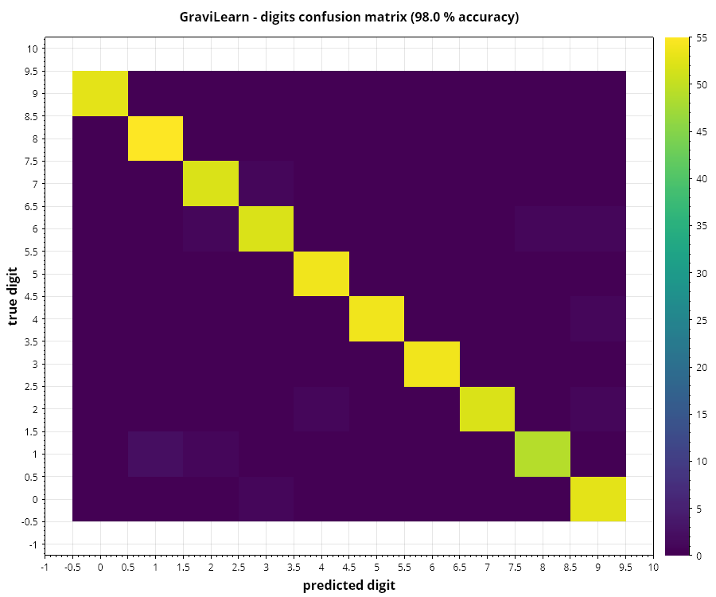
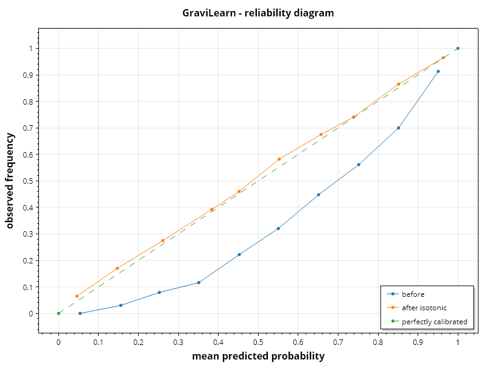
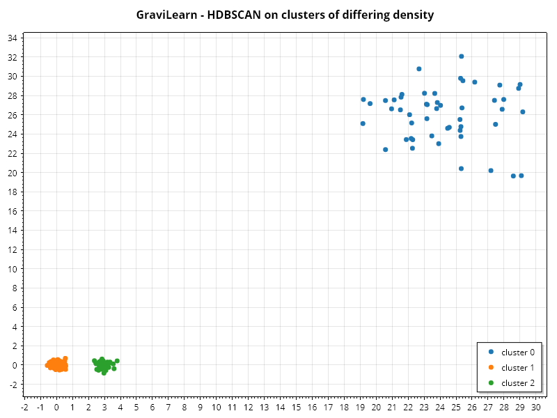
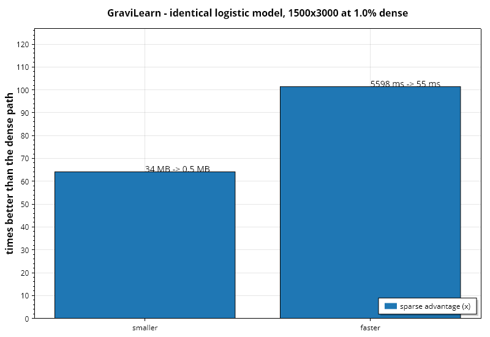

# GraviLearn

*[English](../GraviLearn.md)* · scikit-learn untuk .NET — prapemrosesan, model, pipeline, dan metrik.

## Konvensi

- **Fitur** `X`: sebuah `NdArray` berbentuk *(sampel, fitur)*.
- **Target** `y`: sebuah `NdArray` sepanjang *sampel*.
- `ITransformer` punya `Fit` / `Transform`; `IEstimator` punya `Fit` / `Predict`; `IClassifier`
  menambahkan `PredictProbabilities` dan `Classes`.
- Memanggil `Predict` sebelum `Fit` melempar exception yang menyebut nama modelnya, bukan
  mengembalikan nilai sampah.

## Prapemrosesan

```csharp
using Gravicode.Science.GraviLearn.Preprocessing;

new StandardScaler().FitTransform(x);            // rata-rata nol, varians satu
new MinMaxScaler(0, 1).FitTransform(x);
new RobustScaler().FitTransform(x);              // median dan IQR — hampir tak terpengaruh outlier
new Normalizer(p: 2).FitTransform(x);            // baris bernorma satu, untuk model kosinus

new SimpleImputer(ImputationStrategy.Median).FitTransform(x);
new OneHotEncoder(dropFirst: true).FitTransform(x);
new PolynomialFeatures(degree: 2).FitTransform(x);

var encoder = new LabelEncoder();
var codes = encoder.FitTransform(y);
encoder.InverseTransform(codes);
```

`StandardScaler` membiarkan kolom konstan bernilai nol alih-alih membagi dengan nol, sehingga satu
fitur yang merosot tidak meracuni seluruh matriks dengan NaN.

## Reduksi dimensi

```csharp
using Gravicode.Science.GraviLearn.Decomposition;

var pca = new PrincipalComponentAnalysis(components: 10);   // atau: new PCA(10)
var projected = pca.FitTransform(x);
pca.ExplainedVarianceRatio;
pca.CumulativeExplainedVariance;
pca.InverseTransform(projected);

new LinearDiscriminantAnalysis().FitTransform(x, y);        // terbimbing — memaksimalkan pemisahan kelas
new TStochasticNeighborEmbedding(components: 2, perplexity: 30).FitTransform(x);
```

PCA dihitung dari SVD data yang telah dipusatkan, bukan dekomposisi eigen matriks kovarians.
Keduanya sama dalam aritmetika eksak, tetapi membentuk `X'X` mengkuadratkan condition number,
sehingga jalur SVD menjaga komponen kecil tetap akurat pada data berkondisi buruk.

t-SNE adalah **alat visualisasi**: tidak ada `Transform` untuk data baru, jarak pada keluarannya
tidak bermakna, dan ukuran klaster tidak membawa informasi. Yang dipertahankannya adalah titik mana
dekat dengan titik mana.

## Model terbimbing

### Linear

```csharp
using Gravicode.Science.GraviLearn.Linear;

new LinearRegression().Fit(x, y);                        // OLS lewat pseudo-inverse
new RidgeRegression(alpha: 1.0).Fit(x, y);               // L2 — menyusutkan, menstabilkan fitur kolinear
new LassoRegression(alpha: 0.1).Fit(x, y);               // L1 — mendorong koefisien tepat ke nol
new LogisticRegression(learningRate: 0.1, maxIterations: 1000).Fit(x, y);
new LinearSupportVectorClassifier(c: 1.0).Fit(x, y);
```

Lasso sekaligus berfungsi sebagai seleksi fitur — periksa `ZeroCoefficients`. Regresi logistik
menangani multi-kelas dengan one-vs-rest, lalu men-softmax skor sub-modelnya saat prediksi.

### Pohon dan ensemble

```csharp
using Gravicode.Science.GraviLearn.Trees;

new DecisionTree(SplitCriterion.Gini, maxDepth: 5).Fit(x, y);
new DecisionTreeRegressor(maxDepth: 5).Fit(x, y);

var forest = new RandomForestClassifier(nTrees: 100, maxDepth: 0, seed: 42);
forest.Fit(x, y);
forest.OutOfBagScore;        // estimasi akurasi jujur tanpa data uji terpisah
forest.FeatureImportances;

new RandomForestRegressor(nTrees: 100).Fit(x, y);
new GradientBoostingRegressor(nTrees: 100, learningRate: 0.1, maxDepth: 3).Fit(x, y);
new GradientBoostingClassifier(nTrees: 100).Fit(x, y);    // biner
```

Forest dan boosting memecahkan masalah berbeda: merata-ratakan pohon dalam yang terdekorelasi
menekan **varians**; menambah pohon dangkal yang masing-masing menyesuaikan sisa sebelumnya menekan
**bias**. Dua sumber keacakan pada forest juga berbeda perannya — bootstrap baris mendekorelasi
datanya, pembatasan fitur per split mendekorelasi strukturnya.

`tree.Render(featureNames)` mencetak pohon sebagai teks berindentasi, yang sering sudah cukup untuk
menjelaskan model kepada pemangku kepentingan.

### Tetangga dan Bayes

```csharp
using Gravicode.Science.GraviLearn.Neighbors;

new KNearestNeighborsClassifier(k: 5, DistanceMetric.Euclidean, distanceWeighted: true).Fit(x, y);
new KNearestNeighborsRegressor(k: 5).Fit(x, y);
new GaussianNaiveBayes().Fit(x, y);
new MultinomialNaiveBayes(alpha: 1.0).Fit(counts, y);    // fitur teks / hitungan
```

kNN **mewajibkan fitur diskalakan** — jaraknya akan didominasi kolom dengan satuan terbesar. Ia
juga dilatih seketika dan memprediksi dengan lambat, karena setiap kueri mengukur jarak ke setiap
titik latih.

## Tak terbimbing

```csharp
using Gravicode.Science.GraviLearn.Clustering;

var kmeans = new KMeans(clusters: 3, restarts: 10, seed: 42);
kmeans.FitPredict(x);
kmeans.Centroids;  kmeans.Inertia;
KMeans.ElbowCurve(x, maxK: 10);          // inertia per k, untuk memilih k

new Dbscan(epsilon: 0.5, minSamples: 5).FitPredict(x);   // label -1 berarti derau
new AgglomerativeClustering(clusters: 3, Linkage.Average).FitPredict(x);

var gmm = new GaussianMixture(components: 3, seed: 42);
gmm.FitPredict(x);
gmm.Converged;  gmm.LogLikelihood;  gmm.Bic(x);          // BIC memilih jumlah komponen
```

k-means++ menaburkan centroid berjauhan dengan peluang sebanding kuadrat jarak, itulah sebabnya ia
mengungguli penaburan acak; `restarts` menutup sisanya. DBSCAN menemukan sendiri jumlah klaster dan
punya label outlier eksplisit, tetapi `Epsilon` adalah jarak — **skalakan fitur terlebih dahulu**.

## Metrik

```csharp
Metrics.Accuracy(yTrue, yPredicted);
Metrics.Precision(yTrue, yPredicted, positiveLabel: 1);
Metrics.Recall(...);  Metrics.F1Score(...);  Metrics.Specificity(...);
Metrics.MatthewsCorrelation(...);                       // seimbang bahkan pada kelas timpang
Metrics.F1Average(yTrue, yPredicted, "weighted");       // macro | weighted | micro

Metrics.ConfusionMatrix(yTrue, yPredicted);
Metrics.FormatConfusionMatrix(matrix, classes);
Metrics.ClassificationReport(yTrue, yPredicted, labelNames);

Metrics.RocAucScore(yTrue, scores);                     // berbasis peringkat, eksak, menangani seri
Metrics.RocCurve(yTrue, scores);
Metrics.LogLoss(yTrue, probabilities);

Metrics.MeanSquaredError(...);  Metrics.RootMeanSquaredError(...);
Metrics.MeanAbsoluteError(...); Metrics.R2Score(...);   Metrics.AdjustedR2Score(..., featureCount);
Metrics.RegressionReport(yTrue, yPredicted);

Metrics.SilhouetteScore(x, labels);                     // mutu klaster
```

## Pipeline

```csharp
var pipeline = new Pipeline()
    .Add(new StandardScaler())
    .Add(new PCA(components: 10))
    .Add(new RandomForestClassifier(nTrees: 100));

pipeline.Fit(trainX, trainY);
pipeline.Predict(testX);
pipeline.PredictProbabilities(testX);
pipeline.Score(testX, testY);
```

Alasan memakai pipeline alih-alih memanggil langkahnya satu per satu adalah **kebocoran data**. Di
dalam cross-validation seluruh pipeline dilatih ulang per fold, sehingga scaler mempelajari
rata-ratanya hanya dari fold tersebut. Menskalakan dulu lalu membagi kemudian membocorkan statistik
data uji ke pelatihan dan menghasilkan skor yang tidak bertahan pada data baru.

Hanya langkah terakhir yang boleh berupa estimator; selain itu akan melempar exception.

## Pemilihan model

```csharp
using Gravicode.Science.GraviLearn.ModelSelection;

var split = Selection.Split(x, y, testSize: 0.25, seed: 42, stratify: true);
Selection.KFold(samples, folds: 5);
Selection.StratifiedKFold(y, folds: 5);

Selection.CrossValidate(() => new RandomForestClassifier(nTrees: 100), x, y, folds: 5, stratified: true);
Selection.CrossValidatePipeline(() => BuildPipeline(), x, y, folds: 5);

var search = new GridSearch(p => new RandomForestClassifier(
        nTrees: (int)p["nTrees"], maxDepth: (int)p["maxDepth"]), folds: 5)
    .AddParameter("nTrees", 50, 100, 200)
    .AddParameter("maxDepth", 3, 5, 0);

search.Fit(x, y);
search.Best;  search.BestModel;  search.Report(10);
```

`stratify` penting setiap kali ada kelas yang langka: pembagian tanpa stratifikasi bisa membuat
sebuah kelas sama sekali absen dari pelatihan, yang membuat skornya tak bermakna, bukan sekadar
berisik.

Factory harus mengembalikan model **baru dan belum dilatih** setiap kali dipanggil — memakai ulang
satu instance akan membawa hasil pelatihan fold sebelumnya.

## Dataset

```csharp
Datasets.LoadIris();       // 150 x 4, 3 kelas
Datasets.LoadTitanic();    // 891 x 7, sudah dikodekan dan diisi
Datasets.LoadDigits();     // 1797 x 64, 10 kelas

Datasets.MakeBlobs(300, features: 2, centers: 3, spread: 1.0, seed: 42);
Datasets.MakeMoons(200, noise: 0.1);     // tidak terpisah linear
Datasets.MakeRegression(200, features: 5, noise: 0.5);
```

## Penyimpanan model

```csharp
ModelPersistence.Save(ModelPersistence.Capture(model), "model.json");
var snapshot = ModelPersistence.Load("model.json");
```

Parameter ditulis eksplisit sebagai JSON, bukan dengan menserialisasi grafik objek, sehingga model
tersimpan dapat diperiksa dan dibandingkan, dan tidak ada deserialisasi biner yang terlibat.

### Mengekspor ke ONNX

Untuk melayani model di luar .NET, pipeline yang sudah dilatih bisa ditulis sebagai ONNX:

```csharp
OnnxExport.Supports(pipeline);          // periksa dulu sebelum mencoba
OnnxExport.Save(pipeline, "model.onnx", features: 4);
```

```python
import onnxruntime as ort
session = ort.InferenceSession("model.onnx")
session.run(None, {"input": x.astype("float32")})
```

**Yang bisa diekspor.** Scaler, PCA, dan model linear — setiap langkah yang berupa *pemetaan afin*,
dan itulah sebabnya seluruh pipeline runtuh menjadi segelintir operator inti ONNX (`Sub`, `Div`,
`MatMul`, `Add`, `ArgMax`). Operator inti dipakai, bukan himpunan `ai.onnx.ml`, karena setiap
runtime mengimplementasikannya.

**Yang tidak bisa.** Decision tree, forest, atau k-nearest-neighbour bukan pemetaan afin, dan
`Save` melempar exception alih-alih memancarkan hampiran. Model yang dimuat mulus tetapi
memprediksi salah lebih buruk daripada model yang menolak diekspor.

Dua detail yang mudah terbalik dan menghasilkan model yang tampak sah tetapi salah:

- Dimensi batch ditulis secara **simbolik**, sehingga model hasil ekspor menerima berapa pun
  jumlah barisnya. Memakukannya ke jumlah baris data latih adalah bug ekspor yang umum dan membuat
  modelnya tak berguna untuk satu baris yang justru dikirim endpoint pelayanan.
- Komponen PCA disimpan **tertranspos**, karena graf mengalikan baris `x` dengannya.

Semuanya ditulis sebagai `float32`: runtime ONNX mendukungnya secara universal dan `float64` hanya
sebagian. Klasifikasi cocok persis; regresi cocok sampai sekitar **1e-6** relatif — presisi tunggal
sedang bekerja sebagaimana mestinya.

> Diverifikasi terhadap tooling sungguhan, bukan terhadap pembaca milik library ini sendiri:
> `onnx.checker` memastikan grafnya valid, dan **onnxruntime** Python mereproduksi prediksi .NET —
> 150/150 label pada pipeline Iris, dan selisih maksimum 5,9e-07 pada pipeline regresi.

## Kesalahan yang sering terjadi

| Gejala | Penyebab |
|---|---|
| kNN atau k-means berkinerja buruk | Fitur berbeda skala — tambahkan `StandardScaler` |
| Skor cross-validation jauh di bawah skor uji | Prapemrosesan dilatih sebelum pembagian; gunakan `Pipeline` |
| DBSCAN menaruh semuanya dalam satu klaster atau semua derau | `Epsilon` tidak sesuai skala data |
| Kelas langka bernilai nol | Gunakan `stratify: true` saat membagi |

## Menjelaskan model

`PermutationImportance` menilai setiap fitur berdasarkan seberapa besar akurasi yang hilang ketika
kolomnya diacak. Pengacakan mempertahankan distribusi kolom dan menghancurkan hubungannya dengan
target, sehingga penurunan itulah nilai hubungan tersebut.

```csharp
var ranked = PermutationImportance.Ranked(model, xTest, yTest, repeats: 10);
// feature 0: 0.3125 ± 0.0142
```

**Jalankan pada data uji.** Pada data latih ia mengukur apa yang dihafal model, bukan apa yang
menggeneralisasi, dan model yang overfit akan melaporkan setiap fitur sebagai vital. Ia juga
mengukur hal berbeda dari importance bawaan pohon, yang menggambarkan bagaimana pohon *dibangun* dan
diketahui memihak fitur berkardinalitas tinggi terlepas dari apakah fitur itu memprediksi sesuatu.

Fitur yang berkorelasi berbagi tanggung jawab dan masing-masing tampak tidak penting: mengacak satu
membiarkan yang lain membawa informasi yang sama. Itu keterbatasan nyata metode ini, bukan bug —
pembacaan yang jujur adalah "keduanya bersama-sama penting", dan simpangan baku yang dilaporkan
itulah yang memperingatkan bahwa estimasinya tidak stabil.

`ShapleyValues` menjawab pertanyaan berbeda: bukan "fitur mana yang diandalkan model" melainkan
"mengapa ia mengatakan *itu*, untuk baris *ini*". Keduanya rutin berbeda — sebuah fitur bisa tidak
penting secara global namun menentukan bagi satu pemohon.

```csharp
var attribution = ShapleyValues.Sample(predict, instance, background, samples: 200);
attribution.BaseValue;        // rata-rata model atas data latar
attribution.Contributions;    // jumlahnya sama dengan prediksi dikurangi nilai dasar
attribution.Ranked;           // pengaruh terbesar lebih dulu, ke arah mana pun
```

Nilai Shapley berasal dari teori permainan kooperatif: tambahkan fitur satu per satu dalam urutan
acak, catat seberapa besar masing-masing menggeser prediksi saat bergabung, lalu rata-ratakan atas
semua urutan. Ia adalah satu-satunya atribusi yang memenuhi efisiensi (bagian-bagiannya menjumlah
menjadi keseluruhan), simetri (kontributor setara mendapat kredit setara), dan sifat dummy (fitur
yang tidak mengubah apa pun mendapat nol). Tidak ada heuristik yang lebih murah memiliki ketiganya.

"Absen" berarti diganti nilai dari data latar, sehingga **data latar adalah bagian dari
penjelasannya.** Menjelaskan penolakan pinjaman terhadap latar berisi pemohon yang disetujui
menjawab pertanyaan berbeda dari menjelaskannya terhadap semua pemohon, dan membaca atribusi apa pun
secara jujur menuntut pengetahuan tentang latar mana yang dipakai.

`Exact` mencacah seluruh 2ⁿ subset dan ditolak di atas dua puluh fitur; `Sample` adalah Monte Carlo
atas permutasi dan itulah yang dipakai di atas sekitar lima belas. Karena setiap permutasi bersifat
teleskopik, `Sample` memenuhi efisiensi *secara persis* pada ukuran sampel berapa pun — hanya
pembagian antar fitur yang bersifat hampiran.

## Kalibrasi

Sebuah model bisa memberi peringkat sempurna namun terkalibrasi buruk. Jika segala sesuatu yang ia
sebut "90% mungkin" terjadi 60% dari waktu, urutannya benar dan angkanya tidak — dan setiap keputusan
yang dibuat atas ambang, nilai harapan, atau imbal-balik biaya menjadi salah. Akurasi dan AUC tidak
bisa melihat ini.

```csharp
Calibration.Curve(probabilities, labels, bins: 10);   // diagram reliabilitas
Calibration.ExpectedError(probabilities, labels);     // ECE: selisih rata-rata klaim vs pengamatan
Calibration.BrierScore(probabilities, labels);        // galat kuadrat rata-rata dari probabilitas
```

Bin kosong dibuang alih-alih dilaporkan sebagai nol, yang akan menarik kurva melewati wilayah tanpa
bukti sama sekali. Galat kalibrasi terharap ditimbang oleh populasi bin, sehingga meleset jauh pada
bin berisi tiga sampel tidak mengalahkan meleset kecil pada bin berisi seribu.

`IsotonicRegression` adalah perbaikan bakunya. Ia mencocokkan fungsi tangga tak-menurun terbaik
dengan pool-adjacent-violators: berjalan dari kiri ke kanan, dan setiap kali rata-rata sebuah blok
jatuh di bawah pendahulunya, gabungkan lalu rata-ratakan ulang.

```csharp
var calibrated = new IsotonicRegression().Fit(scores, labels).Predict(scores);
```

Penggabungan diulang *mundur*, karena penggabungan bisa menciptakan pelanggaran baru dengan blok
sebelumnya — loop dalam itulah keseluruhan algoritmanya, dan menghilangkannya menghasilkan sesuatu
yang tampak benar pada data mulus dan gagal pada data kasar yang menjadi sasarannya. Karena
kecocokannya monoton, peringkat pengklasifikasi dipertahankan dan hanya angkanya yang berubah, dan
itulah persis yang seharusnya dilakukan kalibrasi ulang.

## Data tak seimbang

Pada data yang 99% negatif, cara termurah meminimalkan galat total adalah memprediksi "negatif" untuk
segalanya. Model itu meraih akurasi 99% dan tidak berguna.

```csharp
Resampler.OverSample(x, y);            // gandakan kelas minoritas hingga setara mayoritas
Resampler.UnderSample(x, y);           // buang mayoritas hingga setara minoritas
Resampler.Smote(x, y, neighbours: 5);  // sintesis baris minoritas lewat interpolasi
Resampler.ClassWeights(y);             // efek sama tanpa menyentuh data
Resampler.ClassBalance(y);
```

**Lakukan penyeimbangan hanya pada bagian latih.** Menyeimbangkan sebelum pemisahan menempatkan titik
sintetis — atau duplikat titik nyata — di kedua sisi pemisahan, sehingga data uji berisi baris
turunan dari baris latih dan skornya kembali terlalu optimistis. Ini cara paling umum mendapatkan
hasil yang tidak dapat direproduksi dari masalah tak seimbang.

Tidak ada yang gratis. Oversampling membuat kelas minoritas tampak lebih rapat daripada
sesungguhnya; undersampling membuang data nyata. SMOTE menempatkan titik baru di antara tetangga
nyata sehingga pengklasifikasi melihat wilayah alih-alih kumpulan titik — tetapi ia mengandaikan ruas
antara dua tetangga sekelas juga merupakan kelas itu, dan ketika kelas minoritas tidak konveks
andaian itu salah. **Skalakan fitur lebih dulu:** tetangga dicari dengan jarak Euclid, sehingga kolom
tanpa penskalaan bernilai ribuan akan menentukan sendiri setiap ketetanggaan.

`ClassWeights` sering menjadi alat yang lebih baik bila learner menerima bobot sampel: ia tidak
membuang apa pun, tidak mengarang apa pun, dan tidak menambah baris untuk dilatih.

## One-class SVM

Deteksi kebaruan bukanlah klasifikasi dengan satu kelas yang hilang. Tidak ada contoh negatif untuk
mempelajari batas *di antara*; tugasnya adalah menemukan wilayah yang memuat sebagian besar data
latih dan sesedikit mungkin selainnya.

```csharp
var detector = new OneClassSvm(nu: 0.05).Fit(normalData);

detector.Predict(x);            // 1 untuk normal, -1 untuk anomali
detector.DecisionFunction(x);   // jarak bertanda — pakai ini untuk mengurutkan peringatan
```

**`nu` adalah tombol yang menentukan.** Ia sekaligus batas atas bagi fraksi titik latih di luar batas
dan batas bawah bagi fraksi yang menjadi support vector. Jadi `nu: 0.05` adalah pernyataan bahwa
sekitar 5% data latih adalah kontaminasi yang layak dikeluarkan — bukan toleransi yang disetel sampai
jawabannya tampak bagus. Perhatikan bahwa `nu` bernilai 0 tidak punya solusi, sehingga data yang
benar-benar bersih pun tetap memerlukan nilai positif kecil.

Skalakan fitur lebih dulu. Kernel RBF adalah fungsi jarak Euclid, sehingga kolom bernilai ribuan akan
menentukan sendiri setiap kemiripan dan `gamma` menjadi tak bermakna.

**Jangan menilai model dengan menyekor data latihnya sendiri.** Sebuah support vector muncul dalam
fungsi keputusannya sendiri, sehingga titik latih terpencil mendapat kredit karena dekat dengan
dirinya sendiri dan selalu menyekor lebih tinggi daripada titik identik yang ditahan. Ketika `rho`
jatuh di bawah batas kotak, ia mendarat persis *di atas* batas, dan sisi mana dari nol yang
dilaporkannya lalu ditentukan derau titik-mengambang. Evaluasilah pada data yang belum pernah dilihat
model.

Toleransi konvergensi terlihat pada hasil, bukan hanya pada waktu jalan: pada 1e-3 sifat-nu berhenti
berlaku, dan itulah sebabnya nilai bakunya 1e-6.

## HDBSCAN

DBSCAN meminta satu `eps` dan menerapkannya di mana-mana. Itu baik ketika setiap klaster punya
kerapatan sama dan tanpa harapan ketika tidak: `eps` yang cukup ketat untuk memisahkan dua klaster
rapat akan mencabik klaster jarang menjadi derau, dan `eps` yang cukup longgar untuk menyatukan
klaster jarang akan menggabungkan pasangan yang rapat. Tidak ada nilai yang berhasil.

```csharp
var model = new Hdbscan(minClusterSize: 10).Fit(x);

model.Labels;           // -1 adalah derau
model.ClusterCount;
model.Probabilities;    // kekuatan keanggotaan pada [0, 1]; nol untuk derau
model.CoreDistances;    // estimasi kerapatan lokal yang mendasari semuanya
```

Jalan keluarnya adalah menjalankan DBSCAN pada *setiap* ambang sekaligus lalu menanyakan klaster mana
yang bertahan paling lama: hitung jarak inti setiap titik, definisikan keterjangkauan timbal balik
sebagai `max(core(a), core(b), d(a,b))`, bangun pohon rentang minimum atas metrik itu, padatkan
dengan membuang pemisahan yang melepas kurang dari `minClusterSize` titik, lalu pilih klaster yang
tidak bertumpang tindih dengan stabilitas maksimum.

Hasilnya, `minClusterSize` — "berapa titik yang membuat sesuatu layak disebut klaster" — menjadi
satu-satunya parameter yang benar-benar perlu dijawab, dan berbeda dari `eps`, ia adalah pertanyaan
tentang masalahnya, bukan tentang skala datanya.

`Probabilities` sering lebih berguna daripada label datar: titik dengan nilai 0,05 secara nominal
terklaster dan secara praktis tak terbedakan dari derau.

Biayanya O(n²) dalam memori dan waktu — matriks jarak berpasangan dimaterialisasi. Implementasi nyata
memakai space tree, yang mulai menguntungkan di atas beberapa ribu titik dan berhenti membantu di
dimensi tinggi.

## Pelatihan jarang

`SparseLogisticRegression` berlatih langsung pada matriks CSR, tanpa memadatkannya.

```csharp
var vectoriser = new TfidfVectorizer(new VectorizerOptions { MaxFeatures = 30_000 });
var x = vectoriser.FitTransformSparse(documents);

var model = new SparseLogisticRegression(learningRate: 1.0, maxIterations: 200).Fit(x, y);

model.Score(x, y);
model.TopFeatures(20);        // koefisien terbaca langsung sebagai "kata ini menggeser keputusan sejauh ini"
```

Alasan keberadaannya adalah dinding memori, bukan kecepatan. Matriks bag-of-words atas kosakata
30.000 kata sekitar 0,1% tak-nol; setelah dipadatkan, 50.000 dokumen menjadi sekitar 12 GB
bilangan `double`, hampir seluruhnya nol yang biayanya sama untuk disimpan dan dikalikan seperti
angka lain.

Diukur pada 4.000 dokumen atas kosakata 8.000 kata dengan kerapatan 0,37%:

| | nilai |
|---|---|
| matriks, padat | 244,1 MB |
| matriks, CSR | 1,4 MB (**176×**) |
| pencocokan, padat | 12.802 ms |
| pencocokan, jarang | 67 ms (**191×**) |
| akurasi | 99,52% pada keduanya |
| selisih koefisien terbesar | 6,9e-18 |

**Model yang sama, bukan hampiran.** Itulah klaim yang layak dibuat: pengoptimasi jarang yang
mencapai jawaban berbeda akan menjadi algoritma yang berbeda, bukan yang lebih cepat — sehingga
pengujiannya membandingkan vektor koefisien, bukan akurasi, yang akan cocok bahkan bila bobotnya
sudah melenceng.

Dua detail implementasi yang merupakan syarat kebenaran:

- **Penalti L2 diterapkan pada gradien terakumulasi**, bukan dengan meluruhkan setiap bobot pada
  tiap langkah. Peluruhan adalah yang dilakukan implementasi padat dan berbiaya `O(fitur)` per
  pembaruan, yang akan mengembalikan biaya padat itu secara utuh.
- **Vektor bobot tetap padat**, sehingga ini membatasi *jumlah fitur*, bukan jumlah dokumen. 30.000
  bilangan `double` bukan apa-apa, tetapi ada baiknya tahu sumbu mana yang bebas.

Satu perilaku yang tampak seperti bug dan bukan: pada data yang **terpisahkan**, pencocokan tanpa
penalti tidak pernah konvergen. Maksimum likelihood-nya berada di tak-hingga — bobotnya selalu bisa
tumbuh sedikit lagi dan memangkas sedikit lagi dari loss-nya — sehingga uji toleransi tidak pernah
terpicu dan pencocokannya berjalan sampai batas iterasi. Suku L2 membuat fungsi tujuannya konveks
tegas dengan optimum berhingga, dan ia konvergen.

Sisi grafnya sudah jarang sejak awal. `Graph.ToSparseAdjacency` memberi masukan ke
`GnnMath.Propagate`, dan pada Cora dengan 64 fitur itu 0,30 ms melawan 28,15 ms padat — **93,6×**,
identik sampai 1e-10.

## Pelatihan terdistribusi

`GraviLearn.Distributed` menyediakan bagian-bagian yang sama apa pun yang sedang dilatih.

```csharp
var forest = new DistributedForest(nTrees: 500, maxDepth: 12, seed: 42).Fit(x, y, workers: 8);

// Atau potongannya, untuk loop buatan sendiri:
var shards = DataParallel.Partition(items: 1000, workers: 8);
var mean = DataParallel.AverageGradients(perWorkerGradients, sampleCounts);

using var transport = new FileTransport("/shared/exchange", workerCount: 8);
var server = new ParameterServer(transport);
server.Contribute(worker, gradient, sampleCount);
var averaged = server.Aggregate();
```

**`DistributedForest` identik bit demi bit dengan pelatihan proses tunggal.** Bukan setara —
identik. Setiap pohon dalam random forest saling bebas, dan pohon `t` dibenihi dari
`seed + t * 7919`, sebuah fungsi dari indeks globalnya saja. Jadi worker yang diberi pohon 40–79
menumbuhkan persis pohon yang akan ditumbuhkan satu proses pada posisi itu, dan batas shard tidak
dapat mengubah jawaban.

Ia membagi **komputasinya**, bukan memorinya: setiap worker mencocokkan pada seluruh data latih. Itu
arah yang benar untuk forest, di mana pohon-pohonnya adalah bagian yang mahal dan datanya biasanya
muat.

`FileTransport` sungguh-sungguh melintasi batas proses — diverifikasi dengan memunculkan proses
worker sungguhan, bukan thread (`tools/verify/DistributedInterop`). Ia sengaja dibuat sesederhana
mungkin: worker menulis payload-nya lalu mengganti namanya ke tempatnya, pengumpul memeriksa
nama-nama yang sudah jadi. Tanpa broker, tanpa port, tanpa protokol, dan ia berjalan lintas mesin
yang berbagi sistem berkas. Penggantian nama itulah yang membuatnya aman, karena menulis langsung ke
nama akhirnya membiarkan pengumpul membaca berkas yang tertulis separuh.

Dua hal yang merupakan syarat kebenaran, bukan pemolesan:

- **Gradien ditimbang menurut jumlah sampel, bukan dirata-ratakan begitu saja.** Rata-rata biasa
  dari rerata per worker sama dengan rerata global hanya bila setiap shard berukuran sama, dan
  `Partition` menghasilkan shard tak rata setiap kali jumlahnya tidak habis dibagi. Tanpa
  pembobotan, shard kecil diam-diam terlalu diberi bobot dan model berlatih ke sesuatu yang sedikit
  keliru, yang tidak akan tertangkap pemeriksaan bentuk maupun konvergensi.
- **Hasil dikumpulkan menurut urutan worker, bukan urutan kedatangan.** Penjumlahan titik-mengambang
  tidak asosiatif, sehingga menjumlahkan sesuai kedatangan membuat jawabannya bergantung pada
  penjadwalan, dan dua kali jalan pekerjaan yang sama berbeda pada bit-bit terakhirnya.

**Belum diimplementasikan: pelatihan GNN terdistribusi.** Potongannya sudah ada — pengambil sampel
ketetanggaan menghasilkan graf komputasi per batch yang terbatas dan saling bebas, yang persis
merupakan satuan kerja sebuah worker, dan `ParameterServer` merata-ratakan apa yang kembali — tetapi
loop yang menggerakkannya belum ditulis.

---

## Visualisasi

Keempatnya dihasilkan oleh `samples/GraviLearn.Console` dan direproduksi oleh
`notebooks/GraviLearn.Notebook.ipynb`.





Diagram reliabilitas adalah gambaran paling jelas tentang arti kalibrasi. Kurva "sebelum" berada
jauh di bawah diagonal — segala sesuatu yang disebut model berpeluang 60% terjadi jauh lebih jarang
dari itu — dan regresi isotonik menariknya ke garis tanpa menyentuh peringkatnya.



Dua klaster rapat yang berdekatan dan satu klaster menyebar yang jauh. Tidak ada satu pun nilai
`eps` DBSCAN yang memisahkan ketiganya; HDBSCAN sama sekali tidak memerlukan ambang.



Digambarkan sebagai rasio, bukan sebagai MB dan ms mentah, karena kedua besaran itu tidak berbagi
satuan dan membentang tiga orde besaran: pada satu sumbu linear yang lebih kecil lenyap, dan pada
sumbu logaritmik panjang sebuah batang berhenti bermakna. Keduanya adalah model yang sama —
koefisiennya sesuai sampai 3,5e-18.

---

*Dibuat oleh Gravicode Studios, dipimpin oleh Kang Fadhil*
