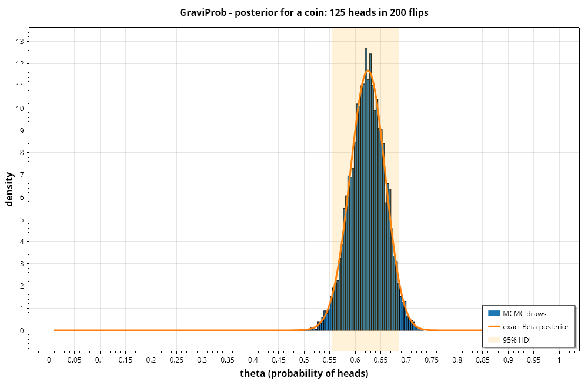
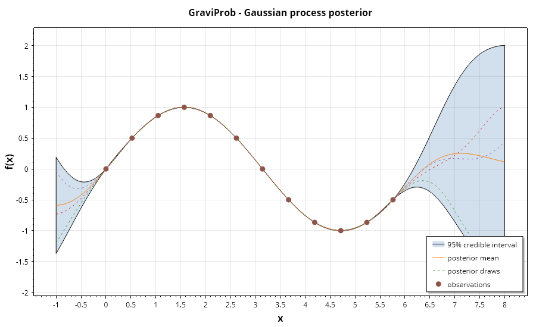
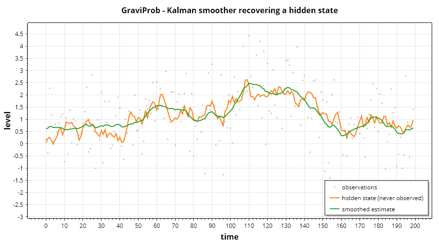

# GraviProb

*[English](../GraviProb.md)* · Probabilistic programming untuk .NET — distribusi, MCMC, inferensi variasional, dan model probabilistik.

## Distribusi

Setiap distribusi menyediakan `LogDensity`, bukan densitas biasa, karena inferensi mengalikan
banyak densitas: dalam ruang linear beberapa ratus observasi akan underflow menjadi nol, sedangkan
dalam ruang log cukup dijumlahkan.

```csharp
using Gravicode.Science.GraviProb;

var normal = Distribution.Normal(mean: 0, stdDev: 1);
normal.LogDensity(1.5);   normal.Density(1.5);
normal.Sample(rng);       normal.Sample(rng, 10_000);
normal.Mean;  normal.Variance;  normal.Cdf(1.96);
normal.LogLikelihood(data);
```

Tersedia: `Normal`, `Uniform`, `Bernoulli`, `Binomial`, `Poisson`, `Gamma`, `Beta`, `Exponential`,
`StudentT`, `LogNormal`, `HalfNormal`, `Categorical`.

`HalfNormal` adalah prior lemah-informatif yang lazim untuk parameter skala. `Beta` mengekspos
konjugasinya secara langsung:

```csharp
var exact = Distribution.Beta(1, 1).PosteriorAfter(successes: 125, failures: 75);
// Beta(126, 76) — posterior bentuk tertutup, dipakai untuk menguji sampler
```

## Menyusun model

```csharp
var model = new BayesianModel()
    .AddDistribution("theta", Distribution.Beta(1, 1))
    .AddObservation("data", DistributionSpec.Binomial(200, "theta"), 125);
```

`DistributionSpec.Binomial(200, "theta")` mencatat **ketergantungan** pada variabel laten, bukan
probabilitas tetap, sehingga sampler mengevaluasi ulang likelihood saat `theta` bergerak. Spesifikasi
yang tersedia: `Binomial`, `Bernoulli`, `Normal`, `Poisson`, ditambah `DistributionSpec.From` untuk
selebihnya:

```csharp
DistributionSpec.From(v => new Gamma(v["shape"], v["rate"]), "shape", "rate");
```

Model adalah log densitas gabungan: prior ditambah likelihood. Nilainya hanya diketahui **sampai
suatu konstanta**, karena marginal likelihood pada teorema Bayes tidak pernah dihitung — dan justru
itulah sebabnya MCMC bekerja, karena Metropolis-Hastings hanya melihat rasio sehingga konstantanya
saling meniadakan.

```csharp
model.LogPosterior(values);
model.LogPrior(values);
model.SampleFromPrior(rng);
model.PriorPredictive(draws: 1000);   // apakah prior menyiratkan data yang masuk akal?
```

## Pengambilan sampel

```csharp
var posterior = model.SampleMCMC(iterations: 20_000, chains: 4, warmup: 10_000, thin: 1, seed: 42);
var gibbs     = model.SampleGibbs(iterations: 20_000, chains: 4);
```

**Metropolis-Hastings** mengusulkan langkah Gaussian dan menerimanya dengan peluang
`min(1, exp(Δ logPosterior))`. Selama warmup skala usulan menyesuaikan diri menuju tingkat
penerimaan **0,234** — nilai optimal asimtotik untuk random walk. Langkah terlalu besar selalu
ditolak dan rantai macet; langkah terlalu kecil selalu diterima tetapi tidak menjelajah apa pun.
Adaptasi **berhenti** saat warmup selesai, karena usulan yang terus berubah merusak sifat Markov.

**Metropolis within Gibbs** memperbarui satu koordinat setiap kali, menargetkan penerimaan 0,44.
Tingkat penerimaan per langkah lebih tinggi, tetapi pencampurannya lambat bila parameter
berkorelasi, karena langkah satu koordinat tidak dapat menyusuri punggungan diagonal.

Rantai berjalan paralel dan saling bebas, itulah sebabnya sampling multi-rantai nyaris gratis dan
R-hat menjadi bermakna.

### Sampling berbasis gradien

```csharp
var nuts = model.SampleNUTS(iterations: 2000, chains: 4);   // ini yang sebaiknya dipakai
var hmc  = model.SampleHMC(iterations: 2000, chains: 4, leapfrogSteps: 20);

model.IsDifferentiable;                    // false berarti keduanya akan melempar exception
model.LogPosteriorGradient(values);        // (densitas, gradien) urut sesuai ParameterNames
```

**Hamiltonian Monte Carlo** mensimulasikan lintasan fisik memakai gradien log densitas, sehingga
usulannya menempuh *menyeberangi* sebaran, bukan berdifusi di sekitarnya. **NUTS** menghapus satu
knob penyetelan terakhir dengan melipatgandakan lintasan sampai kedua ujungnya mulai bergerak
saling mendekat. Keduanya menyesuaikan ukuran langkah lewat dual averaging menuju penerimaan 0,8 —
jauh lebih tinggi daripada 0,234 milik random walk, karena lintasan yang ditolak membuang jauh
lebih banyak kerja daripada satu langkah yang ditolak.

Gradiennya berasal dari tape di
[`GraviNum.Autodiff`](GraviNum.md#diferensiasi-otomatis). Setiap parameter dipetakan dulu ke
seluruh garis bilangan riil, dan transformasinya pun dibangun di atas tape, sehingga aturan rantai
melaluinya tidak pernah diturunkan dengan tangan. Itu juga yang menjaga setiap draw tetap berada di
dalam support.

### Memilih sampler, secara jujur

Diukur di mesin ini, 4 rantai, parameter terburuk yang dilaporkan:

| Model | Sampler | Waktu | ESS/draw | ESS/detik | R-hat terburuk |
|---|---|---:|---:|---:|---:|
| koin, 1 parameter | random walk | 58 ms | 16,5% | **11.340** | 1,006 |
| | NUTS | 669 ms | 44,5% | 2.663 | 1,000 |
| 20 parameter | random walk | 44 ms | 0,4% | 161 | **1,773** |
| | NUTS | 9.915 ms | **100,0%** | **202** | **1,000** |

Pada model satu parameter, random walk empat kali lebih cepat *per sampel efektif* dan tidak ada
alasan memakai gradien. Namun bacalah baris 20 parameter dengan cermat: random walk memberi R-hat
**1,773**, dan apa pun di atas sekitar 1,01 berarti rantai-rantainya tidak sepakat dan draw-nya
bukan berasal dari posterior. Ia bukan menghasilkan sampel yang lebih buruk dengan cepat — ia tidak
menghasilkan apa pun yang bisa dipakai, dengan cepat. NUTS memberi draw yang sepenuhnya bebas
(100% di antaranya efektif) dan tetap menang pada sampel per detik.

Jadi: **random walk untuk segelintir parameter, NUTS di atas itu.** Titik silangnya adalah titik
di mana difusi tak lagi mampu menyeberangi posterior, bukan sebuah titik pada kurva kecepatan.

## Membaca posterior

```csharp
posterior["theta"];                  // semua draw, digabung
posterior.Chain("theta", 0);         // satu rantai
posterior.Mean("theta");  posterior.StandardDeviation("theta");  posterior.Median("theta");

posterior.CredibleInterval("theta", 0.95);           // ekor sama
posterior.HighestDensityInterval("theta", 0.95);     // interval terpendek yang memuat 95%

posterior.RHat("theta");                   // mendekati 1 berarti konvergen; di atas ~1,01 tidak
posterior.EffectiveSampleSize("theta");    // setara berapa draw independen
posterior.AcceptanceRate;

Console.WriteLine(posterior.Summary());
```

Utamakan **HDI** pada posterior yang miring: interval ekor-sama bisa mengecualikan modus, nilai
paling mungkin, sedangkan HDI tidak.

### Pemeriksaan prediktif posterior

```csharp
var replicated = posterior.PosteriorPredictive(
    (values, rng) => rng.Binomial(200, values["theta"]), draws: 5000);
```

Bisakah model yang sudah dilatih menghasilkan kembali data yang dipakainya? Bila nilai teramati
berada jauh di ekor replikasi, modelnya salah — sebagus apa pun konvergensi rantainya.

## Inferensi variasional

```csharp
var fit = model.FitVariational(iterations: 2000, learningRate: 0.05, monteCarloSamples: 8);
fit.Means["theta"];  fit.StandardDeviations["theta"];  fit.EvidenceLowerBound;
```

VI mengubah integrasi menjadi optimasi, sehingga konvergen dalam milidetik ketika MCMC memerlukan
detik. Harganya adalah asumsi mean-field: parameter dianggap saling bebas, sehingga VI secara
sistematis **meremehkan varians posterior** dan tidak dapat merepresentasikan korelasi. Gunakan
untuk iterasi cepat, lalu konfirmasi dengan MCMC.

Parameter berbatas dipetakan ke seluruh garis bilangan riil sebelum dicocokkan — logit untuk
parameter Beta pada (0,1), log untuk skala pada (0,∞) — dengan log Jacobian disertakan dalam fungsi
objektif. Tanpa transformasi itu, pengoptimal akan melangkah keluar dari support dan hasilnya tak
bermakna.

Gradien berasal dari tape autodiff begitu model memiliki minimal 32 parameter, dan dari beda hingga
terpusat di bawah itu. Ambang ini perlu dijelaskan, karena jawaban intuitifnya justru terbalik:
pada model dua parameter, tape terukur **11× lebih lambat**, sebab membangun dan menelusuri graf
lebih mahal daripada empat evaluasi skalar yang murah. Keunggulan mode mundur adalah satu backward
pass mencakup semua parameter, sementara beda hingga butuh `2d` evaluasi tambahan — jadi ia menang
karena dimensi yang bertambah, bukan karena lebih cepat per panggilan. Titik silang terukurnya ada
di sekitar 50 parameter.

## Bayesian network

```csharp
using Gravicode.Science.GraviProb.Models;

var network = new BayesianNetwork()
    .AddVariable("rain", 0.8, 0.2)
    .AddVariable("sprinkler", 2, ["rain"], [[0.6, 0.4], [0.99, 0.01]])
    .AddVariable("wet", 2, ["rain", "sprinkler"],
    [
        [1.00, 0.00],   // tanpa hujan, tanpa penyiram
        [0.10, 0.90],   // tanpa hujan, ada penyiram
        [0.20, 0.80],   // hujan, tanpa penyiram
        [0.01, 0.99],   // keduanya
    ]);

network.Infer("wet");                                                  // 0,4484
network.Infer("rain", new Dictionary<string, int> { ["wet"] = 1 });     // 0,3577
network.Infer("rain", new() { ["wet"] = 1, ["sprinkler"] = 1 });        // 0,0068
network.Sample(rng);
```

Pasangan terakhir itu adalah **explaining away**: rumput basah menaikkan peluang hujan dari 0,20
menjadi 0,36, tetapi begitu penyiram menjelaskannya, peluang hujan turun ke 0,007.

Faktorisasi adalah intinya — distribusi gabungan atas *n* variabel biner punya `2^n - 1` parameter
bebas, sedangkan hasil kali kondisional per variabel jauh lebih kecil secara eksponensial bila
grafnya jarang. Inferensinya berupa enumerasi eksak: benar untuk jaringan kecil, eksponensial di
luar itu. Baris yang jumlahnya bukan satu ditolak saat konstruksi.

## Hidden Markov model

```csharp
var hmm = new HiddenMarkovModel(initial, transitions, emissions);

hmm.LogLikelihood(observations);      // rekursi forward, penskalaan per langkah
hmm.Viterbi(observations);            // jalur paling mungkin, di ruang log
hmm.StatePosteriors(observations);    // forward-backward
hmm.Generate(length, rng);

var learned = HiddenMarkovModel.Random(states: 2, symbols: 3, seed: 42);
learned.Fit(sequences, iterations: 50);   // Baum-Welch (EM)
```

Ketiga algoritma bekerja di ruang log atau dengan normalisasi per langkah, karena probabilitas
mentahnya underflow dalam beberapa puluh langkah waktu.

Viterbi **bukan** sama dengan mengambil state paling mungkin di tiap langkah secara terpisah: ia
memaksimalkan probabilitas gabungan seluruh jalur, sehingga tidak mungkin mengembalikan urutan yang
memuat transisi yang dilarang model.

Baum-Welch menjamin likelihood tidak menurun, tetapi hanya menemukan optimum **lokal** — itulah
sebabnya parameter awal penting dan pencocokan sungguhan memakai beberapa restart acak.

## Regresi linear Bayesian

```csharp
var model = new BayesianLinearRegression(priorPrecision: 1e-3, noisePrecision: 1.0).Fit(x, y);

model.CoefficientMeans;  model.CoefficientCovariance;
model.Predict(newX);
var (mean, deviation) = model.PredictWithUncertainty(newX);
var (lower, upper) = model.PredictInterval(newX, mass: 0.95);
model.SampleCoefficients(draws: 1000);
```

Prior normal-inverse-gamma bersifat konjugat, sehingga posteriornya berbentuk tertutup — tanpa
sampling, dan jawabannya eksak. Keunggulannya dibanding least squares adalah setiap koefisien
membawa posterior penuh, dan prediksinya membawa interval yang **melebar di wilayah yang jarang
dilihat model** — sesuatu yang tak bisa diungkapkan oleh estimasi titik.

## Kesalahan yang sering terjadi

| Gejala | Penyebab |
|---|---|
| "Could not find a starting point with finite posterior density" | Prior tidak memberi massa di tempat likelihood terdefinisi |
| `RHat` jauh di atas 1 | Belum konvergen — perpanjang sampling, atau ubah parameterisasi |
| Penerimaan mendekati 0 atau 1 | Warmup terlalu pendek untuk skala menyesuaikan diri |
| Varians VI terlihat terlalu kecil | Wajar — mean-field meremehkan sebaran secara desain |
| Hasil VI di luar rentang parameter | Sudah diperbaiki: parameter ditransformasi; periksa `SupportBounds` pada distribusi khusus |

## Distribusi multivariat

`MultivariateDistribution` dipisahkan dari `Distribution` alih-alih menggeneralisasinya. Antarmuka
skalar dipakai di mana-mana — prior, likelihood, sampler — dan melebarkannya ke vektor akan membuat
setiap implementasi membawa dimensi yang tidak dimilikinya.

### Normal multivariat

```csharp
var mvn = new MultivariateNormal(mean, covariance);
mvn.LogDensity(x);
mvn.Sample(rng, count);
mvn.Conditional(unknown: [0], observed: [1], values);
```

Semuanya melewati faktor Cholesky `Σ = LLᵀ` yang dihitung sekali saat konstruksi. Faktorisasi tunggal
itu memberi ketiga hal yang dibutuhkan: bentuk kuadratik lewat substitusi maju alih-alih invers
eksplisit, log determinan sebagai dua kali jumlah log diagonal, dan pengambilan sampel sebagai
`μ + Lz`. Membalik `Σ` secara langsung akan lebih lambat dan jauh kurang akurat untuk kovarians yang
berkondisi buruk, dan justru saat itulah hal ini penting.

Kovarians yang bukan definit positif ditolak saat konstruksi. Kovarians singular adalah situasi
pemodelan yang nyata — komponen yang berkorelasi sempurna — tetapi densitasnya lalu tak terbatas pada
subruang berdimensi lebih rendah dan tidak ada sebagaimana tertulis, sehingga gagal dengan lantang
lebih baik daripada mengembalikan tak-hingga di kemudian hari.

`Conditional` adalah sifat yang membuat Gaussian berguna untuk prediksi: mengkondisikan sebuah normal
pada sebagian dirinya menghasilkan normal lain, dalam bentuk tertutup. Itulah seluruh mekanisme di
balik regresi proses Gaussian.

### Dirichlet dan multinomial

```csharp
var prior = Dirichlet.Symmetric(dimension: 3, concentration: 1.0);
var posterior = prior.Posterior([10.0, 5.0, 0.0]);     // konjugasi: pembaruannya adalah penjumlahan
prior.Marginal(0);                                     // setiap marginal adalah Beta
```

Sebuah tarikan Dirichlet adalah vektor bilangan non-negatif yang berjumlah satu, dan itu membuatnya
menjadi prior alami atas parameter sebuah `Categorical`. Dengan dua komponen ia *adalah* Beta. Vektor
konsentrasi mengendalikan lokasi sekaligus sebaran: nilainya yang dinormalkan adalah rerata, totalnya
mengatur seberapa rapat tarikan mengelompok, dan α di bawah satu mendorong massa ke sudut-sudut —
tarikan yang nyaris one-hot, dan itulah yang membuat prior jarang menjadi jarang.

**Setiap entri kovarians di luar diagonal bernilai negatif, dan itu keharusan.** Komponennya berjumlah
tetap, sehingga satu yang naik berarti yang lain turun. Dirichlet sama sekali tidak bisa menyatakan
proporsi yang berkorelasi positif, dan itulah alasan utama beralih ke normal logistik.

Pengambilan sampel menarik satu Gamma per komponen lalu menormalkannya — `Gamma(αᵢ, 1)` yang saling
bebas dibagi jumlahnya persis merupakan `Dirichlet(α)`.

`Multinomial` adalah hitungan dari tarikan kategorikal berulang, generalisasi dari binomial.
Sampelnya menyusuri rantai binomial atas percobaan yang tersisa, sehingga hitungannya berjumlah persis
sama dengan jumlah percobaan, sedangkan mengambil sampel tiap kategori secara mandiri tidak.

## Proses Gaussian

Gagasannya adalah menempatkan prior langsung pada fungsinya, bukan pada parameter sebuah fungsi.
Setiap himpunan masukan berhingga memiliki himpunan keluaran yang normal bersama, dengan kovarians
diberikan kernel; mengkondisikan normal itu pada keluaran teramati menghasilkan normal lain, dan
itulah posteriornya. Tidak ada optimasi yang terlibat, dan ketidakpastian prediktif keluar bersama
prediksinya.

```csharp
var gp = new GaussianProcess(new RbfKernel(lengthScale: 1.0), noise: 0.01).Fit(x, y);

var prediction = gp.Predict(xTest);
prediction.Mean;
prediction.StandardDeviation;
prediction.Interval(0.95);

gp.SamplePosterior(xTest, count: 20, rng);     // fungsi utuh, bukan sebuah pita
gp.LogMarginalLikelihood();
GaussianProcess.Optimise(x, y);                // pencarian grid atas skala panjang dan derau
```

**Kernel adalah modelnya.** Ia mengkodekan setiap asumsi — seberapa mulus fungsinya, pada skala
panjang berapa ia berubah, apakah ia berulang — dan memilihnya adalah keputusan pemodelannya.

| Kernel | Asumsi |
|---|---|
| `RbfKernel` | Terdiferensialkan tak hingga kali. Kuat, sering terlalu kuat. |
| `MaternKernel(0.5)` | Kontinu tetapi tak terdiferensialkan di mana pun. |
| `MaternKernel(1.5)` | Terdiferensialkan sekali. |
| `MaternKernel(2.5)` | Terdiferensialkan dua kali — pengganti RBF yang tidak terlalu mudah percaya. |
| `PeriodicKernel` | Berulang selamanya. Pakai hanya bila itu keyakinan yang sungguh-sungguh. |
| `SumKernel` | Sebuah tren ditambah siklus musiman. |

**Derau bukan opsional.** Suku `noise` sekaligus merupakan model galat pengamatan dan yang menjaga
kovarians tetap dapat dibalik — dengan masukan ganda atau nyaris ganda, kovarians menjadi singular
tanpanya, dan faktorisasinya gagal. GP tanpa derau yang berhasil adalah GP yang kebetulan punya
masukan yang terpisah baik.

`LogMarginalLikelihood` adalah yang dimaksimalkan saat memilih hiperparameter. Berbeda dari likelihood
data latih, ia tidak sekadar membaik seiring model menjadi lebih lentur: suku log-determinan adalah
penalti kompleksitas yang tumbuh seiring kernel membiarkan fungsinya bergoyang, sehingga maksimumnya
berada pada imbal-balik yang sesungguhnya. `Optimise` memakai grid alih-alih metode gradien dengan
sengaja — marginal likelihood tidak konkaf dan memiliki optimum lokal sungguhan dengan tafsir
berbeda, satu menjelaskan data sebagai sinyal dan yang lain sebagai derau.

Target dipusatkan sebelum pencocokan, karena GP memiliki rerata prior nol dan tanpa pemusatan ia
menarik prediksi ke arah nol alih-alih ke arah tingkat data itu sendiri.

`SamplePosterior` memberi fungsi yang koheren, berbeda dari pita marginal yang dilaporkan `Interval`.
Sebuah pita tidak bisa memberi tahu apakah fungsinya bergoyang di dalamnya atau tetap datar.

**Biayanya kubik terhadap jumlah pengamatan.** Beberapa ribu titik adalah batas praktis untuk metode
eksak ini; di atas itu, hampiran jarang atau titik penginduksi merupakan algoritma yang berbeda.

## Model ruang keadaan

Modelnya berupa keadaan tersembunyi yang berkembang dan pengamatan yang melihat sebagiannya, keduanya
linear dan keduanya berderau Gaussian. Di dalam asumsi itu, filter Kalman bukan metode yang bagus,
melainkan *satu-satunya* metode: posterior eksak atas keadaannya, dan estimator varians minimum di
antara semua estimator, bukan hanya yang linear.

```csharp
var filter = KalmanFilter.LocalLevel(processVariance: 0.01, observationVariance: 1.0);
var trend = KalmanFilter.LocalLinearTrend(1e-4, 1e-6, 0.25);

var result = filter.Filter(observations);
result.Filtered;         // tiap keadaan diberikan pengamatan sampai saat itu
result.LogLikelihood;    // dari galat prediksi satu langkah ke depan

filter.Smooth(observations);              // memakai seluruh deret
filter.Forecast(observations, horizon: 10);
filter.Simulate(steps, rng);
```

Banyak hal cocok dengan bentuk ini begitu dituliskan. Model level lokal adalah rata-rata bergerak
terboboti eksponensial yang konstanta pemulusannya *diturunkan dari rasio derau*, bukan ditebak.
Menambahkan kemiringan memberi tren yang menyesuaikan diri — dan kemiringan itu tidak pernah diamati,
melainkan disimpulkan sepenuhnya dari bagaimana levelnya bergerak.

**Penyaringan dan pemulusan menjawab pertanyaan berbeda.** `Filter` mengestimasi tiap keadaan hanya
dari masa lalu, dan itulah yang bisa dilakukan sistem waktu nyata; `Smooth` memakai seluruh deret,
yang jelas lebih baik dan hanya tersedia setelah kejadian. Memakai keadaan yang dimuluskan untuk
mengevaluasi aturan peramalan adalah galat look-ahead, dan itu umum terjadi.

**Hanya rasio antara Q dan R yang penting**, dan itulah sebabnya sebuah filter bisa disetel dengan
satu angka. Q yang besar relatif terhadap R menyatakan bahwa keadaannya bergerak lebih cepat daripada
sensornya berbohong, sehingga filter mengikuti pengukuran dengan ketat; sebaliknya berarti sensornya
berderau dan filter memuluskan dengan kuat.

Pembaruan kovarians memakai bentuk Joseph. Secara aljabar ia setara dengan `P − KHP` yang ringkas, dan
secara numerik jauh lebih baik perilakunya: bentuk ringkas bisa melenceng menjadi kovarians tak
simetris atau definit negatif sepanjang deret yang panjang, dan filter lalu menyimpang tanpa
peringatan.

`LogLikelihood` menguraikan deret menjadi galat prediksi satu langkah yang saling bebas, dan itulah
yang memungkinkan pencocokan parameter — ia likelihood sungguhan dengan maksimum di tempat yang benar.

## Perbandingan model

Pertanyaannya adalah "seberapa baik model ini akan memprediksi data yang belum dilihatnya", dan alasan
keberadaan ukuran-ukuran ini adalah bahwa jawaban dalam-sampel yang tampak jelas bersifat optimistis
secara sistematis — model yang lebih lentur selalu lebih pas pada data tempat ia dicocokkan.

```csharp
var waic = ModelComparison.Waic(logLikelihoodMatrix);      // (tarikan × pengamatan)
var loo = ModelComparison.Loo(logLikelihoodMatrix);

loo.IsReliable;                  // apakah importance sampling-nya dapat dipercaya
loo.UnreliableObservations;      // pengamatan mana yang tidak dapat ditanganinya

ModelComparison.Compare(new Dictionary<string, InformationCriterion>
{
    ["simple"] = simpleWaic,
    ["complex"] = complexWaic,
});
```

**WAIC** mengestimasi optimisme itu sebagai varians posterior dari log likelihood tiap pengamatan,
sehingga penaltinya mengukur kompleksitas efektif, bukan hitungan parameter. Suku `lppd` adalah log
dari sebuah *rerata*, bukan rerata dari log — menghitungnya terbalik memberi angka pada rentang yang
tepat yang bukan WAIC.

**PSIS-LOO** menanyakan hal yang sama lewat importance sampling: menimbang ulang posterior untuk
menghampiri keadaannya bila satu pengamatan dibuang. Ia umumnya lebih disukai, bukan karena lebih
akurat pada masalah yang berperilaku baik — di sana keduanya sangat sepakat — melainkan karena ia
datang dengan diagnostik. Nilai Pareto `k` tiap pengamatan menyatakan apakah penimbangan ulangnya
dapat dipercaya, dan di atas 0,7 bobotnya bervarians tak hingga. **WAIC tidak punya padanannya: ia
gagal secara diam-diam justru pada kasus yang dilaporkan LOO.**

Keduanya berada pada skala deviance, sehingga lebih rendah lebih baik, dan tidak satu pun bermakna
secara mutlak — hanya selisih antar model yang dicocokkan pada pengamatan yang sama yang dapat
ditafsirkan, dan itulah sebabnya `Compare` menolak model yang disekor pada data berbeda.

Galat baku sebuah *selisih* dihitung dari suku per titik yang berpasangan, bukan dari galat
masing-masing model. Model-model itu dievaluasi pada pengamatan yang sama, sehingga galatnya
berkorelasi kuat, dan memperlakukannya sebagai saling bebas membuat setiap selisih tampak tidak
berarti.

---

## Visualisasi

Ketiganya dihasilkan oleh `samples/GraviProb.Console` dan direproduksi oleh
`notebooks/GraviProb.Notebook.ipynb`.





Pitanya menyempit di titik pengamatan dan melebar di luarnya, dan itulah GP yang jujur tentang apa
yang tidak diketahuinya. Garis putus-putus adalah *fungsi* koheren yang ditarik dari posterior —
pita marginal tidak mengatakan apa pun tentang bentuk, sedangkan garis-garis ini iya.



Titik-titik kelabu adalah yang terukur; garis mulus adalah keadaan yang tidak pernah diamati filter
secara langsung. Memulihkannya itulah seluruh tujuannya.

---

*Dibuat oleh Gravicode Studios, dipimpin oleh Kang Fadhil*
