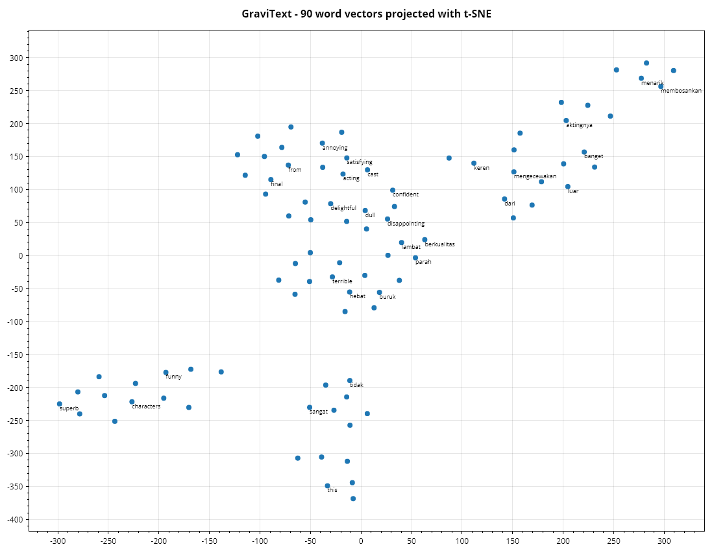

# GraviText

*[English](../GraviText.md)* · NLP modern untuk .NET — tokenisasi, embedding, transformer, dan pipeline tugas.

> **Baca ini dulu.** Library ini tidak menyertakan bobot transformer terlatih. Forward pass
> encoder-nya lengkap dan benar, tetapi `TransformerModel` yang baru dibuat diinisialisasi secara
> acak, sehingga vektor keluarannya adalah derau berstruktur. Ada dua jalan keluar: latih
> arsitekturnya pada teks berlabel Anda sendiri dengan
> [`TransformerClassifier`](#melatih-transformer), atau pakai `Word2Vec` / `TfidfVectorizer`, yang
> belajar dari korpus Anda dan merupakan pilihan lebih baik untuk data kecil. Lihat bagian
> [Transformer](#transformer) di bawah.

Bahasa Inggris dan Bahasa Indonesia didukung sepenuhnya — daftar stop word, stemming, dan leksikon
sentimen tersedia untuk keduanya.

## Tokenisasi

```csharp
using Gravicode.Science.GraviText.Tokenization;

new WhitespaceTokenizer().Tokenize(text);
new RegexTokenizer().Tokenize("Hello, World! It's 2024.");   // [hello, world, it's, 2024]
new CharacterTokenizer().Tokenize(text);
SentenceSplitter.Split("First. Second! Third?");

TextNormalizer.Normalize("  Café  RÉSUMÉ ");                 // "cafe resume"
TextNormalizer.StripAccents(text);
TextNormalizer.RemovePunctuation(text);
```

`StripAccents` memakai tabel pelipatan eksplisit alih-alih normalisasi Unicode, karena library
dibangun dengan `InvariantGlobalization` di mana `String.Normalize` diam-diam mengembalikan
masukannya tanpa perubahan.

### Kosakata dan sub-kata

```csharp
var vocabulary = Vocabulary.Build(tokenizedDocuments, minFrequency: 2, maxSize: 30_000);
vocabulary["hello"];        // id, atau UnknownId
vocabulary[42];             // token
vocabulary.Save("vocab.txt");

var learned = WordPieceTokenizer.Train(documents, vocabularySize: 5000, minFrequency: 2);
var tokenizer = new WordPieceTokenizer(learned);

tokenizer.Tokenize("playing");             // [play, ##ing]
var (ids, mask) = tokenizer.Encode(text, maxLength: 128);   // menambah [CLS]/[SEP], memberi padding
```

WordPiece mencocokkan setiap kata secara rakus dari prefiks terpanjang ke bawah lalu mencocokkan
sisanya dengan penanda `##`. Itulah yang membuat kosakata tetap 30 ribu mampu menutup bahasa yang
terbuka: kata yang belum pernah dilihat terurai menjadi potongan yang dikenal, bukan runtuh menjadi
`[UNK]`.

## Linguistik

```csharp
using Gravicode.Science.GraviText.Linguistics;

StopWords.English;  StopWords.Indonesian;  StopWords.Bilingual;
StopWords.Remove(tokens, StopWords.Indonesian);

PorterStemmer.Stem("connecting");        // connect
PorterStemmer.StemAll(tokens);

IndonesianStemmer.Stem("makanan");       // makan
IndonesianStemmer.Stem("berlari");       // lari
IndonesianStemmer.Stem("menyapu");       // sapu

Lemmatizer.Lemmatize("were");            // be
NGrams.Extract(tokens, 2);
NGrams.Range(tokens, 1, 3);

LanguageDetector.Detect("Solusi ini adalah ...");   // ("id", 0.83)
```

Stemmer Indonesia menerapkan aturan kombinasi imbuhan terlarang Nazief-Adriani. Tanpa aturan itu
`berlari` akan kehilangan `ber-` sekaligus akhiran `-i` palsu dan menghasilkan `lar`; karena `be-`
tidak pernah berpasangan dengan `-i`, huruf terakhirnya benar dipertahankan sebagai bagian akar.

## Vektorisasi

```csharp
using Gravicode.Science.GraviText.Vectorization;

var options = new VectorizerOptions
{
    StopWords = StopWords.Bilingual,
    Stemmer = PorterStemmer.Stem,
    MinNGram = 1,
    MaxNGram = 2,
    MinDocumentFrequency = 2,
    MaxDocumentFrequencyRatio = 0.9,
    MaxFeatures = 20_000,
};

var counts = new CountVectorizer(options);
counts.FitTransform(documents);
counts.TransformSparse(documents);        // yang dibutuhkan korpus nyata

var tfidf = new TfidfVectorizer(options, sublinearTf: true);
var matrix = tfidf.FitTransform(documents);
tfidf.TopTerms(matrix, row: 0, count: 10);
```

Batas frekuensi dokumen adalah bagian yang berguna: batas bawah membuang salah ketik dan istilah
sekali muncul yang hanya menambah dimensi, batas atas membuang istilah yang begitu umum sehingga
tidak membawa sinyal — sebuah daftar stop word khas korpus, dipelajari alih-alih ditulis tangan.

```csharp
Similarity.Cosine(a, b);
Similarity.Jaccard(tokensA, tokensB);
Similarity.Levenshtein("kitten", "sitting");    // 3
Similarity.MostSimilar(matrix, query, top: 5);
```

## Embedding

```csharp
using Gravicode.Science.GraviText.Embeddings;

var embeddings = new Word2Vec(
        dimensions: 100, windowSize: 5, minCount: 5,
        negativeSamples: 5, epochs: 5, seed: 42)
    .Train(documents);

embeddings.Similarity("king", "queen");
embeddings.MostSimilar("king", top: 10);
embeddings.Analogy("man", "king", "woman");     // b - a + c
embeddings.Average(tokens);                     // vektor kalimat sederhana
embeddings.Save("vectors.vec");                 // format teks word2vec

new GloVe(dimensions: 50, windowSize: 5).Train(documents);
```

Word2Vec belajar lewat prediksi: untuk setiap pasangan (pusat, konteks) ia mendekatkan vektor
keduanya dan menjauhkan segelintir kata negatif yang diambil acak. Kata negatif diambil dari
distribusi unigram dipangkatkan 3/4, dan kata yang sangat sering muncul dibuang secara acak lewat
subsampling — keduanya penting, dan keduanya diimplementasikan.

### Menghapus komponen bersama

```csharp
var centred = embeddings.RemoveCommonComponent();
```

Vektor hasil pelatihan berbagi satu arah bersama yang besar, karena setiap kata terdorong ke arah
yang sama oleh negative sampling yang sama-sama dialaminya. Arah itu tidak membawa makna tetapi
mendominasi kosinus — pada korpus demo 80 ulasan, rata-rata kosinus berpasangan **0,995** sebelum
penghapusan dan **0,431** sesudahnya. Ini pascapemrosesan standar (Mu & Viswanath,
"all-but-the-top"), dan pada korpus kecil inilah pembeda antara kemiripan yang informatif dan yang
tidak berguna.

**Mutu embedding membutuhkan data.** Delapan puluh ulasan pendek adalah demo. Vektor kata sungguhan
memerlukan jutaan token; contohnya menyatakan itu secara eksplisit alih-alih menyajikan tetangga
yang berisik sebagai hasil.

## Transformer

```csharp
using Gravicode.Science.GraviText.Transformers;

var config = TransformerConfig.Preset("bert-base", vocabularySize: 30522);
// atau: new TransformerConfig(vocab, HiddenSize: 128, Layers: 4, Heads: 8, IntermediateSize: 512)

var model = new TransformerModel(config, seed: 42).WithTokenizer(wordPiece);

model.Forward(tokenIds, attentionMask);    // satu vektor per posisi
model.Encode("teks contoh", maxLength: 128); // dipool menjadi satu vektor
model.EncodeBatch(documents);               // paralel antar dokumen
model.AttentionMaps;                        // per lapisan, per head

model.LoadWeights("weights.json");          // menyetel HasPretrainedWeights
model.HasPretrainedWeights;
```

Preset: `bert-base`, `bert-small`, `bert-mini`, `bert-tiny`.

Blok penyusunnya tersedia terpisah: `MultiHeadAttention`, `TransformerEncoderLayer`, `LayerNorm`,
`DenseLayer`, `Activations.Gelu`. Pembagi `sqrt(d)` pada attention bukan kosmetik — tanpanya hasil
perkalian titik tumbuh seiring lebar model, softmax jenuh, dan gradien lenyap.

Pooling memakai **rata-rata** hidden state akhir, bukan vektor `[CLS]`, karena `[CLS]` baru membawa
makna kalimat setelah model di-fine-tune untuk menaruhnya di sana.

### Melatih transformer

`TransformerModel` hanya menghitung forward pass, tidak lebih. Itulah sebabnya model baru tetap
acak selamanya: tidak ada gradien, jadi tidak ada cara mengubah bobotnya. `TransformerClassifier`
adalah arsitektur yang sama, dibangun di atas
[tape autodiff](GraviNum.md#diferensiasi-otomatis), sehingga bobotnya bisa dilatih dengan teks
berlabel Anda sendiri.

```csharp
var config = new TransformerConfig(vocabularySize: 5000, HiddenSize: 64, Layers: 2, Heads: 4,
                                   IntermediateSize: 128, MaxPositions: 64);

var model = new TransformerClassifier(config, seed: 42)
    .Fit(dokumenTerTokenisasi, label, epochs: 20, learningRate: 0.005);

model.Predict(tokenIds);
model.Score(dokumenUji, labelUji);
model.LossHistory;                       // rata-rata loss per epoch
```

Lapisannya tersedia terpisah untuk membangun hal lain — `TransformerTape.LayerNorm`,
`MultiHeadAttention`, `EncoderLayer`, `Gelu`, `SoftmaxRows`, `Embed`, `MeanPool`. Semuanya tersusun
dari operasi tape yang sudah ada untuk graph network; tidak satu pun butuh kernel khusus, jadi
tidak satu pun butuh penurunan rumus sendiri. Periksa lapisan yang Anda tulis dengan
`GradientCheck`.

> **Ini bukan cara memperoleh BERT.** Model yang dilatih di sini hanya belajar dari korpus yang
> Anda berikan, dan beberapa ratus dokumen tidak akan menghasilkan pemahaman bahasa yang umum —
> yang bisa dihasilkan adalah klasifier khusus tugas. Untuk data berlabel kecil, `TfidfVectorizer`
> yang diumpankan ke model linear tetap baseline yang lebih kuat dan jauh lebih murah, dan layak
> dikalahkan lebih dulu sebelum beralih ke sini. Yang berubah adalah arsitekturnya kini bisa
> dilatih sama sekali, bukan bahwa ia kini sudah terlatih.

## Pipeline tugas

### Sentimen

```csharp
using Gravicode.Science.GraviText.Tasks;

var analyzer = new SentimentAnalyzer();
analyzer.Analyze("produknya bagus dan sangat memuaskan");   // positive
analyzer.Analyze("this is not good");                        // negative — negasi ditangani

analyzer.Train(documents, labels);      // kini memakai model terlatih
analyzer.Explain("positive", 15);       // istilah yang mendorong keputusannya
```

Jalur leksikon ada karena sentimen adalah satu-satunya tugas yang bisa dijawab dengan layak tanpa
data latih: daftar polaritas ditambah penanganan negasi dan penguat sudah cukup jauh. Dengan label,
classifier terlatih jelas lebih baik.

### Klasifikasi

```csharp
var classifier = new TextClassifier().Train(documents, labels);
classifier.Predict("teks contoh");          // label, keyakinan, skor tiap kelas
classifier.Evaluate(testDocs, testLabels);
classifier.TopFeatures("positive", 15);     // dibaca langsung dari koefisien
```

TF-IDF ke regresi logistik tetap baseline yang kuat, dilatih dalam hitungan detik, dan — tidak
seperti transformer — akan memberi tahu persis kata mana yang mendorong sebuah keputusan.

### Entitas, ringkasan, kata kunci

```csharp
var ner = new NamedEntityRecognizer()
    .AddGazetteer("PRODUCT", ["GraviNum", "GraviFrame"]);
ner.Recognize("Kang Fadhil dari Gravicode Studios di Bandung sejak 2019");
// Kang Fadhil [PERSON], Gravicode Studios [ORGANIZATION], Bandung [LOCATION], 2019 [DATE]

new TextRankSummarizer().Summarize(article, sentenceCount: 3);
new KeywordExtractor().Fit(corpus).Extract(document, count: 10);
```

**Pengenal entitas ini berbasis aturan, bukan model urutan terlatih.** Ia andal menemukan entitas
yang cocok dengan gazetteer-nya atau berdampingan dengan kata pemicu (`PT`, `Dr.`, `di`, `in`), dan
akan melewatkan entitas baru yang bisa ditangkap CRF atau transformer yang di-fine-tune. Ia ada
karena tidak memerlukan data latih dan sepenuhnya dapat diperiksa — perluas dengan `AddGazetteer`.

Peringkasnya bersifat **ekstraktif**: kalimatnya diambil apa adanya dari sumber, diperingkat dengan
PageRank atas graf tumpang tindih kata isi. Ia tidak mungkin berhalusinasi.

## Kesalahan yang sering terjadi

| Gejala | Penyebab |
|---|---|
| Vektor transformer tampak tak bermakna | Tidak ada bobot terlatih — lihat catatan di awal. `TransformerModel` tidak bisa dilatih; pakai `TransformerClassifier` |
| Semua kemiripan kata ≈ 1,0 | Panggil `RemoveCommonComponent()` |
| Stop word Indonesia tidak terbuang | Berikan `StopWords.Indonesian` atau `Bilingual` secara eksplisit |
| Kosakata Word2Vec kosong | `minCount` di atas frekuensi korpus |

## Tokenizer sub-kata yang dapat dilatih

`WordPieceTokenizer` menerapkan kosakata yang diberikan kepadanya. Dua tokenizer berikut
mempelajarinya dari korpus, lewat jalur yang benar-benar berbeda.

### Byte-pair encoding

`BpeTokenizer` mulai dari karakter dan berulang kali menggabungkan pasangan bersebelahan yang paling
sering muncul, mencatat setiap penggabungan sesuai urutan. Menerapkannya kemudian berarti memutar
ulang penggabungan itu.

```csharp
var tokenizer = BpeTokenizer.Train(corpus, vocabularySize: 8000, minFrequency: 2);

tokenizer.Encode("lowest");        // ["low", "est</w>"] — belum pernah dilihat, tetapi terurai
tokenizer.Tokenize(document);
tokenizer.Decode(pieces);
tokenizer.Save("merges.txt");
```

Perbedaannya dari WordPiece terletak pada pasangan mana yang digabung: BPE mengambil yang paling
*sering*, WordPiece mengambil yang paling meningkatkan likelihood korpus. Dalam praktiknya kosakata
keduanya mirip dan BPE lebih sederhana untuk dilatih.

**Urutan penggabungan adalah modelnya.** Kosakata saja tidak bisa melakukan tokenisasi — himpunan
token yang sama diterapkan dalam urutan berbeda menghasilkan segmentasi berbeda — dan itulah sebabnya
`Save` menulis penggabungan berperingkat, bukan daftar token. Dengan alasan sama, penggabungan
diterapkan menurut *peringkat*, bukan dari kiri ke kanan: penggabungan berperingkat rendah yang
datang lebih awal bisa memakan simbol yang dibutuhkan penggabungan berperingkat lebih tinggi.

Kata membawa penanda akhir-kata, sehingga `"est"` yang mengakhiri kata adalah token berbeda dari
`"est"` di dalam kata. Tanpa itu, tokenizer mempelajari penggabungan yang melintasi batas kata dan
menghasilkan segmentasi yang tidak bertahan ketika teks dispasi ulang. Pelatihan memutus seri secara
deterministik, sehingga dua kali jalan atas korpus yang sama tidak mungkin menyimpang —
ketidakterulangan di sini tak terlihat sampai model yang dilatih dengan satu tokenizer disajikan
dengan tokenizer lain.

### Unigram (SentencePiece)

`UnigramTokenizer` adalah gagasan berbeda, bukan varian. Ia mulai dari kosakata kandidat yang besar,
memberi setiap potongan sebuah probabilitas, lalu *memangkas ke bawah* — berulang kali membuang
potongan yang penghapusannya paling sedikit merugikan likelihood korpus.

```csharp
var tokenizer = UnigramTokenizer.Train(corpus, vocabularySize: 8000);

tokenizer.Encode(text);                                // Viterbi: segmentasi terbaik
tokenizer.SampleEncoding(text, rng, alpha: 0.2);       // segmentasi alternatif
tokenizer.Decode(pieces);                              // dapat dibalik secara persis
```

Dua konsekuensi mengikuti, dan keduanya adalah alasan ia layak dimiliki berdampingan dengan BPE:

- **Segmentasinya optimal secara global**, ditemukan lewat Viterbi atas kisi potongan, bukan secara
  serakah, sehingga tidak bergantung pada urutan aturan yang kebetulan dipelajari.
- **Segmentasi alternatif dapat disampel**, dan itulah dasar regularisasi sub-kata — melatih model
  pada beberapa segmentasi tiap kalimat membuatnya jauh lebih tahan terhadap pilihan sembarang
  tokenizer. BPE tidak bisa melakukan ini tanpa perangkat tambahan, karena tidak punya probabilitas
  untuk disampel.

**Spasi adalah bagian dari masukan, bukan pembatas.** Spasi menjadi penanda yang terlihat dan teks
diperlakukan sebagai satu aliran mentah, dan itulah yang membuat skema ini sepenuhnya dapat dibalik
serta mampu menangani bahasa yang sama sekali tidak memberi spasi antar kata.

Karakter tunggal tidak pernah dipangkas: kosakata yang tidak bisa mengeja sebuah karakter tidak bisa
mensegmentasi teks yang memuatnya. Langkah EM mengakumulasi hitungan terharap tiap potongan atas
*seluruh* segmentasi yang ditimbang probabilitas, bukan hanya yang terbaik — memakai jalur Viterbi
saja membuat potongan langka tampak lebih buruk daripada kenyataannya.

## Pelabelan urutan dengan CRF

Melabeli setiap token secara mandiri menghasilkan urutan yang masuk akal secara lokal dan mustahil
secara global — sebuah `I-PER` tanpa `B-PER` di depannya. `LinearChainCrf` menambahkan skor transisi
antar label bersebelahan dan mendekode *urutan* dengan skor tertinggi.

```csharp
var crf = new LinearChainCrf(labels.Count);
crf.ApplyBioConstraints(labels);           // I-X hanya boleh mengikuti B-X atau I-X bertipe sama
crf.Fit(emissionMatrices, tagSequences);

crf.Decode(emissions);        // Viterbi: urutan terbaik
crf.Marginals(emissions);     // keyakinan per token, lewat forward-backward
crf.LogLikelihood(emissions, labels);
```

**Urutan terbaik bukanlah urutan token-token terbaik.** Mengambil label teratas tiap token secara
mandiri mengabaikan semua skor transisi, dan itulah satu-satunya hal yang ditambahkan model ini.

Fungsi partisi dihitung secara persis oleh algoritma forward dalam O(n·k²), atas apa yang kalau tidak
akan berupa kⁿ urutan. Itulah yang menjadikan ini model probabilitas, bukan sekadar fungsi penilaian,
dan sebabnya gradien pelatihan — hitungan teramati dikurangi hitungan terharap, bentuk klasik keluarga
eksponensial — bersifat persis, bukan hasil sampel.

`Forbid` memberi sebuah transisi skor yang tidak bisa dipulihkan jalur mana pun. Menyatakan kendala
dengan cara itu lebih baik daripada berharap data latih mengajarkannya: penalti yang dipelajari
selalu bisa dikalahkan emisi yang percaya diri, dan keluarannya lalu berupa pelabelan yang menurut
skemanya tidak mungkin ada. Transisi terlarang tidak punya gradien dan tidak pernah memperolehnya,
sehingga pelatihan tidak dapat melarutkannya.

**Emisi datang dari luar.** CRF menerima matriks skor per token — dari model linear, transformer, apa
pun — dan hanya mempelajari transisinya. Itulah yang membuatnya dapat dirangkai, dan sesuai dengan
cara CRF dipakai dalam praktik, yakni sebagai lapisan akhir sebuah tagger.

## NER terlatih

`NamedEntityRecognizer` mencocokkan gazetteer dan pola kapitalisasi. `TrainedNer` belajar dari teks
beranotasi, dan itulah yang membuatnya bisa menggeneralisasi ke nama yang belum pernah dilihatnya.

```csharp
var sentences = TaggedSentence.LoadConll("datasets/ner_conll.txt");
var ner = new TrainedNer().Fit(sentences.Take(315).ToList());

ner.Recognize("Kartika Wijaya bekerja di Gravicode .");
//   PER: 'Kartika Wijaya'
//   ORG: 'Gravicode'

ner.Evaluate(heldOut);       // P 98,1%  R 97,7%  F1 97,9%  (213 diprediksi, 214 sebenarnya)
```

Rancangannya dua tahap: model linear menyekor tiap token terhadap fiturnya, dan `LinearChainCrf`
mendekode urutan terbaik dari skor itu. Pemisahan itulah yang membuat kendala BIO dapat ditegakkan —
model per token tidak bisa tahu bahwa `I-PER` tidak boleh mengikuti `O`, dan CRF membuatnya mustahil
secara struktural, bukan sekadar tidak mungkin.

Fitur sengaja berbasis bentuk, bukan berbasis identitas. Katanya sendiri hanyalah satu fitur di
antara banyak; sisanya menggambarkan kapitalisasi, imbuhan, kandungan digit, dan tetangganya. Fitur
bentuk-kata mengerjakan sebagian besar tugasnya — memetakan huruf besar ke `X`, huruf kecil ke `x`,
dan digit ke `d` mengubah "Jakarta" dan "Bandung" menjadi `Xxxxxxx` yang sama, sehingga bukti tentang
yang satu berpindah ke yang lain. Itulah keseluruhan perbedaannya dengan gazetteer.

**Evaluasilah atas entitas, bukan token.** Akurasi token didominasi tag `O` — model yang memprediksi
`O` di mana-mana menyekor di atas 85% pada kebanyakan korpus — sehingga nyaris tak bermakna.
`Evaluate` menyekor entitas utuh, menuntut batas dan tipe semuanya benar, dan itulah yang dimaksud
ukuran CoNLL serta yang dirujuk angka-angka yang dipublikasikan.

## Tumpukan dekoder

`TransformerDecoder` secara struktural adalah enkoder dengan dua perubahan: perhatiannya ditopengi
secara kausal, dan kepala model bahasa memproyeksikan tiap posisi kembali ke kosakata.

```csharp
var decoder = new TransformerDecoder(config, vocabulary);

decoder.Generate(prompt, maxNewTokens: 50, options: SamplingOptions.Nucleus, rng: rng);
decoder.Generate("the cat", tokenizer, maxNewTokens: 20);
decoder.Perplexity(tokenIds);
```

**Penopengan kausal itulah yang memungkinkan pelatihan untuk pembangkitan.** Setiap posisi
memprediksi penerusnya, dan karena tidak ada posisi yang bisa melihat jawabannya sendiri, seluruh n
prediksi datang dari satu lintasan maju, bukan satu per token. Menghilangkan topeng tidak
menghasilkan model yang lebih buruk — ia menghasilkan model yang tampak terlatih dengan indah dan
tidak membangkitkan apa pun, karena saat inferensi masa depan yang ia pelajari untuk diandalkan
tidak ada di sana.

Opsi pengambilan sampel diterapkan dalam urutan biasa: hukum pengulangan, skalakan dengan suhu,
potong dengan top-k, lalu dengan top-p. Menerapkan suhu setelah pemotongan akan mengubah token mana
yang seharusnya dipilih pemotongan. Tanda pada penalti pengulangan penting — membagi logit *negatif*
dengan penalti justru menaikkannya, yang merupakan kebalikan dari penalti.

```csharp
SamplingOptions.Greedy;                                  // deterministik
SamplingOptions.Nucleus;                                 // top-p pada 0,9
new SamplingOptions(Temperature: 0.8, TopK: 40, RepetitionPenalty: 1.1);
```

Ini bersifat **maju saja**, seperti `TransformerModel`: ia menjalankan model yang bobotnya berasal
dari tempat lain. Dekoder yang dapat dilatih tempatnya di pita autodiff berdampingan dengan
`TransformerTape`.

**Pembangkitan di sini kuadratik, dan itu disadari.** Setiap token baru menjalankan ulang seluruh
awalan alih-alih menyimpan key dan value token yang sudah diproses. Cache KV membuatnya linear dan
merupakan optimasi paling berharga untuk pembangkit sungguhan; ia ditinggalkan karena melipatduakan
keadaan yang harus dipegang pembaca, dan ukuran yang dijalankan di sini tidak memerlukannya.

## Memuat checkpoint terlatih

`TransformerCheckpoint.Load` mengisi **setiap** parameter sebuah `TransformerModel` dari checkpoint
ONNX: penyematan, layer norm penyematan, dan per lapisan keempat proyeksi perhatian, kedua lapisan
feed-forward, serta kedua layer norm.

```csharp
var model = new TransformerModel("bert-base", vocabularySize: 30522);
var report = TransformerCheckpoint.Load(model, "bert-base-uncased.onnx");

Console.WriteLine(report);            // loaded 196, missing 0, unused 3
Console.WriteLine(model.HasPretrainedWeights);
```

Ini menutup celah yang lebih buruk daripada tampaknya. `LoadOnnxWeights` sudah ada dan memuat
*tabel* penyematan — cukup untuk mencari vektor kata, dan tidak cukup untuk menjalankan modelnya.
Setiap bobot perhatian dan feed-forward tetap terinisialisasi acak, sehingga model yang melaporkan
`HasPretrainedWeights == true` tetap menghasilkan derau berbentuk kalimat.

Diverifikasi terhadap **implementasi NumPy yang independen** untuk enkoder yang sama, dengan
kesesuaian sampai **2,6e-07** — presisi float32, yang memang seharusnya diberikan oleh initializer
float32 yang dilebarkan ke float64. Itu memeriksa seluruh tumpukan sekaligus: penyematan, kedua
layer norm, keempat proyeksi, koneksi residual, GELU, dan softmax perhatian. Pemuatan yang *nyaris*
benar tidak akan cocok sama sekali. Lihat `tools/verify/checkpoint_interop.py`.

### Nama adalah data, bukan hasil penyimpulan

Tensor berbentuk [768, 768] bisa berupa proyeksi query, key, atau output, dan tidak ada yang
menyatakannya selain namanya. Karena itu pemetaannya eksplisit:

```csharp
TransformerCheckpoint.Inspect("model.onnx");           // apa isi berkas ini sebenarnya?

CheckpointNames.HuggingFaceBert                        // bert.encoder.layer.{0}.attention.self.query.weight
CheckpointNames.Reprefixed("roberta.")                 // tata letak sama, nama model berbeda
CheckpointNames.Unprefixed                             // encoder.layer.{0}....
```

Jalankan `Inspect` lebih dulu pada berkas yang belum dikenal. Nama adalah konvensi, dan berkas itu
sendiri satu-satunya otoritas atas konvensi mana yang diikutinya.

### Tiga hal yang ditolak, bukan diserap diam-diam

**Transpos yang salah.** `nn.Linear` milik PyTorch menyimpan bobotnya sebagai
(out_features, in_features) dan menghitung `x Wᵀ`; `DenseLayer` menyimpan (inputs, outputs) dan
menghitung `x W`. Proyeksi perhatian BERT berukuran 768×768 — persegi, sehingga kedua pembacaan
konsisten dan kesalahannya termuat diam-diam serta menghasilkan omong kosong yang percaya diri.
Bobot feed-forward berukuran 768×3072 dan tidak persegi, jadi orientasinya diperiksa terhadap
*itu* sebelum apa pun ditulis.

**Checkpoint sebagian.** Mode ketat melempar kesalahan; mode longgar memuat dan melaporkan persis
apa yang hilang. Bagaimanapun juga `HasPretrainedWeights` tetap bernilai false, karena model dengan
tiga dari dua belas lapisan termuat menghasilkan keluaran yang bukan milik checkpoint-nya maupun
milik model acak, dan tidak ada yang di hilir bisa membedakannya.

**Arsitektur yang tidak cocok.** Bentuknya diperiksa, bukan dipercaya begitu saja, sehingga
checkpoint untuk model yang lebih lebar gagal alih-alih memuat kolom-kolom pertamanya dan tampak
baik-baik saja.

### Yang tidak disediakan

**Tidak ada bobot yang disertakan dalam repositori ini.** Lisensi dan ukuran membuat checkpoint
sungguhan tidak bisa disertakan, sehingga pemuatnya diverifikasi terhadap checkpoint sintetis dan
Anda membawa ekspor Anda sendiri:

```python
from transformers import AutoModel
import torch

model = AutoModel.from_pretrained("bert-base-uncased")
torch.onnx.export(model, torch.zeros(1, 8, dtype=torch.long), "bert-base-uncased.onnx",
                  input_names=["input_ids"], opset_version=13)
```

Bagian tokenizer-nya sudah tersedia — `BpeTokenizer.Load` dan `UnigramTokenizer.Load` membaca format
yang dipakai tokenizer terpublikasi, dan `WordPieceTokenizer` menerima `Vocabulary` yang dimuat dari
`vocab.txt`.

---

## Visualisasi

Dihasilkan oleh `samples/GraviText.Console`. `notebooks/GraviText.Notebook.ipynb` menambahkan
heatmap perhatian kausal, yang seluruh bagian di atas diagonalnya persis nol.



---

*Dibuat oleh Gravicode Studios, dipimpin oleh Kang Fadhil*
