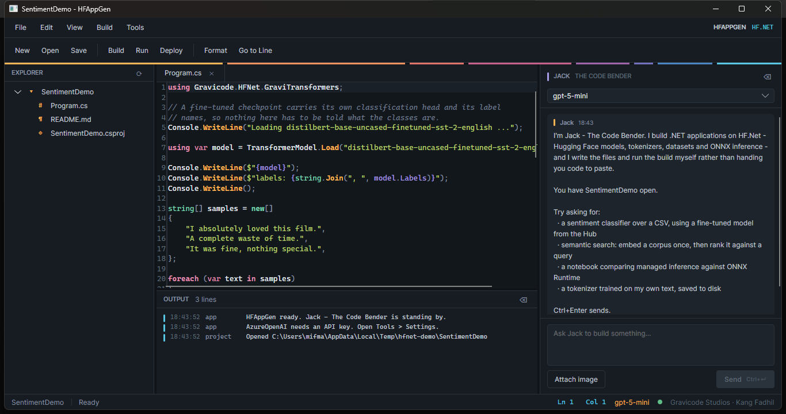
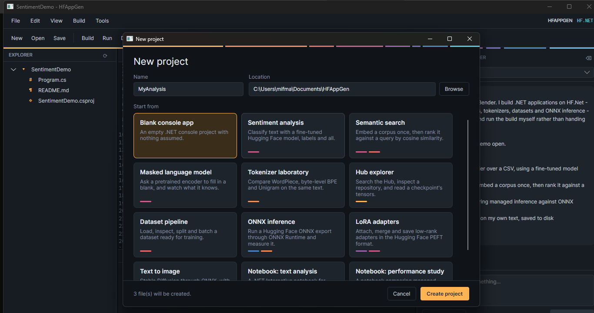

# HF.Net

**A Hugging Face style machine learning ecosystem for .NET.**

Load a real model from the Hugging Face Hub, tokenize exactly the way it was trained, and run it —
all from C#, with no Python in the loop.

```csharp
using var model = TransformerModel.Load("bert-base-uncased");

foreach (var fill in model.FillMask("The capital of France is [MASK].", topK: 3))
    Console.WriteLine($"{fill.Token,-10} {fill.Score:P2}");

// paris      41.53 %
// lille       7.16 %
// lyon        6.31 %
```

Built on [Gravicode.Science](https://github.com/DotNetVibeCoderz/Vibe_ML/tree/main/GravicodeScience)
— `GraviNum` (arrays), `GraviFrame` (dataframes) and `GraviLearn` (classical ML).

*Dibuat oleh Gravicode Studios, dipimpin oleh Kang Fadhil.*

**Documentation:** [English](docs/) · [Bahasa Indonesia](docs/id/)

---

## The libraries

Each mirrors a package in the Python Hugging Face stack.

| Library | Mirrors | What it does |
|---|---|---|
| **GraviHub** | `huggingface_hub` | Hub download and upload, a readable local cache, and readers for the formats the Hub serves: **safetensors** and **`pytorch_model.bin`** |
| **GraviTokenizers** | `tokenizers` | WordPiece, byte-level BPE and Unigram, loading `tokenizer.json` — with character offsets that point back into the original text |
| **GraviDatasets** | `datasets` | CSV, Parquet, JSON and JSON Lines, Hub datasets, splits, streaming and memory-mapped reads |
| **GraviTransformers** | `transformers` | Load pretrained BERT-family encoders and run them: classification, fill-mask, named entities, question answering, embeddings, similarity |
| **GraviPEFT** | `peft` | LoRA adapters in the Hugging Face PEFT format — apply, merge, save, load |
| **GraviAccelerate** | `accelerate` | Device selection across CPU SIMD and ILGPU, sharding, weighted gradient averaging, honest throughput measurement |
| **GraviOptimum** | `optimum` | ONNX Runtime inference with an explicitly chosen execution provider, and weight quantisation that reports its measured error |
| **GraviDiffusers** | `diffusers` | DDPM, DDIM and Euler schedulers, and a Stable Diffusion text-to-image pipeline over ONNX |

```
Gravicode.Science ──► GraviHub ──┬──► GraviTokenizers ──┐
  GraviNum                       ├──► GraviDatasets     ├──► GraviTransformers ──┬──► GraviPEFT
  GraviFrame                     └──► GraviOptimum ─────┘                        └──► GraviDiffusers
  GraviLearn                          GraviAccelerate
```

## Install

```bash
dotnet add package Gravicode.HFNet.GraviTransformers
```

Each library is a separate package; add only what you need, and the rest comes transitively.

| | |
|---|---|
| `Gravicode.HFNet.GraviHub` | `Gravicode.HFNet.GraviPEFT` |
| `Gravicode.HFNet.GraviTokenizers` | `Gravicode.HFNet.GraviAccelerate` |
| `Gravicode.HFNet.GraviDatasets` | `Gravicode.HFNet.GraviOptimum` |
| `Gravicode.HFNet.GraviTransformers` | `Gravicode.HFNet.GraviDiffusers` |

Or build from source:

```bash
git clone <this repository>
cd HF.Net
dotnet build HF.Net.sln -c Release
dotnet run --project samples/GraviTransformers.Console -- bert-base-uncased
```

Set `HF_TOKEN` for private or gated repositories, and for a much higher anonymous rate limit.
Downloads land in the same cache the Python tooling uses (`HF_HUB_CACHE`, then `HF_HOME`), so the
two share a machine without duplicating a single checkpoint.

## What it can do today

**Reads both weight formats the Hub serves.** safetensors is memory-mapped and read lazily, so
listing four hundred tensors costs a header read rather than a multi-gigabyte load. The many
repositories that only ever published `pytorch_model.bin` work too — the pickle is interpreted
against an allow-list of tensor constructors, so nothing in the file is executed.

**Tokenizes identically to the reference implementation.** `bert-base-uncased` on
*"Hello, world! Tokenizers are unbelievable."* produces
`[CLS] hello , world ! token ##izer ##s are unbelievable . [SEP]` with ids
`101 7592 1010 2088 999 19204 17629 2015 2024 23653 1012 102` — the same ids Python gives.

**Runs real models.** Verified against `bert-base-uncased` (fill-mask),
`distilbert-base-uncased-finetuned-sst-2-english` (classification: 99.99% POSITIVE on
*"I absolutely loved this film."*) and `prajjwal1/bert-tiny` (a pickle-only checkpoint).

**Answers with spans of your text, not with new text.** `dslim/bert-base-NER` on
*"Kang Fadhil founded Gravicode Studios in Bandung"* returns `PER Kang Fadhil` (98.8%),
`ORG Gravicode Studios` (99.5%) and `LOC Bandung` (99.7%) with exact character offsets, and
`distilbert-base-cased-distilled-squad` extracts its answer from the passage it was given. Sentence
pairs are exact: segment 0 is folded into the word embeddings and segment 1 is carried as a
difference applied per position.

## What it cannot do yet

Stated plainly, because a library that fails quietly is worse than one that says no:

- **Decoder-only models** — GPT, Llama, Mistral — are **refused**, not half-loaded. They need causal
  masking and rotary positions this encoder does not have.
- **LoRA adapter matrices are not trainable here.** They can be applied, merged, saved and loaded,
  and a task head trains over a frozen encoder. Train the adapters themselves with PEFT in Python
  and serve them here.
- **Vision models are not implemented.** ViT and CLIP need a patch embedding this encoder does not
  have; text is the whole surface today.
- **Diffusion needs an ONNX export**, not the PyTorch weights.
- **Uploads are capped at 10 MB.** Real weights need Git LFS, which GraviHub does not implement.

## How it compares to Python

Measured against the reference implementation on the same machine in the same session — full
method and caveats in **[docs/benchmarks.md](docs/benchmarks.md)**.

| | Python | HF.Net | |
|---|---:|---:|---|
| Tokenize 1,000 documents | 18.1 ms | **10.9 ms** | **1.66x faster** |
| Open a 420 MB checkpoint, list 206 tensors | 0.65 ms | 0.71 ms | level |
| Read one 30,522 × 768 tensor | 1.1 ms | 197 ms | 173x slower |
| bert-base forward pass, 1 document | 50.8 ms | 300–600 ms | 6–12x slower |
| The same work through ONNX Runtime | — | **0.67 ms** | the production path |

**Tokenization is faster than the Rust `tokenizers` crate, and the ids are identical.** Reading a
tensor is slower because every value is widened to `double` — structural, not fixable. Managed
inference is *much* slower than torch, and that is the expected shape: the managed encoder exists so
a model can be **loaded, inspected and understood** in pure .NET. When you need throughput, export
to ONNX and run it through `GraviOptimum`.

**And they agree.** Same prompt, same checkpoint, top five identical to a tenth of a percentage
point:

```
The capital of France is [MASK].

        python            hf.net
  1     paris   41.68%    paris   41.53%
  2     lille    7.14%    lille    7.16%
  3     lyon     6.34%    lyon     6.31%
```

## HF Gallery

`samples/HFGallery` is a desktop application that runs nine HF.Net use cases against real models and
shows the answer next to the code that produced it. Nothing in it is mocked.


Entities come back as spans of the original text, taken from the tokenizer's character offsets, so
the casing and the punctuation survive and an off-by-one is visible rather than plausible.


`bert-base-uncased` is 420 MB, and the treemap says where those bytes are: feed-forward 216 MB,
attention 108 MB, embeddings 91 MB. Producing it costs a header parse, not a 420 MB load.


Eight sentences from three topics, embedded and projected onto two principal components. The groups
separate without being told to.

```bash
dotnet run --project samples/HFGallery
dotnet run --project samples/HFGallery -- --list            # the catalog
dotnet run --project samples/HFGallery -- --run Named       # one case, headless
dotnet run --project samples/HFGallery -- --open Question   # open on a case and run it
```

The charts are drawn directly into a `DrawingContext` — no charting library — and the palettes were
searched in OKLCH and checked with a validator rather than chosen by eye. See
[docs/hf-gallery.md](docs/hf-gallery.md) for the other six cases and what the validator turned up.

## HFAppGen

`tools/HFAppGen` is an Avalonia IDE whose assistant — **Jack, the Code Bender** — builds HF.Net
applications from a prompt. It writes the files, runs the build, and fixes what the compiler says.
Supports OpenAI, Azure OpenAI, Claude, Gemini and Ollama through Semantic Kernel; everything is
configured in `app.config` and editable from the UI.



The banded rule under the toolbar is the **offset rail**: eight spans, one per HF.Net library, each
as wide as that library's real share of the source.



```bash
dotnet run --project tools/HFAppGen
dotnet run --project tools/HFAppGen -- --selftest   # one headless round trip
```

See [docs/HFAppGen.md](docs/HFAppGen.md).

## Repository layout

```
src/            one class library per Gravi* project
samples/        Gravi*.Console apps, plus HFGallery — nine use cases in an Avalonia window
tests/          Gravi*.Tests — 191 tests, no network required
benchmarks/     comparison/ — HF.Net measured against the Python reference
notebooks/      .NET Interactive notebooks (01 getting started, 02 performance)
datasets/       titanic.csv, iris.csv, imdb_reviews.csv, finance_timeseries.csv
docs/           one page per library, plus id/ mirroring every page
tools/HFAppGen/ the Avalonia app generator
```

## Commands

```bash
dotnet build HF.Net.sln -c Release
dotnet test                                                   # every test
dotnet test tests/GraviHub.Tests                              # one project
dotnet test tests/GraviHub.Tests --filter "FullyQualifiedName~SafeTensors"
dotnet run --project samples/GraviHub.Console
dotnet run --project samples/HFGallery                        # the use case gallery
dotnet run --project tools/HFAppGen                           # the IDE
dotnet pack HF.Net.sln -c Release                             # -> artifacts/packages
dotnet format
```

## Requirements

- .NET 10 SDK
- An internet connection for anything that touches the Hub (the built-in datasets and every test
  work offline)

## Licence

MIT.
