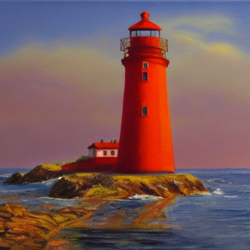
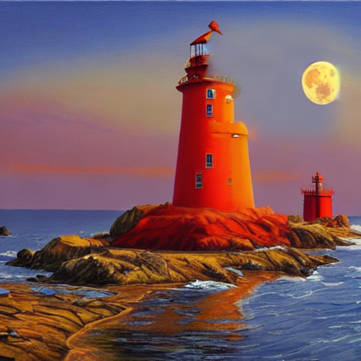

# GraviDiffusers

**Denoising diffusion: schedulers, and Stable Diffusion over ONNX — text to image, image to image, inpainting, LoRA.**

Mirrors `diffusers`.

*Dibuat oleh Gravicode Studios, dipimpin oleh Kang Fadhil.*

```csharp
using Gravicode.HFNet.GraviDiffusers;
```

## The noise schedule

Every sampler is a different way of walking the forward noise process backwards, so the schedule has
to match the one the weights were trained with or nothing else matters.

```csharp
NoiseSchedule.StableDiffusion;   // 1000 steps, 0.00085 -> 0.012, ScaledLinear
NoiseSchedule.Ddpm;              // 1000 steps, 1e-4 -> 0.02, Linear

new NoiseSchedule(trainTimesteps: 1000, betaStart: 0.00085, betaEnd: 0.012,
                  BetaSchedule.ScaledLinear);
```

| Schedule | Shape |
|---|---|
| `Linear` | Betas spaced linearly |
| `ScaledLinear` | The square of a linear ramp in `sqrt(beta)` - what Stable Diffusion trains with |
| `SquaredCosine` | Cosine, adding noise more gently at both ends |

**Using plain linear betas with Stable Diffusion's endpoints** produces images that are recognisably
structured and consistently washed out - easy to mistake for a bad prompt.

```csharp
schedule.Betas; schedule.Alphas; schedule.AlphasCumulative;
schedule.AlphaBar(t);    // 1.0 for t < 0, which lands the last step on a clean sample
schedule.Sigma(t);
```

## Samplers

```csharp
// Built from the repository's own scheduler_config.json - the usual way.
var config = SchedulerConfig.Load("scheduler/scheduler_config.json");
IScheduler scheduler = new DdimScheduler(config, eta: 0);   // deterministic
                     = new DdpmScheduler(config);          // the reference
                     = new EulerScheduler(config);         // good at 20-30 steps
```

`SchedulerConfig` carries everything diffusers reads from that file: the betas, `timestep_spacing`
(`leading`, `linspace`, `trailing`), `steps_offset`, `set_alpha_to_one`, `prediction_type`
(`epsilon`, `v_prediction`, `sample`) and `clip_sample`. Each one changes which timesteps are visited
or how a step is taken, so a sampler built without them walks a different path from the one the
model was published with. The older `(NoiseSchedule)` constructors still work, for experiments.

**DDIM** reconstructs an estimate of the clean sample at every step and re-noises it to the next
level. That is what lets it skip timesteps: it stays consistent visiting 25 of 1000, where DDPM's
update assumes adjacent steps and degrades badly. At `eta = 0` it is fully deterministic.

**DDPM** is faithful and slow, one step per training timestep. It is here as the reference the
faster samplers are checked against.

**Euler** treats the reverse process as an ODE in the noise level and takes plain Euler steps along
it, which is why twenty or thirty steps are enough. Its timesteps can fall between training steps;
the sigmas are interpolated there, as diffusers does.

### How the coefficients are verified

Two ways. Build `x_t` from a known `x₀` and a known noise, then let the model return that exact noise
at every step: DDIM's trajectory must land back on `x₀`, and it does to **1e-9**. And every sampler's
timesteps, sigmas and step outputs are pinned to values printed by diffusers 0.40 itself, for each
spacing and prediction type.

## Text to image

```csharp
using var pipeline = DiffusionPipeline.FromPretrained("nmkd/stable-diffusion-1.5-onnx-fp16");

var options = new GenerationOptions(Steps: 25, GuidanceScale: 7.5, Width: 512, Height: 512, Seed: 42,
                                    NegativePrompt: "blurry");

using var lighthouse = pipeline.Generate(
    "a red lighthouse on a cliff at dawn, oil painting", options,
    onStep: (step, total) => Console.Write($"\r  {step}/{total}"));

lighthouse.Save("lighthouse.png");
```



That picture, at 25 DDIM steps on a laptop CPU in about six minutes. diffusers' own
`OnnxStableDiffusionPipeline` with the same seed gives the same picture, to 54.7 dB PSNR.

### It is diffusers' pipeline, step for step

The pipeline follows diffusers' ONNX pipelines line by line, so the same settings give the same
image:

- **The noise** is `np.random.RandomState(seed).randn(...)`: `NumpyRandom` reproduces NumPy's
  Mersenne Twister and its Gaussian draw bit for bit.
- **The prompt** is tokenized as CLIP's tokenizer does it - lower-cased, regex-split, byte-level BPE
  with `</w>` - and padded with the model's own pad token (`<|endoftext|>` on SD 1.x, `!` on 2.x).
- **Guidance** runs the UNet once on a batch of `[unconditional, conditional]`.
- **The geometry** comes from the repository: the VAE's scale factor from `block_out_channels`, the
  latent scaling from `scaling_factor`, the UNet's input channels from its config. A model with a
  different VAE produces an image of the size asked for.
- **Pixels** are rounded, not truncated - truncating darkens every pixel by half a level.

On float32 exports the result is identical to diffusers' to the last pixel; that is tested on tiny
exported models, for DDIM, Euler, image to image and inpainting. On float16 exports diffusers keeps
its latents in float16 between steps and HF.Net in double, so they agree to about 55 dB.

### Repositories that work

| Repository | Size | Notes |
|---|---|---|
| `nmkd/stable-diffusion-1.5-onnx-fp16` | 2.1 GB | SD 1.5, float16. Checked against diffusers above. |
| `onnx-community/stable-diffusion-v1-5-ONNX` | 4.3 GB | SD 1.5, float32. |
| `amd/stable-diffusion-1.5_io16_amdgpu` | 2.1 GB | SD 1.5, float16. |
| `onnxruntime/sd-turbo` | 2.6 GB | **CUDA only.** Built from ONNX Runtime's fused GPU kernels (`NhwcConv`, `GroupNorm`); on a CPU it is refused by name. |
| `optimum-internal-testing/tiny-stable-diffusion-onnx` | 9 MB | Random weights, for testing. |

A repository needs `text_encoder/`, `unet/` and `vae_decoder/` with a `model.onnx` each, and
`vae_encoder/` for image to image and inpainting. One holding only PyTorch weights is refused on
load; convert it with `optimum-cli export onnx --model <id> <out>`. `DiffusionPipeline.FromDirectory`
opens an export on disk.

## Image to image

```csharp
using var night = pipeline.ImageToImage("the same lighthouse at night, stars", lighthouse,
                                        strength: 0.6, options);
```

The picture is encoded, noised to `strength` of the way through the schedule and denoised from
there: 0 returns it, 1 ignores it.

**The VAE encoder as exported is not deterministic.** It samples its latent inside the graph with a
`RandomNormalLike` that has no seed, so it returns a different latent on every call - in Python as
well. HF.Net writes a copy beside it once, `vae_encoder/model.mean.onnx`, with that node's scale set to
zero, which gives the distribution's mean. A seed then reproduces a result.

On SD 1.5 at strength 0.6 the result agrees with diffusers' `OnnxStableDiffusionImg2ImgPipeline`, run
with the same mean-patched encoder and seed, to 57.8 dB PSNR.

## Inpainting

```csharp
using var repainted = pipeline.Inpaint("a full moon", lighthouse, mask, options);   // white = repaint
```

With an **inpainting UNet** (nine input channels) this is diffusers' inpainting pipeline: the UNet sees
the latents, the mask at latent resolution, and the latents of the image with the masked area blacked
out. With an **ordinary UNet** it blends instead - after every step the unmasked area is replaced by
the original noised to that step - which works on any checkpoint and is softer at the edges.



The lighthouse above, with the sky's top right corner masked and `"a full moon in the sky"`, on the
ordinary SD 1.5 UNet.

## Emphasis

```csharp
pipeline.PromptWeighting = true;
pipeline.Generate("a (red:1.4) lighthouse at [dawn], ((oil painting))", options);
```

AUTOMATIC1111's syntax and arithmetic: `(word)` multiplies by 1.1, `[word]` divides by it,
`(word:1.4)` sets the weight, brackets nest and `\(` escapes. Each token's text-encoder output is
scaled by its weight and the whole is rescaled to its original mean. It is off by default, so a plain
prompt is always encoded exactly as diffusers encodes it. `PromptWeights.Parse` shows the pieces.

## LoRA

```csharp
var report = pipeline.LoadLora("some-user/some-sd15-lora", scale: 0.8);   // a file, folder or repo
Console.WriteLine(report);      // LoRA: 128 UNet and 72 text-encoder layers
pipeline.UnloadLoras();
```

kohya's layout (`lora_unet_..._to_q.lora_down.weight`) and diffusers' or PEFT's
(`unet....to_q.lora_A.weight`) are both read. An ONNX export's weights are anonymous
(`onnx::MatMul_2567`), but its node names keep the PyTorch module path, so each adapter is matched
through the node that consumes the weight. The update is added to the stored weight and handed to ONNX
Runtime as a replacement initializer; the model file is never rewritten. A LoRA whose modules match
nothing is refused - it was trained for another model.

Tested against a LoRA fused into the UNet and text encoder in PyTorch and then exported: the two
agree except for three values in 12,288 that differ by one level.

## Things that will catch you

**A guidance scale above 1 runs the UNet on a batch of two**, conditioned and not. A scale of exactly
1 is not merely a weak setting: it halves the work.

**Width and height must be multiples of the VAE's scale factor** - 8 for Stable Diffusion. diffusers'
ONNX pipelines assume 8 whatever the VAE says; on a model whose VAE downsamples less, they return an
image smaller than the one asked for.

**Budget about 8 GB of memory for SD 1.5 on the CPU**, even from a 2 GB float16 export: ONNX Runtime has
few float16 kernels on the CPU, so it inserts casts and keeps float32 copies of the weights it needs.

**The float16 exports are float16 all the way down**, the timestep included. HF.Net converts at the
boundary; nothing needs setting.

## See also

[GraviOptimum](GraviOptimum.md) · [GraviTokenizers](GraviTokenizers.md) ·
[notebook 05](../notebooks/05-stable-diffusion.ipynb)
