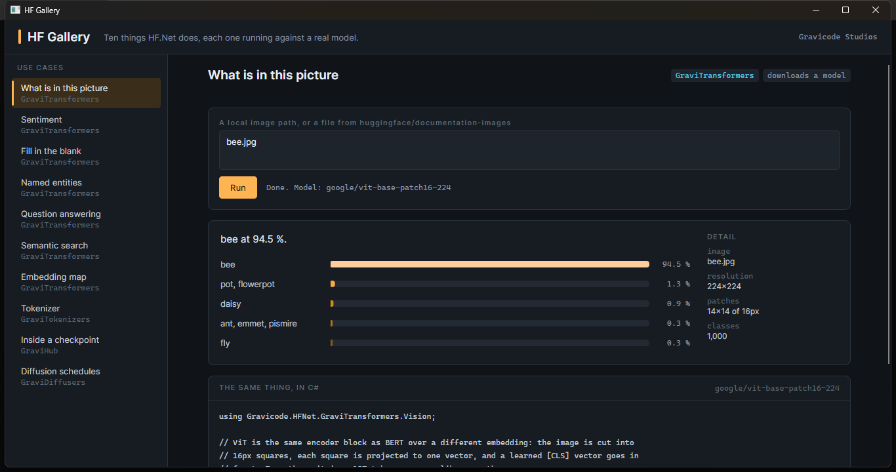
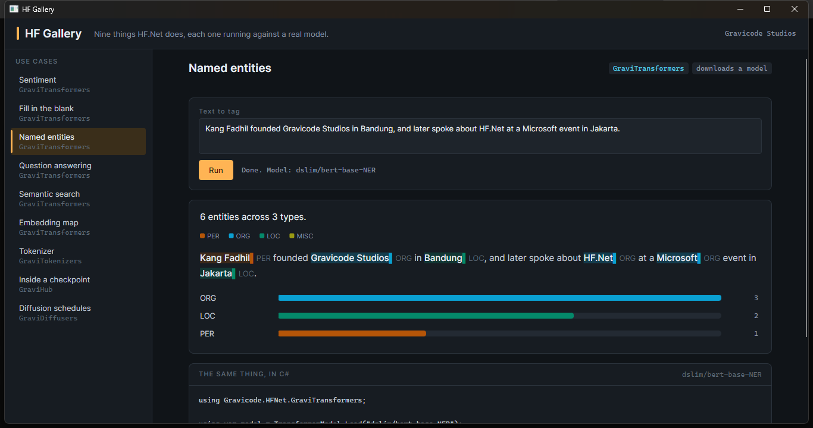
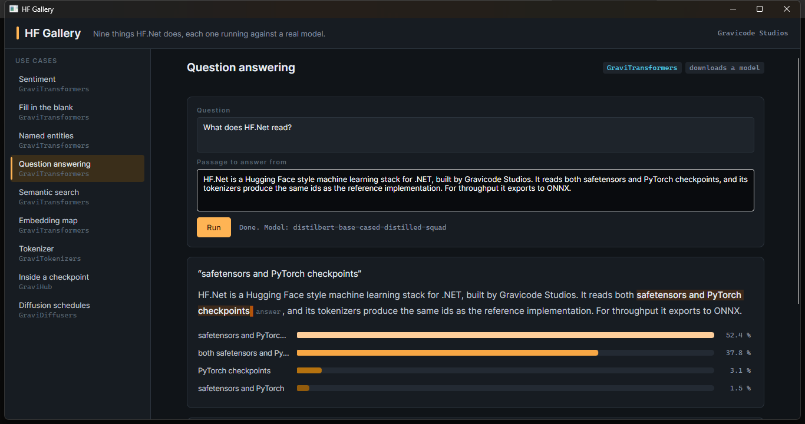
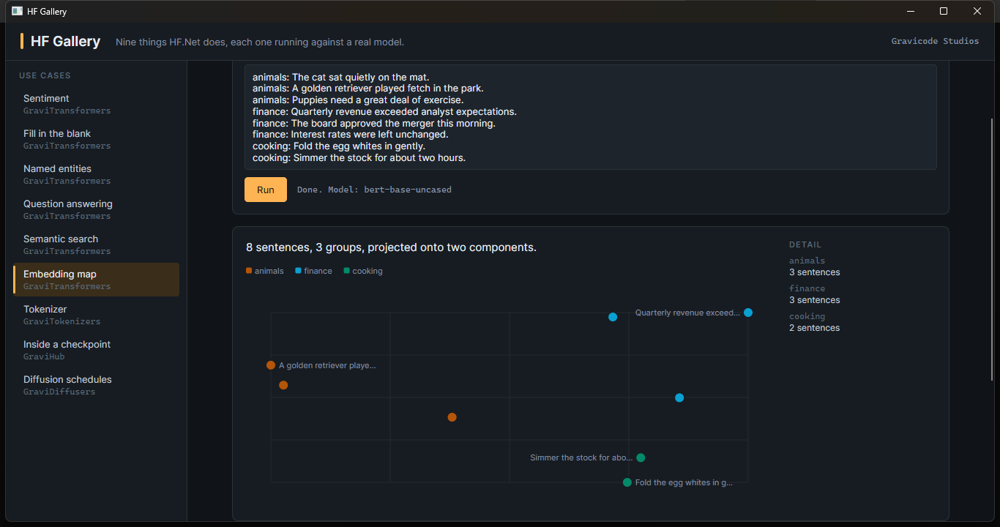
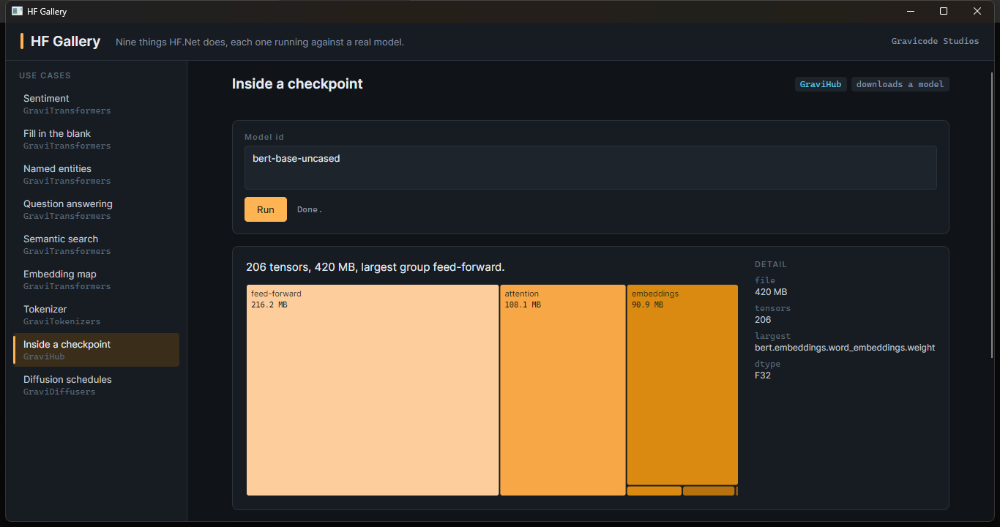
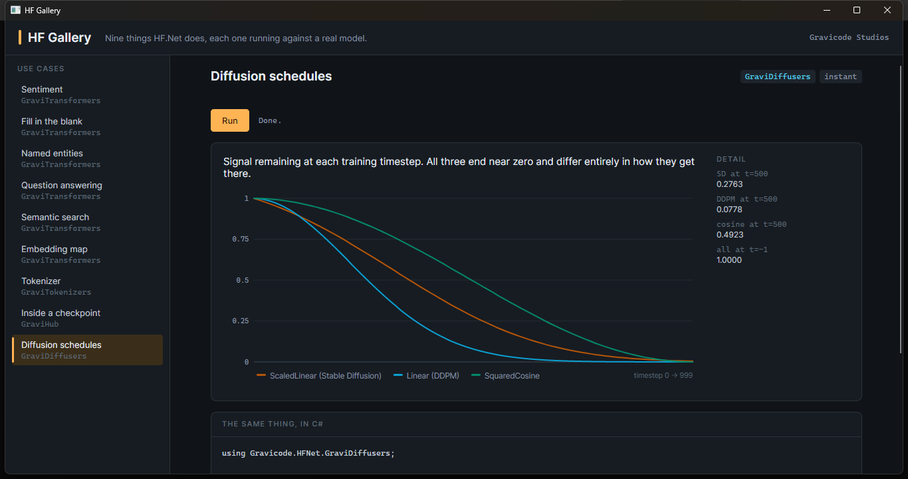
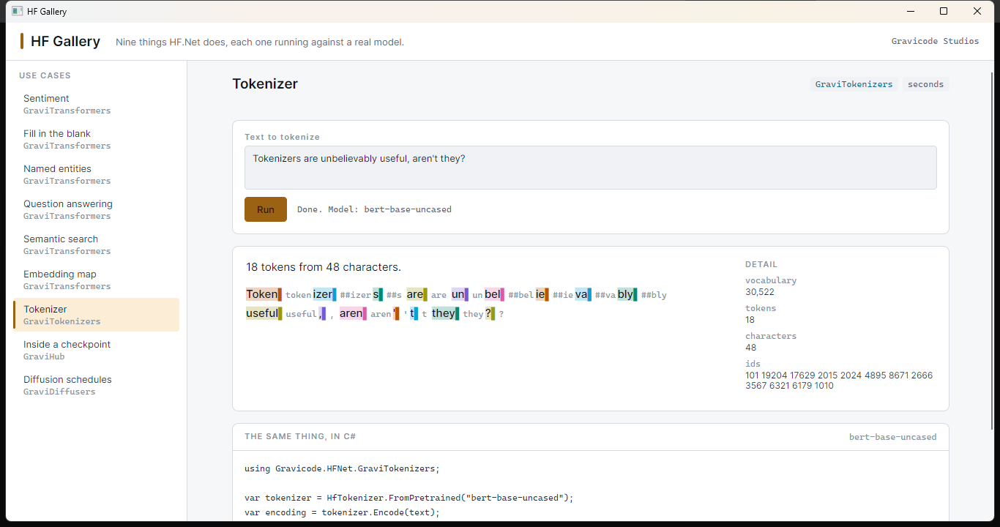

# HF Gallery

*[Bahasa Indonesia](id/hf-gallery.md)*

`samples/HFGallery` is a desktop application that runs ten HF.Net use cases against real models
and shows both the answer and the code that produced it. Nothing in it is mocked: every panel you
see is the output of a checkpoint downloaded from the Hub during that run.

```bash
dotnet run --project samples/HFGallery
```

| Flag | What it does |
|---|---|
| *(none)* | Opens the window on the first case. |
| `--list` | Prints the catalog and exits. |
| `--run <case>` | Runs one case in the terminal and prints what it produced. |
| `--open <case>` | Opens the window and runs that case immediately. |
| `--light` | Uses the light theme. |

`<case>` is a prefix of the case title, so `--run Named` is enough.

---

## The ten cases

| Case | Library | Model | What it shows |
|---|---|---|---|
| What is in this picture | GraviTransformers | `google/vit-base-patch16-224` | A Vision Transformer over image patches |
| Sentiment | GraviTransformers | `distilbert-base-uncased-finetuned-sst-2-english` | A fine-tuned head and its own label names |
| Fill in the blank | GraviTransformers | `bert-base-uncased` | The masked-language head |
| Named entities | GraviTransformers | `dslim/bert-base-NER` | Token classification, as spans of the input |
| Question answering | GraviTransformers | `distilbert-base-cased-distilled-squad` | Span extraction over a sentence pair |
| Semantic search | GraviTransformers | `bert-base-uncased` | Embed a corpus once, rank it per query |
| Embedding map | GraviTransformers | `bert-base-uncased` | 768 dimensions projected to two |
| Tokenizer | GraviTokenizers | `bert-base-uncased` | Which characters became which piece |
| Inside a checkpoint | GraviHub | any repo with safetensors | Where a 420 MB model's bytes actually are |
| Diffusion schedules | GraviDiffusers | *none* | Signal remaining at each training timestep |

---

## What is in this picture

A Vision Transformer is the same encoder block as BERT over a different embedding: the image becomes
a 14x14 grid of 16px squares, each square becomes one vector, and a learned `[CLS]` vector goes in
front. The picture is fetched from the Hub, so nothing is checked in.



## Named entities

Spans are drawn where they sit in the original text, taken from the tokenizer's character offsets.
That is the difference between a list of extracted strings and an answer you can check: the casing,
the punctuation and the position all survive, and an off-by-one in the offsets is immediately
visible instead of silently plausible.



## Question answering

The question and the passage go in as a pair, which is also what exercises the segment embeddings.
Only positions inside the passage are eligible and the end can never precede the start, so the
answer is always a real span of the text rather than something assembled from two unrelated
argmaxes.



## Embedding map

Eight sentences from three topics, embedded with `bert-base-uncased` and projected onto their first
two principal components. The groups separate without being told to — that separation is the whole
claim behind semantic search, shown rather than asserted.



## Inside a checkpoint

`bert-base-uncased` is 420 MB. The treemap says where those bytes went: feed-forward 216 MB,
attention 108 MB, embeddings 91 MB. Reading it costs a header parse, not a 420 MB load — the file
is memory-mapped and only the listing is touched.



## Diffusion schedules

Three noise schedules over 1,000 training timesteps. They all end near zero and differ entirely in
how they get there, which is why a Stable Diffusion checkpoint run on `Linear` betas produces
images that look like a bad prompt rather than like a bug.



## Tokenizer, in the light theme

The light palette is its own set of steps rather than an inversion of the dark one, and `--light`
exists so it can actually be looked at.



---

## How the charts are built

There is no charting library. `Controls/Charts.cs` draws four forms — bars, scatter, lines,
treemap — directly into a `DrawingContext`, and `Controls/SpanView.cs` builds the marked passages
from text inlines so that wrapping and selection come from the text stack.

The palettes in `Themes/Tokens.axaml` were searched in OKLCH and checked with a validator rather
than chosen by eye, which is what turned up the problem worth recording here: **the eight-band
library ramp HFAppGen uses on its offset rail fails as a categorical palette.** Its adjacent pairs
measure ΔE 6.8 under normal vision, well under the floor of 15 — correct for a rail where adjacency
carries meaning, wrong the moment the same colours have to say *which thing this is*. The
categorical set the gallery uses instead measures ΔE 9.4 under deuteranopia and ΔE 15.8 under
normal vision, across all pairs, on both surfaces.

Two consequences of that are visible in the app:

- **Hues are assigned in fixed order and never cycled.** A seventh category takes the muted ink and
  reads as "other" rather than repeating category one's colour, because a repeated hue is a lie
  about identity.
- **Colour follows the entity, not the rank.** In the sentiment chart POSITIVE keeps its hue whether
  it comes first or second, so re-running on different text never repaints the bars.

Sequential colour is used where the encoded quantity really is magnitude — the fill-mask
candidates, the treemap cells — and the dark and light themes have separate ramps, because a ramp
wide enough to read as a ramp always puts one end too close to whichever ground it is drawn on.

---

## Adding a case

Derive from `GalleryCase`, fill in the metadata, and return a `CaseResult`:

```csharp
internal sealed class MyCase : GalleryCase
{
    public override string Title => "My case";
    public override string Blurb => "One line saying what it demonstrates.";
    public override string Library => "GraviTransformers";
    public override string Model => "bert-base-uncased";
    public override string? DefaultInput => "Something to start from.";

    public override string Code => """
        // The C# shown in the code panel.
        """;

    public override async Task<CaseResult> RunAsync(
        string input, string second, IProgress<string> progress, CancellationToken token)
    {
        var model = await ModelCache.ModelAsync(Model, progress, token);

        return new CaseResult
        {
            Summary = "A sentence describing what came back.",
            Bars = [new Datum("first", 0.9), new Datum("second", 0.1)],
        };
    }
}
```

Then add it to `Catalog.All`. Whichever fields of `CaseResult` you fill in get drawn; the rest stay
hidden. Models come from `ModelCache` so that two cases on the same checkpoint share one load.

---

*Dibuat oleh Gravicode Studios, dipimpin oleh Kang Fadhil.*
