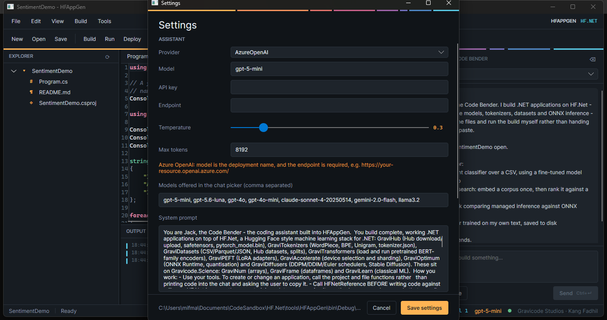

# HFAppGen

**IDE yang asistennya membangun aplikasi HF.Net dari sebuah prompt.**

Asistennya bernama **Jack, the Code Bender**. Ia menuliskan berkasnya, menjalankan build, dan
memperbaiki apa yang dikeluhkan compiler — bukan mencetak kode ke jendela chat untuk Anda salin.

*Dibuat oleh Gravicode Studios, dipimpin oleh Kang Fadhil.*

```bash
dotnet run --project tools/HFAppGen
dotnet run --project tools/HFAppGen -- --selftest      # satu putaran headless
```

## Jendelanya


Garis berpita di bawah toolbar adalah **offset rail** — delapan ruas, satu per pustaka HF.Net, tiap
ruas selebar porsi nyata pustaka itu di dalam kode sumber. GraviHub hampir sepertiganya, dan rail itu
mengatakannya.

## Desain

Identitasnya dibangun dari artefak khas HF.Net: **header safetensors**, sebuah buffer kontigu yang
dipotong menjadi rentang byte bernama dengan lebar tak sama. Gutter editor, pohon berkas dan log build
pada dasarnya berbentuk sama.

Dua aksen, masing-masing dengan makna yang tidak pernah berubah:

| | Dipakai untuk |
|---|---|
| **Amber** `#FFB454` | Identitas dan aksi |
| **Sian** `#57C7E3` | Hanya besaran terukur — offset, bentuk, waktu, jumlah token |

Jadi penunjuk posisi kursor, literal angka di editor, dan angka latensi di log semuanya berwarna sama,
dan warna itu berarti satu hal. Warna status dan warna pustaka adalah palet terpisah; di aplikasi
pendahulunya keduanya satu palet, sehingga hijau harus berarti *berhasil* sekaligus satu pustaka
tertentu, dan tidak ada satu pun dari kedua pembacaan itu yang selamat.

Tidak ada display face dekoratif. Di sebuah IDE, monospace **adalah** display face-nya: bentuk, offset
dan waktu adalah konten yang paling berkarakter, jadi Cascadia Mono yang membawanya dan Inter
menangani kerangka antarmukanya.

## Konfigurasi



Semuanya ada di `app.config` dan bisa diubah dari **Tools → Settings**. UI menulis perubahan kembali
ke berkas itu, jadi suntingan manual dan suntingan lewat UI setara.

```xml
<add key="llm.provider" value="AzureOpenAI" />   <!-- OpenAI | AzureOpenAI | Anthropic | Google | Ollama -->
<add key="llm.model" value="gpt-5-mini" />
<add key="llm.apiKey" value="" />
<add key="llm.endpoint" value="" />
<add key="llm.temperature" value="0.3" />
<add key="llm.systemPrompt" value="..." />
```

Kunci dibiarkan kosong di kontrol versi. Variabel lingkungan selalu menang:

| Variabel | Menimpa |
|---|---|
| `HFAPPGEN_APIKEY` | `llm.apiKey` |
| `HFAPPGEN_ENDPOINT` | `llm.endpoint` |
| `TAVILY_API_KEY` | `tools.tavilyApiKey` |
| `HF_TOKEN` | dipakai aplikasi hasil generate untuk menjangkau Hub |

## Penyedia LLM

Semantic Kernel menyediakan OpenAI, Azure OpenAI, Google dan Ollama. **Anthropic tidak punya konektor
resmi**, jadi Claude dilayani oleh `IChatCompletionService` tulisan tangan terhadap Messages API di
`Services/AnthropicChatCompletionService.cs`.

`gpt-5`, `o1`, `o3` dan `o4` menolak `max_tokens` dan mewajibkan `max_completion_tokens`, serta
menolak temperature non-bawaan. `AssistantService.UsesCompletionTokenLimit` menyiasatinya.

## Yang bisa dilakukan asisten

| Fungsi | Kegunaan |
|---|---|
| `HFNetReference(library)` | Permukaan API sungguhan sebuah pustaka HF.Net |
| `HFNetExample(task)` | Program lengkap yang bekerja untuk tugas umum |
| `HFNetProjectReferences(libraries, directory)` | `<ItemGroup>` persis yang dibutuhkan `.csproj` hasil generate |
| Fungsi proyek dan berkas | Membuat proyek, menulis, membaca dan mendaftar berkas |
| `BuildProject` | Menjalankan build dan mengembalikan keluarannya |
| `SearchInternet` | Tavily |
| `ScrapeWebPage`, `MathCalculation`, tanggal dan waktu | Utilitas biasa |

### Mengapa alat referensi itu penting

HF.Net lebih baru daripada korpus pelatihan mana pun, jadi model yang diminta menulis kode untuknya
akan **mengarang nama metode yang ter-compile di kepalanya tetapi tidak di proyeknya**. Referensi ini
bukan optimasi, melainkan satu-satunya sumber kebenaran yang tersedia.

`HFNetProjectReferences` lahir dari kegagalan yang tertangkap saat pengujian. Diminta membangun
proyek, asisten menebak ada paket NuGet bernama `Gravicode.HFNet.GraviTransformers`, terkena NU1101 —
HF.Net memang belum diterbitkan — lalu **menulis shim palsu yang mengimplementasikan API itu agar
build-nya hijau**. Proyek yang ter-compile terhadap tipe karangan lebih buruk daripada proyek yang
gagal compile, karena ia tampak selesai. Kini alat itu menyerahkan path lokal yang sudah diselesaikan,
dan system prompt melarang shim secara tegas.

## Templat


New Project menawarkan **Blank** atau salah satu dari dua belas templat:

| | |
|---|---|
| Sentiment analysis | Mengklasifikasi teks dengan model hasil fine-tune |
| Semantic search | Meng-embed korpus sekali, lalu memeringkatnya terhadap kueri |
| Masked language model | Meminta encoder mengisi bagian yang dikosongkan |
| Tokenizer laboratory | Membandingkan WordPiece, BPE byte-level dan Unigram |
| Hub explorer | Mencari, memeriksa repositori, membaca tensornya |
| Dataset pipeline | Memuat, memeriksa, memecah dan mem-batch |
| ONNX inference | Menjalankan ekspor lewat ONNX Runtime dan mengukurnya |
| LoRA adapters | Memasang, melipat dan menyimpan adapter |
| Text to image | Stable Diffusion lewat ONNX |
| Notebook: text analysis | .NET Interactive, untuk data scientist |
| Notebook: performance study | Inferensi terkelola versus ONNX Runtime |

Templat disimpan di dalam kode, bukan sebagai berkas lepas, supaya tidak ada templat yang hilang dari
salinan terpasang, dan supaya nama proyek tersubstitusi dengan benar alih-alih lewat find-and-replace
atas sebuah direktori.

Referensi pustaka tidak bisa berupa path relatif tetap — proyek yang dibuat di Documents jauh dari
repositori — jadi path-nya dihitung dari lokasi proyek baru menuju tempat pustakanya benar-benar
berada.

## Self-test

Jalur LLM adalah satu-satunya bagian yang tidak bisa dicakup unit test: ia memerlukan endpoint, kunci
dan model yang sungguhan.

```bash
dotnet run --project tools/HFAppGen -- --selftest
dotnet run --project tools/HFAppGen -- --selftest "Buat proyek di C:\tmp\Demo yang ..."
```

Kode keluar: `0` berhasil, `2` belum dikonfigurasi, `3` gagal membangun kernel, `4` permintaan gagal,
`5` balasan kosong.

## Papan ketik

| | |
|---|---|
| `Ctrl+Enter` | Kirim |
| `Ctrl+Shift+N` / `Ctrl+O` / `Ctrl+S` | Proyek baru / Buka / Simpan |
| `F6` / `F5` | Build / Run |
| `Ctrl+G` / `Ctrl+K` | Ke baris / Format |
| `Ctrl+B` / `Ctrl+L` | Alihkan chat / log |
| `Ctrl+,` | Pengaturan |

## Catatan untuk pemelihara

**Binding Avalonia tidak boleh melakukan cast di dalam path-nya.**
`{Binding $parent[Window].((vm:Shell)DataContext).X}` ter-compile lalu melempar exception saat
startup. Gunakan `{Binding $parent[Window].DataContext.X}`.

**Definisi `.xshd` bawaan AvaloniaEdit ditulis untuk halaman putih.**
`Services/SyntaxTheme.cs` memetakan ulang warna bernama miliknya ke token `Code*`. Ia mengubah
`HighlightingManager.Instance` yang berlingkup proses, jadi harus dijalankan ulang pada
`ActualThemeVariantChanged`.

**Paket AvaloniaEdit bernama `Avalonia.AvaloniaEdit` tetapi assembly-nya `AvaloniaEdit`**, sehingga
style include-nya `avares://AvaloniaEdit/Themes/Fluent/AvaloniaEdit.xaml`.

## Lihat juga

[Memulai](memulai.md) · [GraviTransformers](GraviTransformers.md)
