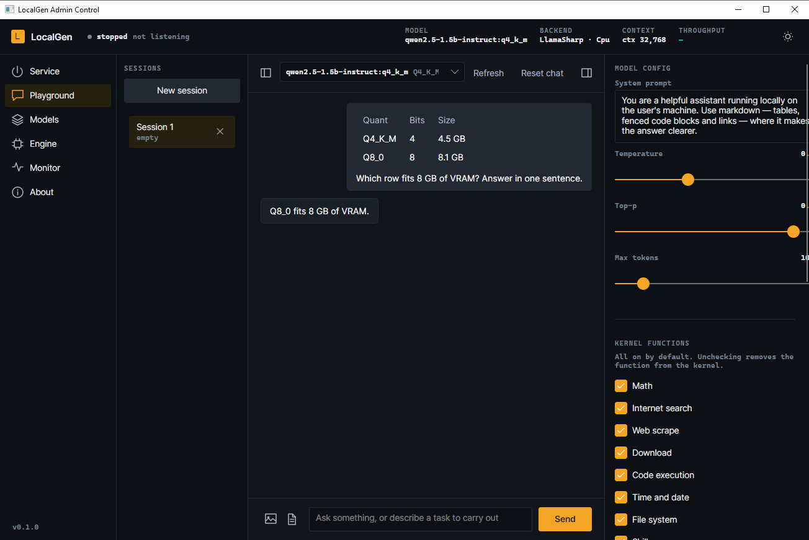
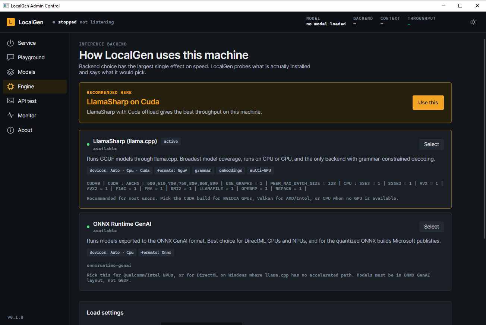
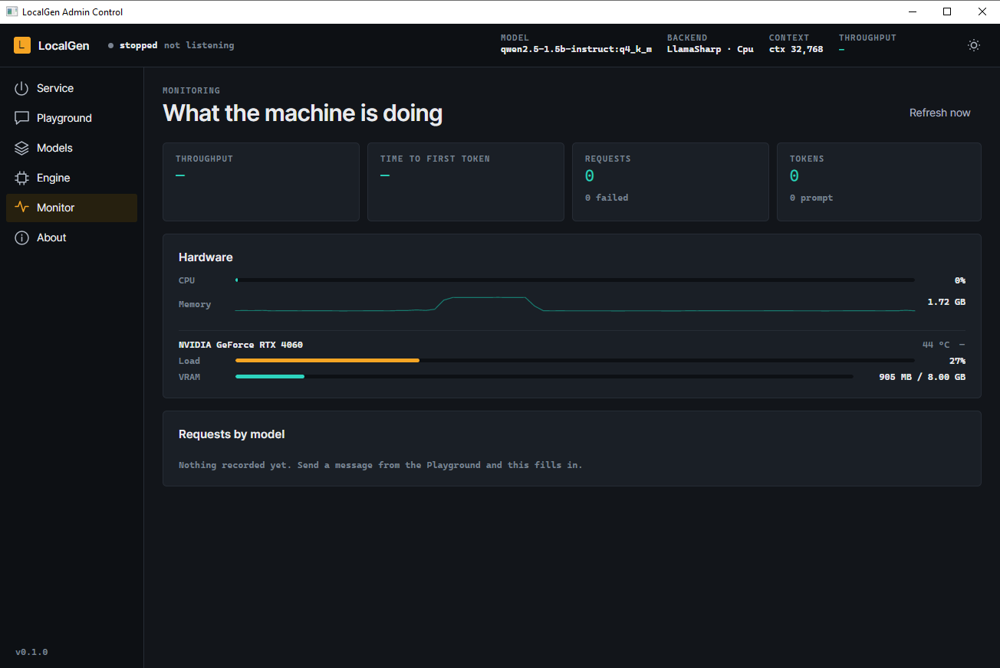
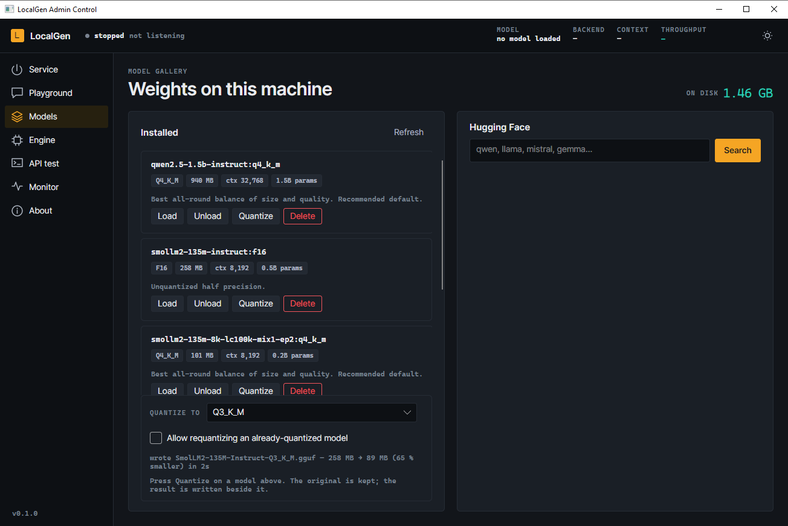
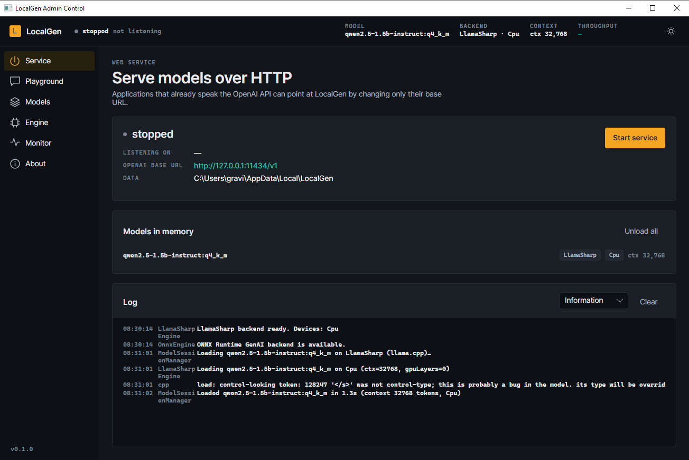
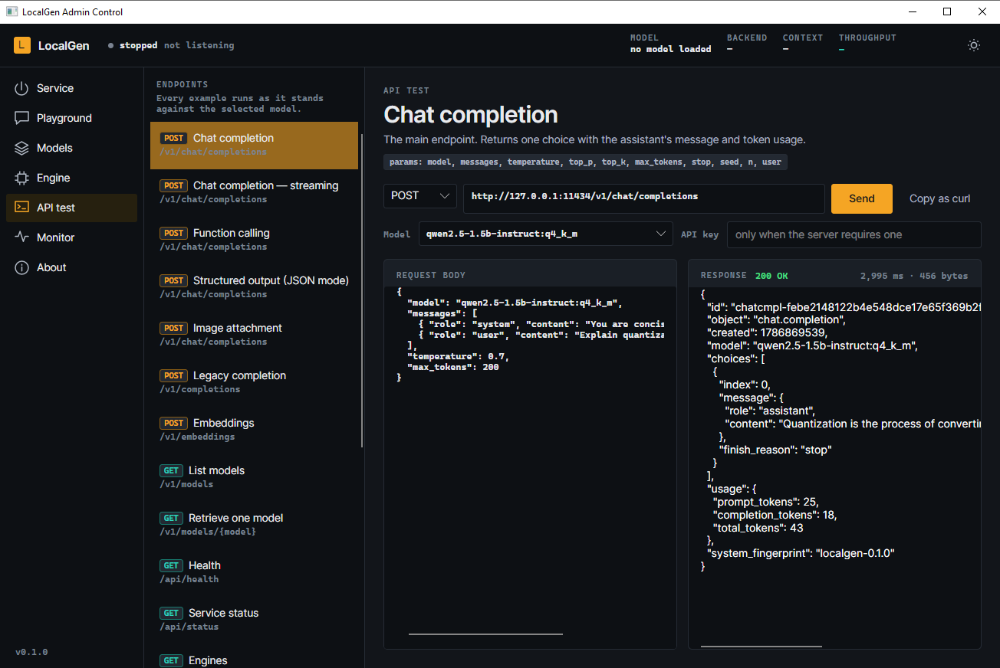
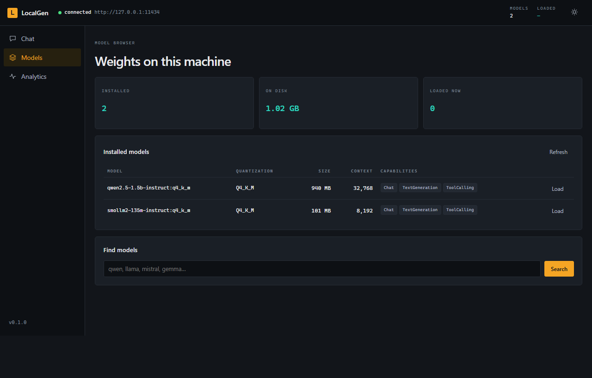

# LocalGen

**A local AI inference engine for .NET.** Run open models on your own machine and serve them
through an API your existing OpenAI code already speaks.

*Dibuat oleh **Gravicode Studios**, dipimpin oleh **Kang Fadhil**.*

> [English](#english) · [Bahasa Indonesia](#bahasa-indonesia)



---

<a id="english"></a>

## English

### What it is

LocalGen combines what Ollama, LocalAI and LM Studio each do well into one .NET solution:

- **OpenAI-compatible API** — point any existing client at LocalGen by changing its base URL.
- **Pluggable backends** — llama.cpp (GGUF, CPU or GPU), ONNX Runtime GenAI, and Foundry Local.
- **Desktop Admin Control** — Avalonia app for service control, a tool-using playground, the
  model gallery, engine selection and live monitoring.
- **Web chat** — a Blazor interface with light and dark themes.
- **CLI** — `pull`, `run`, `serve`, `benchmark`, `quantize` and more, built with Spectre.Console.
- **Model management** — split multi-part models download and delete as one unit, and any model
  can be quantized to a smaller format from the CLI or the Admin Control.
- **Agents and tools** — Semantic Kernel with seven built-in kernel functions, a Skills system
  and MCP client support.
- **RAG** — ingest Word, Excel, PowerPoint, PDF, EPUB, RTF, HTML, CSV, markdown and code, then
  search them by meaning over SQLite, Qdrant, Chroma or Azure AI Search.
- **Offline** — nothing on the inference path needs the network.

### Requirements

- [.NET 10 SDK](https://dotnet.microsoft.com/download)
- A GGUF model (LocalGen downloads one for you)
- Optional: an NVIDIA GPU for the CUDA backend

### Install and run

There is an installer per platform — an MSI, a signed `.pkg` and a `.deb` — each carrying the CLI,
the server and the Admin Control with the .NET runtime already inside, so nothing else has to be
installed first. See [Installers](docs/installers.md) for what each one puts where.

To build from source instead:

```bash
git clone https://github.com/gravicode/LocalGen.git
cd LocalGen
dotnet build
```

Pull a model and chat with it:

```bash
dotnet run --project src/LocalGen.Cli -- pull huggingface:bartowski/Qwen2.5-7B-Instruct-GGUF
dotnet run --project src/LocalGen.Cli -- run qwen2.5-7b-instruct:q4_k_m
```

Start the API server:

```bash
dotnet run --project src/LocalGen.Cli -- serve
```

Open the desktop console or the web UI:

```bash
dotnet run --project src/LocalGen.Desktop
dotnet run --project src/LocalGen.Web      # http://localhost:5000
```

### What it looks like

Admin Control keeps a readout strip on every screen — service state, the resident model, the
backend and device in use, and live throughput. Local inference is the one setting where the
machine is visible, so it is never hidden behind a status page.

| | |
| --- | --- |
| **Engine** — leads with what actually probed on this machine, then every backend with its devices, formats and llama.cpp build banner | **Monitor** — throughput, time to first token, CPU, GPU load and VRAM |
| [](docs/images/admin-engine.png) | [](docs/images/admin-monitor.png) |
| **Models** — installed weights beside a Hugging Face search, with quantization sizes in view | **Service** — start, stop and read the log of the embedded web service |
| [](docs/images/admin-models.png) | [](docs/images/admin-service.png) |
**API test** sends real HTTP requests to every OpenAI endpoint, each with a payload that runs as
it stands — the claim that LocalGen is a drop-in replacement is only worth something if you can
check it:

[](docs/images/admin-apitest.png)

The web UI is a client of the same API, so it can point at a LocalGen instance on another machine:

[](docs/images/web-models.png)

More screens in the [usage guide](docs/usage.md).

### Use it from your code

LocalGen speaks the OpenAI wire format, so existing clients work unchanged:

```python
from openai import OpenAI

client = OpenAI(base_url="http://127.0.0.1:11434/v1", api_key="not-needed")

response = client.chat.completions.create(
    model="qwen2.5-7b-instruct:q4_k_m",
    messages=[{"role": "user", "content": "Explain quantization briefly."}],
)
print(response.choices[0].message.content)
```

Or use the .NET SDK:

```csharp
using LocalGen.Sdk;

using var client = new LocalGenClient(new LocalGenClientOptions
{
    Endpoint = "http://127.0.0.1:11434",
    DefaultModel = "qwen2.5-7b-instruct:q4_k_m"
});

await foreach (var token in client.StreamTextAsync("Write a haiku about local inference."))
{
    Console.Write(token);
}
```

### GPU acceleration

The CPU backend is the default so the first build stays small. For an NVIDIA GPU:

```bash
dotnet build -p:LlamaBackend=cuda12
```

Then choose **Cuda** on the Engine screen, or set `LocalGen:Engine:Device` to `Cuda`.

Measured on an RTX 4060 with a 1.5B model at Q4_K_M:

| | CPU | CUDA |
| --- | ---: | ---: |
| Throughput | 21 tokens/s | 163 tokens/s |
| Time to first token | 339 ms | 54 ms |

The Engine screen tells you which one is actually in use — a CUDA build that fails to load falls
back to CPU silently, so the number to check is the device, not the speed. See the
[installation guide](docs/installation.md#gpu-backends) for what LocalGen works around.

### Documentation

| Guide | Contents |
| --- | --- |
| [Installation](docs/installation.md) | Prerequisites, GPU backends, first run |
| [Installers](docs/installers.md) | Building, signing and releasing the platform packages |
| [Using LocalGen](docs/usage.md) | CLI, Admin Control, Playground, web UI |
| [HTTP API](docs/api.md) | OpenAI-compatible endpoints and LocalGen extensions |
| [.NET SDK](docs/sdk.md) | Client library, streaming, `IChatClient`, DI |
| [Modelfile](docs/modelfile.md) | Format reference and examples |
| [Skills and MCP](docs/skills-and-mcp.md) | Authoring skills, attaching MCP servers |
| [RAG](docs/rag.md) | Ingestion, chunking, vector backends |
| [Deployment](docs/deployment.md) | Docker, Kubernetes, offline and edge |
| [Architecture](docs/architecture.md) | How the projects fit together |
| [Samples](samples/README.md) | Console, Blazor, Avalonia and WPF examples |

### Project layout

```
src/
  LocalGen.Core                  Engine contracts, Modelfile, OpenAI protocol
  LocalGen.Runtime               Model store, catalogues, session lifetime, metrics
  LocalGen.Engines.LlamaSharp    llama.cpp backend (GGUF, CPU/GPU, grammar)
  LocalGen.Engines.Onnx          ONNX Runtime GenAI backend
  LocalGen.Engines.FoundryLocal  Foundry Local backend
  LocalGen.Server                OpenAI-compatible HTTP API + management endpoints
  LocalGen.Kernel                Semantic Kernel, built-in functions, Skills, MCP
  LocalGen.Rag                   Document ingestion and vector search
  LocalGen.Sdk                   .NET client library
  LocalGen.Cli                   Command line interface
  LocalGen.Desktop               Avalonia Admin Control
  LocalGen.Web                   Blazor chat UI
tests/                           Unit tests
docs/                            Documentation
samples/                         Example applications
```

### Licence

MIT.

---

<a id="bahasa-indonesia"></a>

## Bahasa Indonesia

### Apa itu LocalGen

LocalGen menggabungkan kekuatan Ollama, LocalAI, dan LM Studio dalam satu solusi .NET:

- **API kompatibel OpenAI** — arahkan klien OpenAI yang sudah ada ke LocalGen cukup dengan
  mengganti base URL-nya.
- **Engine yang bisa ditukar** — llama.cpp (GGUF, CPU atau GPU), ONNX Runtime GenAI, dan
  Foundry Local.
- **Admin Control desktop** — aplikasi Avalonia untuk kontrol service, playground dengan tool,
  galeri model, pemilihan engine, dan monitoring langsung.
- **Chat web** — antarmuka Blazor dengan tema terang dan gelap.
- **CLI** — `pull`, `run`, `serve`, `benchmark`, `quantize`, dan lainnya, dibangun dengan
  Spectre.Console.
- **Manajemen model** — model multi-bagian (sharded) diunduh dan dihapus sebagai satu kesatuan,
  dan model apa pun bisa dikuantisasi ke format lebih kecil dari CLI maupun Admin Control.
- **Agent dan tool** — Semantic Kernel dengan tujuh kernel function bawaan, sistem Skills, dan
  dukungan klien MCP.
- **RAG** — ingest Word, Excel, PowerPoint, PDF, EPUB, RTF, HTML, CSV, markdown, dan kode, lalu
  cari berdasarkan makna melalui SQLite, Qdrant, Chroma, atau Azure AI Search.
- **Offline** — tidak ada jalur inference yang membutuhkan jaringan.

### Kebutuhan

- [.NET 10 SDK](https://dotnet.microsoft.com/download)
- Model GGUF (LocalGen bisa mengunduhkannya)
- Opsional: GPU NVIDIA untuk backend CUDA

### Instalasi dan menjalankan

Tersedia installer untuk tiap platform — MSI, `.pkg` bertanda tangan, dan `.deb` — masing-masing
sudah memuat CLI, server, dan Admin Control beserta runtime .NET di dalamnya, jadi tidak ada yang
perlu dipasang lebih dulu. Lihat [Installer](docs/installers.md) untuk rincian isinya.

Atau bangun dari kode sumber:

```bash
git clone https://github.com/gravicode/LocalGen.git
cd LocalGen
dotnet build
```

Unduh model lalu mengobrol dengannya:

```bash
dotnet run --project src/LocalGen.Cli -- pull huggingface:bartowski/Qwen2.5-7B-Instruct-GGUF
dotnet run --project src/LocalGen.Cli -- run qwen2.5-7b-instruct:q4_k_m
```

Menjalankan API server:

```bash
dotnet run --project src/LocalGen.Cli -- serve
```

Membuka konsol desktop atau UI web:

```bash
dotnet run --project src/LocalGen.Desktop
dotnet run --project src/LocalGen.Web      # http://localhost:5000
```

### Tampilannya

Admin Control menampilkan readout strip di setiap layar — status service, model yang sedang di
memori, backend dan perangkat yang dipakai, serta throughput langsung. Inference lokal adalah satu-
satunya konteks di mana mesinnya terlihat, jadi itu tidak disembunyikan di halaman status.

| | |
| --- | --- |
| **Engine** — diawali rekomendasi berdasar apa yang benar-benar terdeteksi di mesin ini | **Monitor** — throughput, waktu ke token pertama, CPU, beban GPU, dan VRAM |
| [](docs/images/admin-engine.png) | [](docs/images/admin-monitor.png) |
| **Models** — model terpasang berdampingan dengan pencarian Hugging Face | **Service** — start, stop, dan baca log web service yang tertanam |
| [](docs/images/admin-models.png) | [](docs/images/admin-service.png) |
**API test** mengirim request HTTP sungguhan ke setiap endpoint OpenAI, masing-masing dengan
payload siap jalan — klaim bahwa LocalGen adalah pengganti drop-in baru berarti kalau bisa diuji:

[](docs/images/admin-apitest.png)

UI web adalah klien dari API yang sama, jadi bisa diarahkan ke instance LocalGen di mesin lain:

[](docs/images/web-models.png)

Layar selengkapnya ada di [panduan penggunaan](docs/usage.md).

### Memakainya dari kode Anda

LocalGen memakai format wire OpenAI, jadi klien yang sudah ada tetap berjalan tanpa perubahan:

```python
from openai import OpenAI

client = OpenAI(base_url="http://127.0.0.1:11434/v1", api_key="not-needed")

response = client.chat.completions.create(
    model="qwen2.5-7b-instruct:q4_k_m",
    messages=[{"role": "user", "content": "Jelaskan kuantisasi secara singkat."}],
)
print(response.choices[0].message.content)
```

Atau memakai SDK .NET:

```csharp
using LocalGen.Sdk;

using var client = new LocalGenClient(new LocalGenClientOptions
{
    Endpoint = "http://127.0.0.1:11434",
    DefaultModel = "qwen2.5-7b-instruct:q4_k_m"
});

await foreach (var token in client.StreamTextAsync("Tulis haiku tentang inference lokal."))
{
    Console.Write(token);
}
```

### Akselerasi GPU

Backend CPU dipakai secara default supaya build pertama tetap ringan. Untuk GPU NVIDIA:

```bash
dotnet build -p:LlamaBackend=cuda12
```

Lalu pilih **Cuda** di layar Engine, atau set `LocalGen:Engine:Device` menjadi `Cuda`.

Diukur pada RTX 4060 dengan model 1.5B Q4_K_M:

| | CPU | CUDA |
| --- | ---: | ---: |
| Throughput | 21 token/s | 163 token/s |
| Waktu ke token pertama | 339 ms | 54 ms |

Layar Engine menunjukkan mana yang benar-benar dipakai — build CUDA yang gagal dimuat akan jatuh
ke CPU tanpa pesan apa pun, jadi yang perlu diperiksa adalah *device*-nya, bukan kecepatannya.
Lihat [panduan instalasi](docs/installation.md#gpu-backends) untuk hal-hal yang sudah ditangani
LocalGen secara otomatis.

### Dokumentasi

| Panduan | Isi |
| --- | --- |
| [Instalasi](docs/installation.md) | Prasyarat, backend GPU, menjalankan pertama kali |
| [Installer](docs/installers.md) | Membangun, menandatangani, dan merilis paket per platform |
| [Menggunakan LocalGen](docs/usage.md) | CLI, Admin Control, Playground, UI web |
| [HTTP API](docs/api.md) | Endpoint kompatibel OpenAI dan ekstensi LocalGen |
| [SDK .NET](docs/sdk.md) | Library klien, streaming, `IChatClient`, DI |
| [Modelfile](docs/modelfile.md) | Referensi format dan contoh |
| [Skills dan MCP](docs/skills-and-mcp.md) | Membuat skill, memasang server MCP |
| [RAG](docs/rag.md) | Ingest, chunking, backend vektor |
| [Deployment](docs/deployment.md) | Docker, Kubernetes, offline dan edge |
| [Arsitektur](docs/architecture.md) | Bagaimana antar-proyek terhubung |
| [Contoh](samples/README.md) | Contoh Console, Blazor, Avalonia, dan WPF |

### Struktur proyek

Lihat tabel struktur pada bagian bahasa Inggris di atas — nama proyek dan perannya sama.

### Lisensi

MIT.
