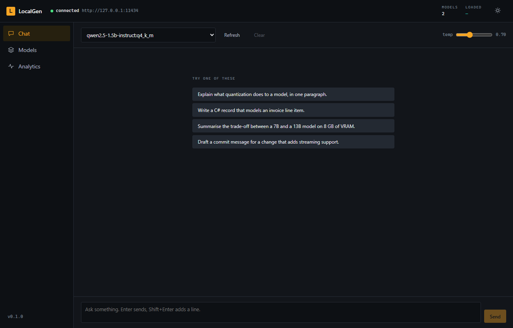

# Using LocalGen

## Command line

```bash
localgen --help
```

The CLI works against a running server when it finds one, and loads models itself when it does
not. That means `localgen run` works with no daemon, but reuses the server's already-loaded
weights when one is up rather than loading a second copy.

| Command | What it does |
| --- | --- |
| `list` (`ls`) | Installed models |
| `pull <reference>` | Download a model |
| `run <model> [prompt]` | Chat — interactive without a prompt |
| `rm <model>` | Delete a model |
| `show <model>` | Details and Modelfile |
| `create <name> -f Modelfile` | Create a variant |
| `quantize <model> <target>` | Convert a model to a smaller quantization |
| `benchmark <model>` | Measure throughput and latency |
| `serve` | Start the web service |
| `status` (`ps`) | Service state and resident models |
| `engines` | Backends and what this machine supports |

### Examples

```bash
# Let LocalGen pick the quantization
localgen pull huggingface:bartowski/Qwen2.5-7B-Instruct-GGUF

# Or name the file
localgen pull huggingface:bartowski/Qwen2.5-7B-Instruct-GGUF/Qwen2.5-7B-Instruct-Q5_K_M.gguf

# One-shot, with token counts
localgen run qwen2.5-7b-instruct:q4_k_m "Explain B-trees" --stats

# Interactive: /clear resets, /bye exits, Ctrl+C stops generation
localgen run qwen2.5-7b-instruct:q4_k_m --system "Answer in Indonesian"

# Serve on the network, with a key
localgen serve --bind 0.0.0.0 --port 8080 --api-key "$(openssl rand -hex 16)"

# Air-gapped
localgen serve --offline

# Compare quantizations
localgen benchmark qwen2.5-7b-instruct:q4_k_m -n 5 -t 256

# Shrink a model. The source is kept; the result lands beside it and is picked up automatically.
localgen quantize smollm2-135m-instruct:f16 Q4_K_M
```

An unrecognised target is answered with the full table of what the backend can produce, so there
is no separate command to list them.

Quantizing a model that is already quantized needs `--allow-requantize`, and is worse than
quantizing the original weights to the same target — the error from each pass compounds.

### Split models

Models too large for one file are published as `model-00001-of-00003.gguf` and siblings. LocalGen
lists such a set once, downloads every part, reports the size of the whole, and deletes all of it
when you remove the model. Point `pull` at any part — or at the repository — and the rest follows.

## Admin Control (desktop)

```bash
dotnet run --project src/LocalGen.Desktop
```

The strip along the top stays visible on every screen: service state, the resident model, the
backend and device in use, and live throughput with a trace of recent readings.

### Service


Start, stop and restart the web service, and read its log. The service runs inside the desktop
process, so anything the Playground has loaded is immediately available over HTTP.

### Playground


Chat with tools. Both side panels collapse from the buttons flanking the model picker, which
gives the transcript the whole window once the settings are set.

Replies render as markdown — tables become real grids with aligned columns, fenced code blocks
carry a language label and a copy button, images load inline, and links open in your browser.
Video, audio and documents appear as cards that hand the file to your own application, because
Avalonia has no media player and shipping one would be a large dependency for a small feature.

Tool output and errors are shown verbatim in monospace instead: they are machine text — JSON, a
stack trace — and running them through a markdown renderer would mangle them.

The panel on the right controls:

- **Model config** — system prompt, temperature, top-p, max tokens
- **Kernel functions** — Math, Internet search, Web scrape, Download, Code execution, Time and
  date, File system, Skills. All on by default; unchecking one removes it from the kernel rather
  than asking the model not to use it.
- **Skills** — installed skills and the gallery
- **MCP servers** — attach external tool servers
- **Use this from code** — emits a runnable snippet wired to the current model and settings, for
  the .NET SDK, Semantic Kernel, Python or curl

Tool calls appear in the transcript as they happen, with their arguments, result and duration.

#### Sessions

Sessions are listed on the left. Each keeps its own history and staged attachments.

- **New session** starts an empty conversation
- **✕** on a session deletes it — the last one is replaced rather than leaving you with nowhere
  to type
- **Reset chat** empties the current conversation but keeps the session and its name

#### Attachments

The two buttons left of the composer attach files. Both upload first, so the file has an address:

- **Images** are sent as image content, the way the OpenAI API carries them, and render inline in
  the transcript.
- **Documents** are extracted to text and sent with the message, and the transcript shows a link
  you can open. Word, Excel, PowerPoint, PDF, EPUB, RTF, HTML, CSV, markdown, plain text and
  source code are all read; the office formats arrive as markdown, so a table in a spreadsheet
  reaches the model as a table.

Staged files appear as chips above the composer with their size, and each can be removed on its
own before sending. Files are stored content-addressed by hash, so attaching the same image to
five messages stores it once.

Extraction happens when you pick the file, not when you send, so an unreadable document is
reported while you are still choosing.

> Whether the model can *see* an attached image depends on the model. Text-only models are told an
> image was attached and that they cannot read it, rather than being handed a silent placeholder.

### Models


Installed models with quantization, size, context length and estimated memory, alongside a
Hugging Face search. Selecting a search result lists its quantizations with size and a note on the
trade-off, so the choice is made with the numbers in view.

Each model also carries a **Quantize** button, which converts it to the target chosen at the foot
of the panel. The original is kept — a quantization is lossy, and comparing it against the source
is the point — and the result is registered immediately rather than after a restart. The panel is
hidden when no installed backend can quantize, which is any install without llama.cpp.

### Engine


Leads with a recommendation derived from what actually probed on this machine, then lists every
backend with its availability, devices, formats and — when unavailable — why. Below that are the
load settings: device, GPU layers, context size and threads.

Changes apply to the next model load. Models already in memory keep the settings they were loaded
with; unload and reload one to move it.

### API test


A request bench for the HTTP API. LocalGen's central claim is that it is a drop-in replacement for
the OpenAI API, and that claim is only worth anything if you can check it — so this sends real
requests over HTTP and shows the raw response, rather than going through the SDK.

Every endpoint comes with a payload that runs as it stands: the model you pick is substituted into
the example, so Send works without editing anything first.

| Group | Covers |
| --- | --- |
| **OpenAI** | Chat completion, streaming, function calling, structured output, image attachment, legacy completion, embeddings, list and retrieve models |
| **Management** | Health, status, engines, metrics, installed models, pull, logs, catalogue search |
| **Files** | Upload an attachment, download one |

The response pane shows the status, elapsed time and size, with JSON pretty-printed. Streaming
endpoints append frames as they arrive and report when the first one landed — a stream that only
appeared at the end would prove nothing about whether the server actually streams.

**Copy as curl** turns the current request into a shell command, `-N` included for streaming
endpoints so curl does not buffer the response away.

Requests go over HTTP to the address in the URL box, so the service has to be running — start it
from the Service screen, or point the URL at a LocalGen instance on another machine.

### Monitor


Throughput, time to first token, request and token counts, CPU and GPU load, VRAM, and a breakdown
of requests by model. GPU figures come from `nvidia-smi`, so other vendors report nothing.

## Web UI



```bash
dotnet run --project src/LocalGen.Web
```

A Blazor chat interface at `http://localhost:5000`, with a model browser and an analytics page.
It is a client of the API, so it can point at a LocalGen instance on another machine:

```json
{ "LocalGen": { "Endpoint": "http://192.168.1.50:11434", "ApiKey": "…" } }
```

The theme follows a toggle in the header and is remembered per browser.

## Modelfiles

Create a variant with its own prompt and settings, sharing the base model's weights:

```
FROM qwen2.5-7b-instruct:q4_k_m

PARAMETER temperature 0.3
PARAMETER num_ctx 8192
PARAMETER stop "<|im_end|>"

SYSTEM """
You are a senior .NET engineer. Answer with code first, explanation second.
Prefer the standard library over dependencies.
"""
```

```bash
localgen create dotnet-helper -f Modelfile
localgen run dotnet-helper
```

See the [Modelfile reference](modelfile.md).

## Offline

Set `LocalGen:Runtime:OfflineMode` to `true`, or pass `--offline` to `serve`. Inference is
unaffected; anything that needs the network — model downloads, web search, scraping, the skill
gallery — fails with a clear message instead of hanging.

Prepare a machine before disconnecting it:

```bash
localgen pull huggingface:bartowski/Qwen2.5-7B-Instruct-GGUF
localgen pull huggingface:nomic-ai/nomic-embed-text-v1.5-GGUF   # for RAG
localgen serve --offline
```
