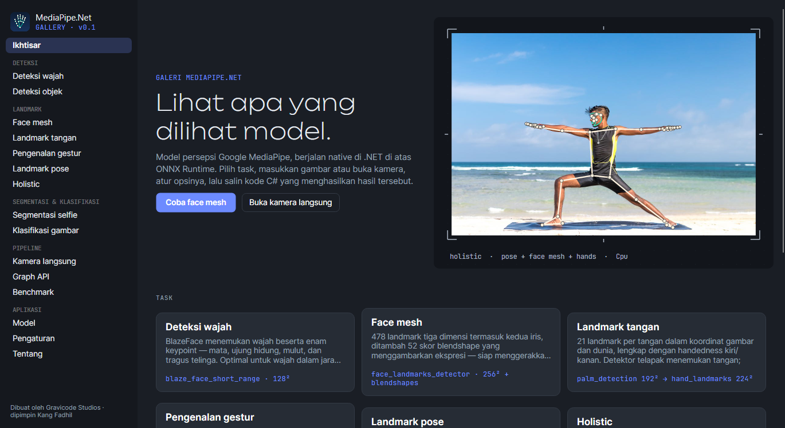
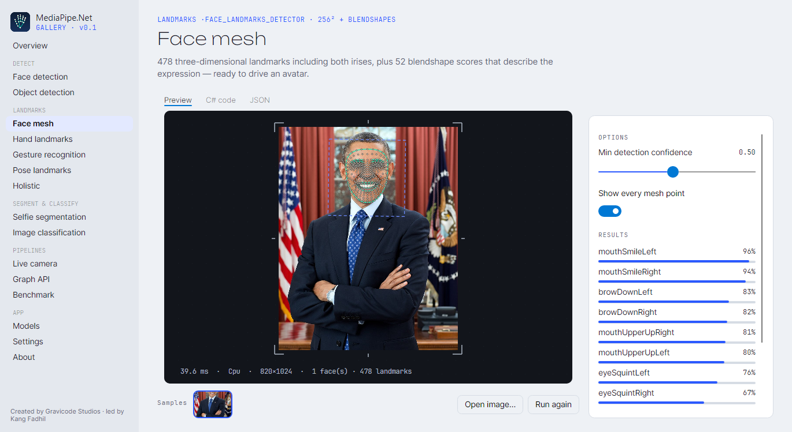
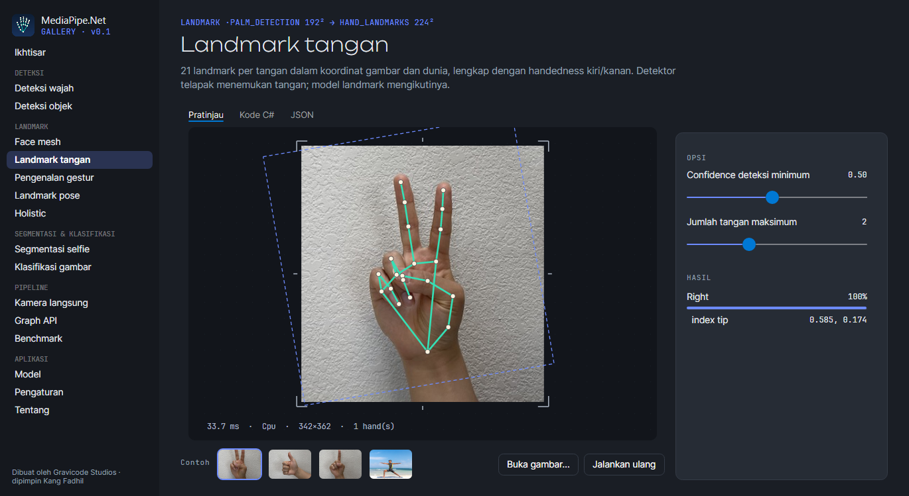
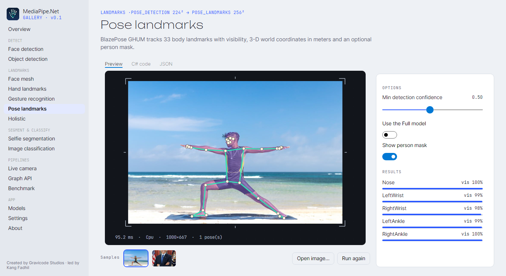
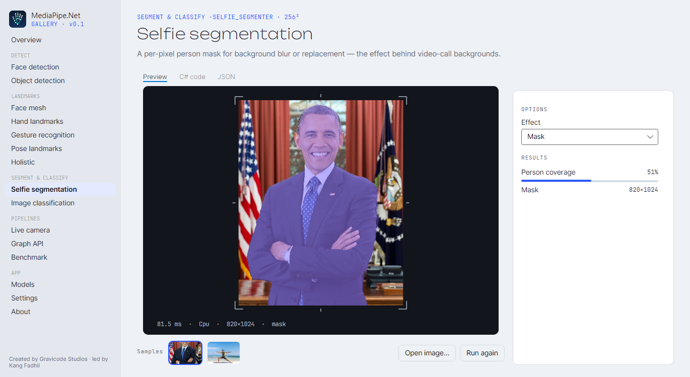
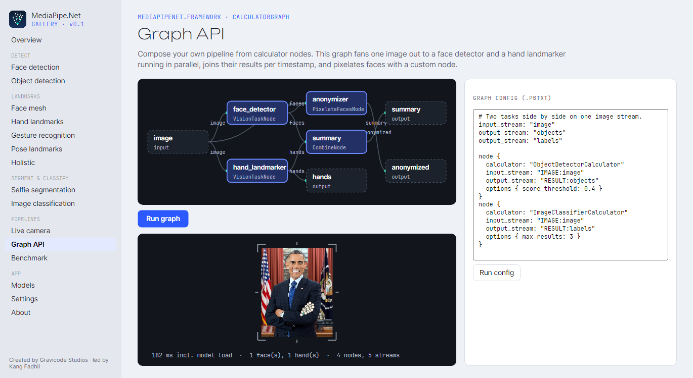
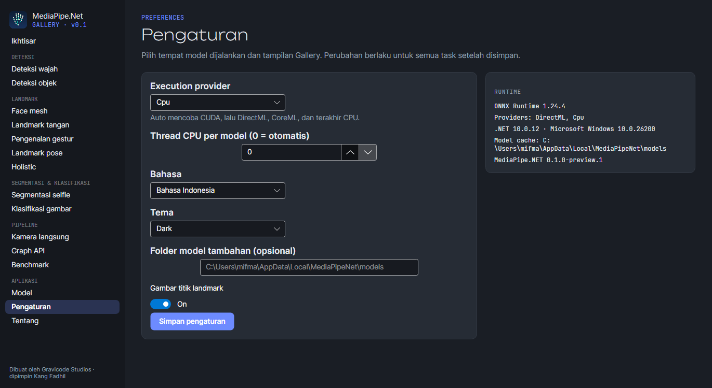

<p align="center">
  
</p>

<h1 align="center">MediaPipe.NET</h1>

<p align="center">
  <b>Task vision Google MediaPipe, native di .NET 10.</b><br/>
  Wajah · face mesh & blendshape · tangan · gestur · pose · holistic · segmentasi · objek · klasifikasi<br/>
  <i>Dibuat oleh <b>Gravicode Studios</b>, dipimpin <b>Kang Fadhil</b></i>
</p>

<p align="center">
  <a href="README.md">🇬🇧 Read in English</a> ·
  <a href="docs/id/memulai.md">Dokumentasi</a> ·
  <a href="docs/id/task.md">Task</a> ·
  <a href="docs/id/graph-api.md">Graph API</a> ·
  <a href="PLAN.md">Roadmap</a>
</p>

---



MediaPipe.NET adalah port [Google MediaPipe](https://ai.google.dev/edge/mediapipe) untuk ekosistem .NET. Library ini
menjalankan model-model MediaPipe sendiri — dikonversi dari rilis TFLite resmi ke ONNX dan **divalidasi silang
dengan paket resmi MediaPipe Python** — di atas ONNX Runtime, sementara pre- dan post-processing-nya (anchor, region
of interest berotasi, proyeksi landmark, tracking, smoothing) ditulis ulang dalam C#. Tanpa Python, tanpa interop
C++, tanpa proses terpisah.

```csharp
using MediaPipeNet.Imaging;
using MediaPipeNet.Tasks.Vision;

using var gestures = GestureRecognizer.Create();
using var image = MPImage.Load("tangan.jpg");

foreach (var hand in gestures.Recognize(image).Hands)
    Console.WriteLine($"Tangan {hand.Hand.Handedness.CategoryName}: {hand.TopGesture}");   // Tangan Right: Thumb_Up (74 %)
```

## Keunggulan

- **Sembilan task** dengan bentuk yang sama seperti MediaPipe Tasks — `FaceDetector`, `FaceLandmarker` (478
  landmark + 52 blendshape), `HandLandmarker`, `GestureRecognizer`, `PoseLandmarker` (+ mask segmentasi),
  `HolisticLandmarker`, `ImageSegmenter`, `ObjectDetector`, `ImageClassifier`.
- **Tiga running mode** — `Image`, `Video` (tracking dan smoothing One-Euro antar-frame), dan `LiveStream`
  (asinkron; frame dibuang saat task sibuk sehingga latensi tidak menumpuk).
- **Graph API** — susun `ICalculatorNode` yang terhubung lewat stream `Packet<T>` ber-timestamp, dengan semantik
  sinkronisasi input dan timestamp bound ala MediaPipe, eksekusi paralel ter-pipeline, flow limiting, side packet,
  dan parser konfigurasi `.pbtxt`.
- **Cepat dan hemat** — deteksi wajah 8 ms pada 640×480 di CPU laptop 4-core tahun 2017; tensor pra-alokasi yang
  di-pool membuat satu inferensi hanya mengalokasikan ~3–18 KB.
- **CPU di mana saja, GPU bila ada** — CPU (Windows / Linux / macOS, x64 / ARM64), DirectML (GPU DX12 apa pun),
  CUDA, CoreML; `ExecutionProvider.Auto` memilih yang terbaik dan kembali ke CPU bila gagal.
- **Model diurus otomatis** — paket `Gravicode.MediaPipeNet.Models.*` menyalin model ke samping aplikasi; jika tidak ada,
  model diunduh dari nuget.org saat pertama dipakai dan diverifikasi SHA-256.
- **Hasil strongly-typed dan siap JSON**, utilitas visualisasi, `IFrameSource` untuk webcam dan file video,
  `LiveStreamProcessor<T>`, DI untuk ASP.NET Core, telemetri `ILogger` dan `System.Diagnostics.Metrics`, CLI,
  notebook Polyglot, serta aplikasi Gallery berbasis Avalonia.

## Instalasi

```bash
dotnet add package Gravicode.MediaPipeNet               # task + runtime CPU (Windows, Linux, macOS)
dotnet add package Gravicode.MediaPipeNet.Models.All    # opsional: bundel semua model (≈75 MB) untuk offline
```

| Paket | Isi |
|---|---|
| `Gravicode.MediaPipeNet` | Semua task + ONNX Runtime **CPU** (dan CoreML di macOS). Mulai dari sini. |
| `Gravicode.MediaPipeNet.DirectML` / `Gravicode.MediaPipeNet.Cuda` | Semua task + runtime DirectML atau CUDA (pengganti `Gravicode.MediaPipeNet`). |
| `Gravicode.MediaPipeNet.Models.Face` · `.Hand` · `.Pose` · `.Segmentation` · `.ObjectDetection` · `.ImageClassification` · `.All` | Model ONNX, disalin ke `bin/…/models`. |
| `Gravicode.MediaPipeNet.Visualization` | Menggambar landmark, kotak, dan mask di gambar ImageSharp. |
| `Gravicode.MediaPipeNet.Video.OpenCv` | `WebcamFrameSource`, `VideoFileFrameSource`. |
| `Gravicode.MediaPipeNet.Extensions.DI` | `services.AddMediaPipeNet().AddFaceDetector()…` |
| `Gravicode.MediaPipeNet.Cli` | `dotnet tool install -g Gravicode.MediaPipeNet.Cli` → `mediapipenet-cli` |
| `Gravicode.MediaPipeNet.Core` · `.Imaging` · `.Inference` · `.Framework` · `.Tasks.Vision` | Lapisan-lapisan library untuk penggunaan lanjutan. |

## Tur singkat

<table>
<tr>
<td width="50%"><br/><b>Face mesh</b> — 478 landmark + blendshape</td>
<td width="50%"><br/><b>Landmark tangan</b> — 21 titik, ROI berotasi</td>
</tr>
<tr>
<td><br/><b>Pose</b> — 33 landmark + mask orang</td>
<td><br/><b>Segmentasi selfie</b></td>
</tr>
<tr>
<td><br/><b>Graph API</b> — node paralel, kalkulator kustom</td>
<td><br/><b>Pengaturan</b> — provider, thread, bahasa, tema</td>
</tr>
</table>

## Contoh lain

**Video dengan tracking** — detektor hanya berjalan ketika tangan hilang:

```csharp
using var hands = HandLandmarker.Create(new HandLandmarkerOptions { RunningMode = RunningMode.Video, NumHands = 1 });
await using var camera = new WebcamFrameSource(0);                       // MediaPipeNet.Video.OpenCv
await using var live = new LiveStreamProcessor<HandLandmarkResult>(camera, (frame, ts) => hands.DetectForVideo(frame, ts));
live.ResultReady += (_, r) => Console.WriteLine($"{r.Result.Hands.Count} tangan · {r.Stats.ProcessingFps:F0} fps");
await live.RunAsync(cancellationToken);
```

**Mode potret** — blur latar dengan selfie segmenter:

```csharp
using var segmenter = ImageSegmenter.Create();
var mask = segmenter.Segment(image).ConfidenceMask;
using var canvas = image.ToImage();
SegmentationMaskOverlay.BlurBackground(canvas, mask, sigma: 18);        // MediaPipeNet.Visualization
canvas.SaveAsPng("potret.png");
```

**Graph dari konfigurasi gaya MediaPipe:**

```csharp
var graph = GraphConfig.ParsePbtxt("""
    input_stream: "image"
    output_stream: "objects"
    node {
      calculator: "ObjectDetectorCalculator"
      input_stream: "IMAGE:image"
      output_stream: "RESULT:objects"
      options { score_threshold: 0.4 }
    }
    """).Build(CalculatorRegistry.Default.AddVisionCalculators());
```

**ASP.NET Core:**

```csharp
builder.Services.AddMediaPipeNet().AddFaceDetector().AddObjectDetector(o => o with { ScoreThreshold = 0.5f });
app.MapPost("/faces", async (IFormFile file, FaceDetector detector) =>
{
    using var image = await MPImage.LoadAsync(file.OpenReadStream());
    return detector.Detect(image);                                       // diserialisasi sebagai JSON
});
```

## Akurasi: divalidasi silang dengan MediaPipe

Setiap model hasil konversi dibandingkan dengan interpreter TFLite pada input acak (selisih maks ≈ 1e-4), dan setiap
task dibandingkan end-to-end dengan **paket resmi MediaPipe Python 1.0.1** pada gambar fixture
([`tests/assets/golden`](tests/assets/golden)):

| Task | MediaPipe (Python) | MediaPipe.NET |
|---|---|---|
| Deteksi wajah (potret) | kotak 234 px, skor 0.922 | IoU kotak > 0.9, skor 0.928 |
| Face mesh | 478 landmark | error rata-rata < 0.006 (ternormalisasi) · senyum 0.96 vs 0.96 |
| Gestur | Thumb_Up · Victory · Pointing_Up | Thumb_Up · Victory · Pointing_Up |
| Segmentasi selfie | rata-rata 0.5072 | rata-rata 0.5080 |
| Deteksi objek | dog 0.73 · cat 0.70 · dog 0.68 · cat 0.65 | 4 objek yang sama, IoU kotak > 0.85 |
| Klasifikasi gambar | cheeseburger 0.889 | cheeseburger 0.848 |

## Performa

BenchmarkDotNet, Intel Core i7-8650U (2017, 4 core), provider CPU, input 640×480, end-to-end:

| Task | Rata-rata | Alokasi / panggilan |
|---|---:|---:|
| FaceDetector | **8,1 ms** | 3 KB |
| ImageSegmenter (selfie) | 9,6 ms | 2,9 MB (mask output) |
| ImageClassifier | 10,5 ms | 58 KB |
| FaceLandmarker | 25,1 ms | 19 KB |
| ObjectDetector | 30,6 ms | 17 KB |
| HandLandmarker / GestureRecognizer | 31,4 / 31,8 ms | 11 / 12 KB |
| PoseLandmarker (lite) | 36,9 ms | 11 KB |

NFR-1 meminta deteksi wajah di bawah 50 ms pada 640×480 di CPU 8-core modern; MediaPipe.NET hanya butuh 8 ms di
laptop 4-core tahun 2017. Lihat [docs/id/performa.md](docs/id/performa.md).

## Struktur repositori

```
src/          Core · Imaging · Inference · Framework · Tasks.Vision · Visualization · Video.OpenCv · Extensions.DI · Cli · meta package
models/       onnx/ (13 model hasil konversi) + proyek paket Gravicode.MediaPipeNet.Models.*
samples/      BasicUsage · GraphApiDemo · MediaPipeNet.Gallery (Avalonia)
tests/        Core.Tests · Framework.Tests · Tasks.Tests (validasi silang golden) — 104 test
benchmarks/   suite BenchmarkDotNet
notebooks/    MediaPipeNet_QuickStart.ipynb (Polyglot Notebooks)
tools/        model-conversion (TFLite → ONNX + validasi) · golden (referensi MediaPipe Python)
docs/         dokumentasi en/ dan id/, images/
```

Build dan test:

```bash
dotnet build MediaPipeNet.slnx -c Release
dotnet test MediaPipeNet.slnx -c Release
dotnet run --project samples/MediaPipeNet.Gallery
```

## Dokumentasi

| Bahasa Indonesia | English |
|---|---|
| [Memulai](docs/id/memulai.md) | [Getting started](docs/en/getting-started.md) |
| [Task](docs/id/task.md) | [Tasks](docs/en/tasks.md) |
| [Mode & video langsung](docs/id/video-dan-live-stream.md) | [Running modes & live video](docs/en/video-and-live-stream.md) |
| [Graph API](docs/id/graph-api.md) | [Graph API](docs/en/graph-api.md) |
| [Model](docs/id/model.md) | [Models](docs/en/models.md) |
| [Performa & GPU](docs/id/performa.md) | [Performance & GPUs](docs/en/performance.md) |
| [Arsitektur](docs/id/arsitektur.md) | [Architecture](docs/en/architecture.md) |
| [Integrasi (DI, ASP.NET, telemetri)](docs/id/integrasi.md) | [Integration](docs/en/integration.md) |
| [CLI](docs/id/cli.md) | [CLI](docs/en/cli.md) |
| [Aplikasi Gallery](docs/id/gallery.md) | [Gallery app](docs/en/gallery.md) |
| [Pengujian & validasi](docs/id/pengujian.md) | [Testing & validation](docs/en/testing.md) |
| [Referensi API](docs/id/referensi-api.md) | [API reference](docs/en/api-reference.md) |
| [Pemecahan masalah](docs/id/pemecahan-masalah.md) | [Troubleshooting](docs/en/troubleshooting.md) |

## Lisensi

MediaPipe.NET berlisensi [Apache License 2.0](LICENSE). Bobot model © Google LLC, Apache-2.0, dikonversi dari
rilis resmi MediaPipe — lihat [NOTICE](NOTICE) untuk atribusi dan lisensi pihak ketiga (ImageSharp menggunakan
Six Labors Split License).

---

<p align="center">Dibuat oleh <b>Gravicode Studios</b> · dipimpin <b>Kang Fadhil</b></p>
