<p align="center">
  
</p>

<h1 align="center">MediaPipe.NET</h1>

<p align="center">
  <b>Google MediaPipe's vision, audio and text tasks, native in .NET 10.</b><br/>
  Faces · face mesh, blendshapes & head pose · hands · gestures · pose · holistic · segmentation · interactive segmentation ·
  face stylization · objects · classification · embeddings · audio events & voice activity · sentiment · language detection<br/>
  <i>Created by <b>Gravicode Studios</b>, led by <b>Kang Fadhil</b></i>
</p>

<p align="center">
  <a href="README.id.md">🇮🇩 Baca dalam Bahasa Indonesia</a> ·
  <a href="https://dotnetvibecoderz.github.io/Vibe_ML/mediapipenet/">Documentation site</a> ·
  <a href="docs/en/getting-started.md">Getting started</a> ·
  <a href="docs/en/tasks.md">Tasks</a> ·
  <a href="docs/en/audio-and-text.md">Audio & text</a> ·
  <a href="docs/en/graph-api.md">Graph API</a> ·
  <a href="PLAN.md">Roadmap</a>
</p>

---

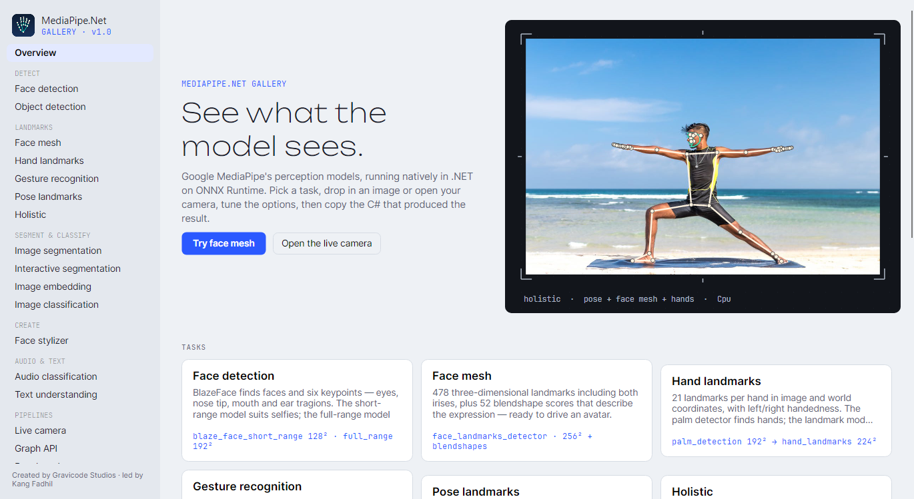

MediaPipe.NET is a port of [Google MediaPipe](https://ai.google.dev/edge/mediapipe) for the .NET ecosystem. It
runs MediaPipe's own models — converted from the official TFLite releases to ONNX and **cross-validated against
the official MediaPipe Python package** — on ONNX Runtime, with the pre- and post-processing (anchors, rotated
regions of interest, landmark projection, tracking, smoothing) re-implemented in C#. No Python, no C++ interop,
no separate process.

```csharp
using MediaPipeNet.Imaging;
using MediaPipeNet.Tasks.Vision;

using var gestures = GestureRecognizer.Create();
using var image = MPImage.Load("hand.jpg");

foreach (var hand in gestures.Recognize(image).Hands)
    Console.WriteLine($"{hand.Hand.Handedness.CategoryName} hand: {hand.TopGesture}");   // Right hand: Thumb_Up (74 %)
```

## Highlights

- **Seventeen tasks** with the same shape as MediaPipe Tasks —
  *vision:* `FaceDetector` (short/full range), `FaceLandmarker` (478 landmarks, 52 blendshapes, facial transformation
  matrix), `HandLandmarker`, `GestureRecognizer`, `PoseLandmarker` (heatmap-refined, + segmentation mask),
  `HolisticLandmarker`, `ImageSegmenter` (selfie, multiclass, hair, DeepLab v3), `InteractiveSegmenter`,
  `FaceStylizer`, `ImageEmbedder`, `ObjectDetector`, `ImageClassifier`;
  *audio:* `AudioClassifier` (YAMNet), `VoiceActivityDetector`;
  *text:* `TextClassifier`, `TextEmbedder`, `LanguageDetector`.
- **Three running modes** — `Image`, `Video` (tracking and One-Euro smoothing between frames) and `LiveStream`
  (asynchronous, frames dropped while busy so latency never builds up).
- **Graph API** — compose `ICalculatorNode`s connected by timestamped `Packet<T>` streams, with MediaPipe's input
  synchronization and timestamp-bound semantics, pipelined parallel execution, flow limiting, side packets, loops
  (back edges), dedicated executors, subgraphs, Chrome-trace profiling and a `.pbtxt` config parser.
- **Fast and frugal** — 8 ms face detection at 640×480 on a 2017 4-core laptop CPU; pooled, preallocated
  tensors mean a steady-state inference allocates ~3–18 KB.
- **CPU everywhere, GPU when present** — CPU (Windows / Linux / macOS, x64 / ARM64), DirectML (any DX12 GPU),
  CUDA, CoreML, NNAPI (Android); `ExecutionProvider.Auto` picks the best and falls back to CPU.
- **Models handled for you** — `Gravicode.MediaPipeNet.Models.*` packages copy models next to your app; otherwise they are
  downloaded from nuget.org on first use and verified by SHA-256. Validated **FP16 / INT8** variants on request;
  **your own Model Maker models** with `ModelPath`.
- **Batches and API stability** — `ProcessBatch` for offline throughput; the public API is tracked by analyzers so
  changes are always deliberate.
- **Strongly-typed, JSON-ready results**, visualization helpers, `IFrameSource` for webcams and video files,
  `LiveStreamProcessor<T>`, DI for ASP.NET Core, `ILogger` and `System.Diagnostics.Metrics` telemetry, a CLI,
  a Polyglot notebook and an Avalonia Gallery app.

## Install

```bash
dotnet add package Gravicode.MediaPipeNet               # all tasks + CPU runtime (Windows, Linux, macOS)
dotnet add package Gravicode.MediaPipeNet.Models.All    # optional: bundle every model (≈215 MB) for offline use
```

| Package | What it contains |
|---|---|
| `Gravicode.MediaPipeNet` | All tasks + ONNX Runtime **CPU** (and CoreML on macOS). Start here. |
| `Gravicode.MediaPipeNet.DirectML` / `Gravicode.MediaPipeNet.Cuda` | All tasks + the DirectML or CUDA runtime (use instead of `Gravicode.MediaPipeNet`). |
| `Gravicode.MediaPipeNet.Models.Face` · `.Hand` · `.Pose` · `.Segmentation` · `.ObjectDetection` · `.ImageClassification` · `.ImageEmbedding` · `.FaceStylizer` · `.Audio` · `.Text` · `.All` | The ONNX models, copied to `bin/…/models`. |
| `Gravicode.MediaPipeNet.Models.Quantized` | FP16 / INT8 variants for `InferenceOptions.Precision`. |
| `Gravicode.MediaPipeNet.Visualization` | Draw landmarks, boxes and masks on ImageSharp images. |
| `Gravicode.MediaPipeNet.Video.OpenCv` | `WebcamFrameSource`, `VideoFileFrameSource`. |
| `Gravicode.MediaPipeNet.Extensions.DI` | `services.AddMediaPipeNet().AddFaceDetector()…` |
| `Gravicode.MediaPipeNet.Cli` | `dotnet tool install -g Gravicode.MediaPipeNet.Cli` → `mediapipenet-cli` |
| `Gravicode.MediaPipeNet.Tasks.Audio` · `.Tasks.Text` | Audio or text tasks alone (no imaging dependencies). |
| `Gravicode.MediaPipeNet.Core` · `.Imaging` · `.Inference` · `.Framework` · `.Tasks.Core` · `.Tasks.Vision` | The layers, for advanced use. |

## A tour

<table>
<tr>
<td width="50%">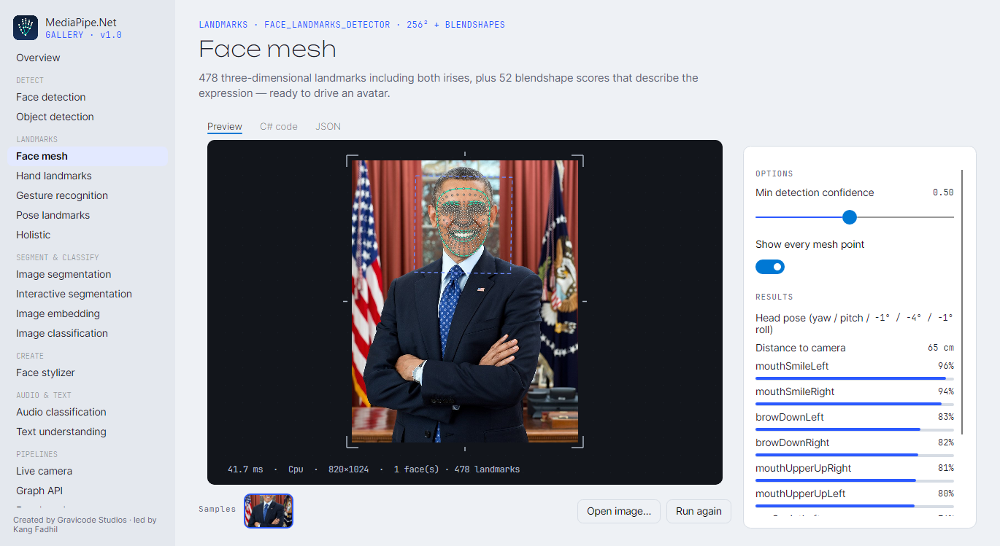<br/><b>Face mesh</b> — 478 landmarks + blendshapes</td>
<td width="50%">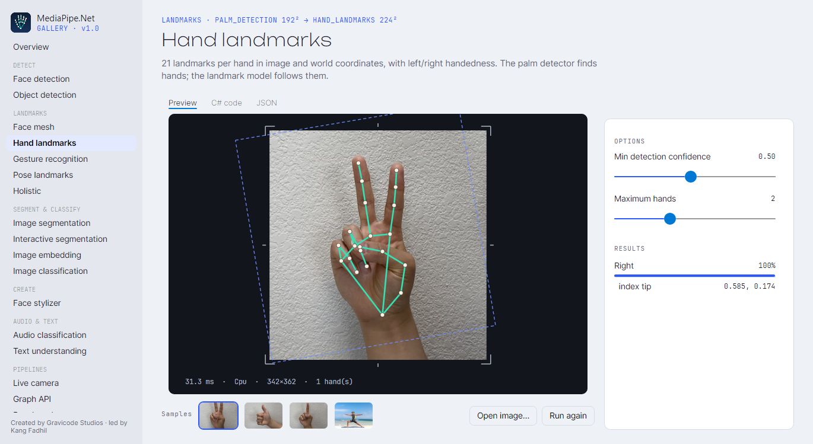<br/><b>Hand landmarks</b> — 21 points, rotated ROI</td>
</tr>
<tr>
<td>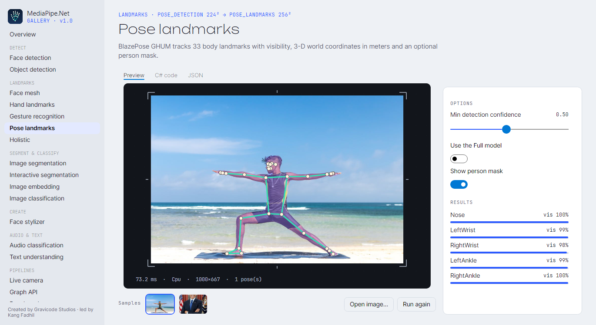<br/><b>Pose</b> — 33 landmarks + person mask</td>
<td>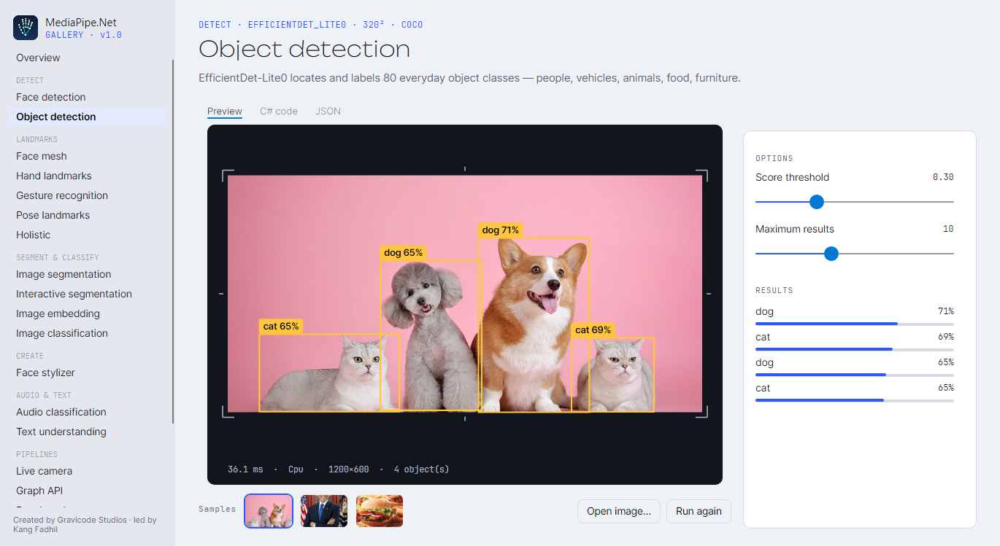<br/><b>Object detection</b> — EfficientDet-Lite0</td>
</tr>
<tr>
<td>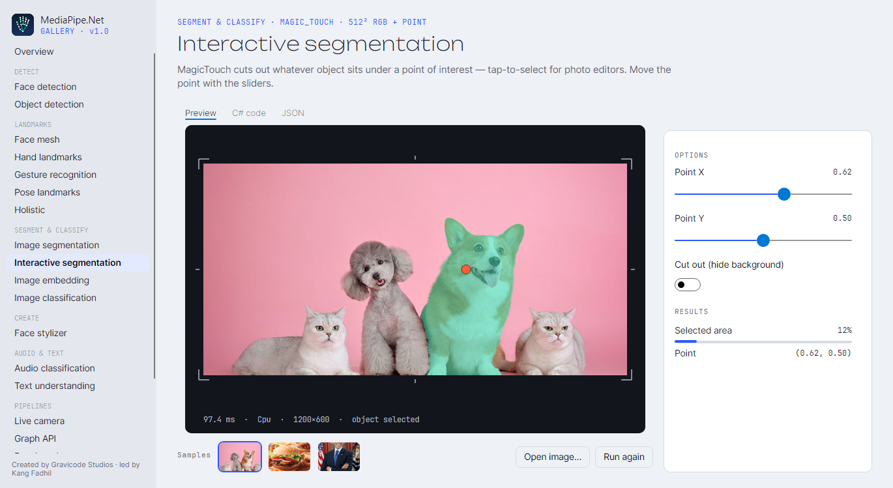<br/><b>Interactive segmentation</b> — MagicTouch</td>
<td>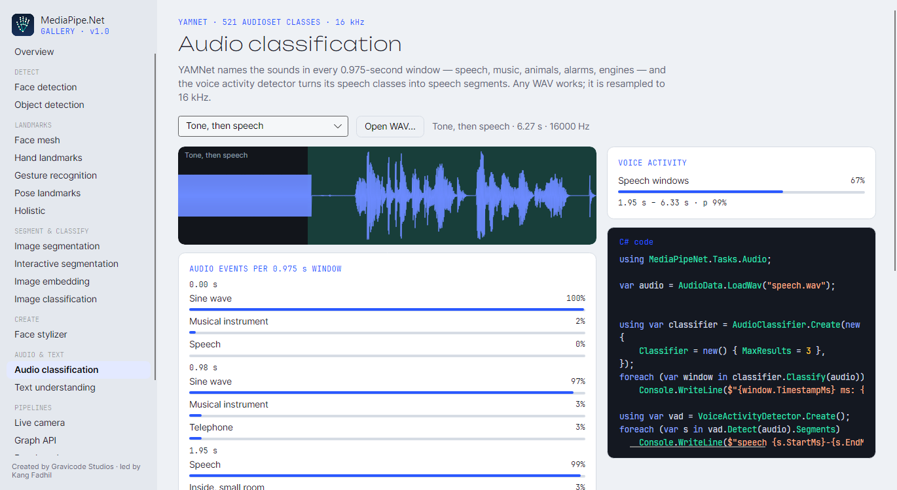<br/><b>Audio</b> — YAMNet events + voice activity</td>
</tr>
<tr>
<td>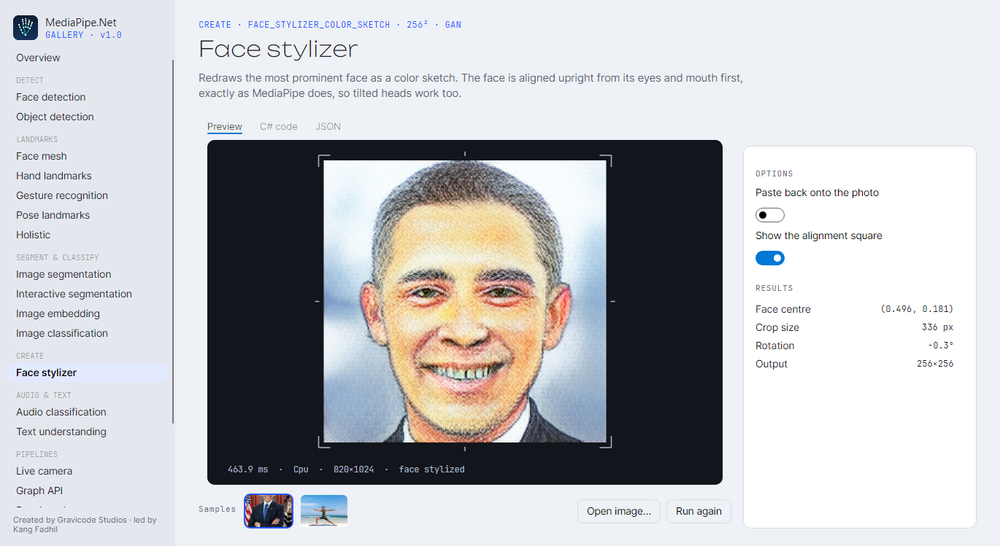<br/><b>Face stylizer</b> — color sketch, aligned like MediaPipe</td>
<td><br/><b>Multiclass segmentation</b> — hair, skin, clothes</td>
</tr>
<tr>
<td>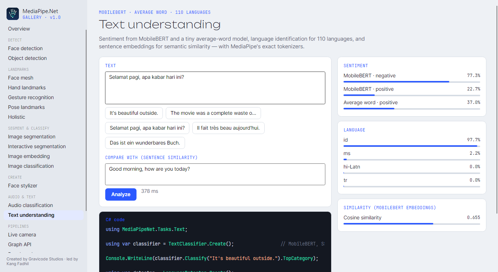<br/><b>Text</b> — sentiment, language, similarity</td>
<td>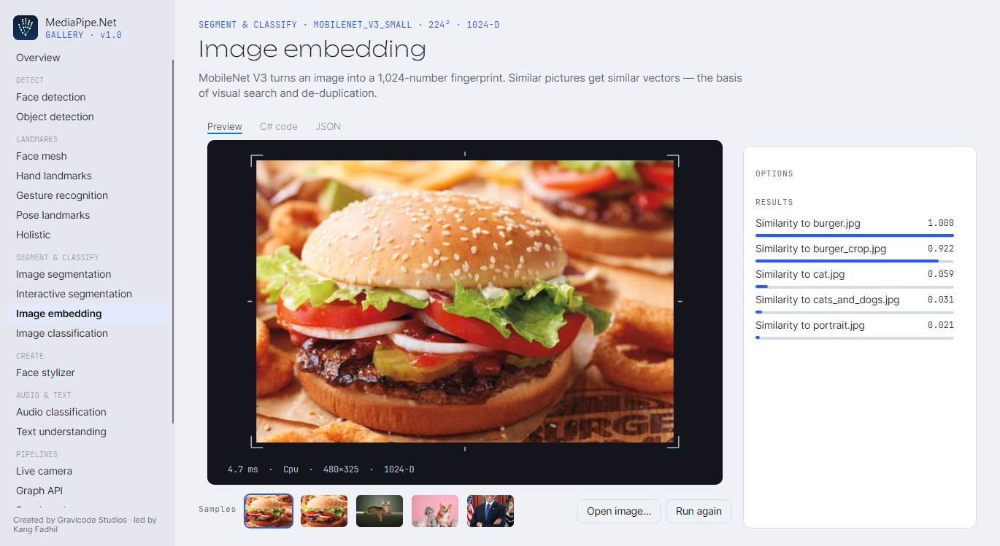<br/><b>Image embedding</b> — MobileNet V3, visual similarity</td>
</tr>
<tr>
<td>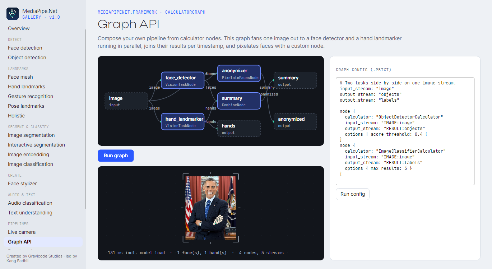<br/><b>Graph API</b> — parallel nodes, custom calculator</td>
<td>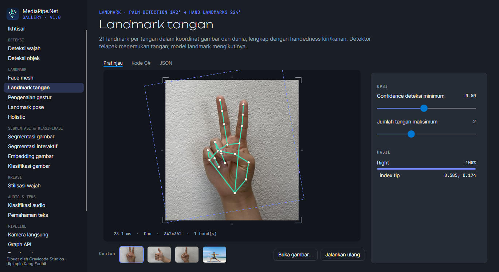<br/><b>Gallery</b> — dark theme, Bahasa Indonesia</td>
</tr>
</table>

## More examples

**Video with tracking** — the detector only runs when a hand is lost:

```csharp
using var hands = HandLandmarker.Create(new HandLandmarkerOptions { RunningMode = RunningMode.Video, NumHands = 1 });
await using var camera = new WebcamFrameSource(0);                       // MediaPipeNet.Video.OpenCv
await using var live = new LiveStreamProcessor<HandLandmarkResult>(camera, (frame, ts) => hands.DetectForVideo(frame, ts));
live.ResultReady += (_, r) => Console.WriteLine($"{r.Result.Hands.Count} hand(s) · {r.Stats.ProcessingFps:F0} fps");
await live.RunAsync(cancellationToken);
```

**Portrait mode** — blur the background with the selfie segmenter:

```csharp
using var segmenter = ImageSegmenter.Create();
var mask = segmenter.Segment(image).ConfidenceMask;
using var canvas = image.ToImage();
SegmentationMaskOverlay.BlurBackground(canvas, mask, sigma: 18);        // MediaPipeNet.Visualization
canvas.SaveAsPng("portrait.png");
```

**Head pose for AR** — the facial transformation matrix:

```csharp
using var landmarker = FaceLandmarker.Create(new() { OutputFacialTransformationMatrixes = true });
Matrix4x4 pose = landmarker.Detect(image).Faces[0].GetTransformMatrix()!.Value;   // canonical face → camera (cm)
```

**Audio and text:**

```csharp
using var audio = AudioClassifier.Create();
foreach (var w in audio.Classify(AudioData.LoadWav("street.wav"))) Console.WriteLine($"{w.TimestampMs} ms {w.TopCategory}");

using var language = LanguageDetector.Create();
Console.WriteLine(language.Detect("Selamat pagi, apa kabar?").TopLanguage);       // id (97.6 %)
```

**Your own model** (MediaPipe Model Maker, converted with `convert_models.py --custom`):

```csharp
using var classifier = ImageClassifier.Create(new() { ModelPath = "models/my_food.onnx" });   // labels from my_food.labels.txt
```

**A graph from MediaPipe-style config:**

```csharp
var graph = GraphConfig.ParsePbtxt("""
    input_stream: "image"
    output_stream: "objects"
    node {
      calculator: "ObjectDetectorCalculator"
      input_stream: "IMAGE:image"
      output_stream: "RESULT:objects"
      options { score_threshold: 0.4 }
    }
    """).Build(CalculatorRegistry.Default.AddVisionCalculators());
```

**ASP.NET Core:**

```csharp
builder.Services.AddMediaPipeNet().AddFaceDetector().AddObjectDetector(o => o with { ScoreThreshold = 0.5f });
app.MapPost("/faces", async (IFormFile file, FaceDetector detector) =>
{
    using var image = await MPImage.LoadAsync(file.OpenReadStream());
    return detector.Detect(image);                                       // serialized as JSON
});
```

## Accuracy: cross-validated against MediaPipe

Every converted model is compared with the TFLite interpreter on random input (max |Δ| ≈ 1e-4), and every task
is compared end-to-end with the **official MediaPipe Python package 1.0.1** on fixture images
([`tests/assets/golden`](tests/assets/golden)):

| Task | MediaPipe (Python) | MediaPipe.NET |
|---|---|---|
| Face detection (portrait) | box 234 px, score 0.922 | box IoU > 0.9, score 0.928 |
| Face mesh | 478 landmarks | mean error < 0.006 (normalized) · smile 0.96 vs 0.96 |
| Gestures | Thumb_Up · Victory · Pointing_Up | Thumb_Up · Victory · Pointing_Up |
| Selfie segmentation | mean 0.5072 | mean 0.5080 |
| Object detection | dog 0.73 · cat 0.70 · dog 0.68 · cat 0.65 | same 4 objects, box IoU > 0.85 |
| Image classification | cheeseburger 0.889 | cheeseburger 0.848 |
| Facial transformation matrix | translation (−0.4, 22.5, −65.5) cm | within 2° and 1.5 cm |
| Pose (heatmap-refined) | 33 landmarks | mean error 0.0024 |
| Holistic hands (pose.jpg) | left + right hand | mean error < 0.01 |
| Selfie multiclass | background 49.1 % · clothes 41.5 % · face 5.8 % | each category within 1.5 % |
| Image embedding | burger/crop 0.920 · burger/cat 0.048 | 0.92 · 0.05 |
| Audio (YAMNet) | Speech in 4 windows, Tick last | same top classes |
| Text sentiment (MobileBERT) | positive 0.9995 · negative 0.9999 | within 0.01 |
| Language detection | id 0.976 · fr 0.9999 · de 0.9999 … | within 0.001 |

## Performance

BenchmarkDotNet, Intel Core i7-8650U (2017, 4 cores), CPU provider, 640×480 input, end to end:

| Task | Mean | Allocated / call |
|---|---:|---:|
| FaceDetector | **8.1 ms** | 3 KB |
| ImageSegmenter (selfie) | 9.6 ms | 2.9 MB (the output mask) |
| ImageClassifier | 10.5 ms | 58 KB |
| FaceLandmarker | 25.1 ms | 19 KB |
| ObjectDetector | 30.6 ms | 17 KB |
| HandLandmarker / GestureRecognizer | 31.4 / 31.8 ms | 11 / 12 KB |
| PoseLandmarker (lite) | 36.9 ms | 11 KB |

| ImageEmbedder | 3.6 ms | 7 KB |
| AudioClassifier (4.3 s clip) | 14.0 ms | 256 KB |
| TextClassifier (MobileBERT / average word) | 56 / 0.02 ms | 4 / 2.5 KB |
| LanguageDetector | 0.06 ms | 12 KB |

NFR-1 asks for face detection under 50 ms at 640×480 on a modern 8-core CPU; MediaPipe.NET needs 8 ms on a
2017 4-core laptop. `ProcessBatch` doubles offline throughput. See [docs/en/performance.md](docs/en/performance.md).

## Repository

```
src/          Core · Imaging · Inference · Framework · Tasks.Core · Tasks.Vision · Tasks.Audio · Tasks.Text ·
              Visualization · Video.OpenCv · Extensions.DI · Cli · meta packages
models/       onnx/ (25 converted models + quantized/ FP16·INT8 variants) + Gravicode.MediaPipeNet.Models.* package projects
samples/      BasicUsage · GraphApiDemo · MediaPipeNet.Gallery (Avalonia)
tests/        Core.Tests · Framework.Tests · Tasks.Tests (golden cross-validation) — 159 tests
benchmarks/   BenchmarkDotNet suite
notebooks/    MediaPipeNet_QuickStart.ipynb (Polyglot Notebooks)
tools/        model-conversion (TFLite → ONNX, validation, quantization, custom models) · golden (MediaPipe Python references) · update_public_api.py
docs/         en/ and id/ documentation, images/
```

Build and test:

```bash
dotnet build MediaPipeNet.slnx -c Release
dotnet test MediaPipeNet.slnx -c Release
dotnet run --project samples/MediaPipeNet.Gallery
```

## Documentation

| English | Bahasa Indonesia |
|---|---|
| [Getting started](docs/en/getting-started.md) | [Memulai](docs/id/memulai.md) |
| [Tasks](docs/en/tasks.md) | [Task](docs/id/task.md) |
| [Audio & text tasks](docs/en/audio-and-text.md) | [Task audio & teks](docs/id/audio-dan-teks.md) |
| [Custom models](docs/en/custom-models.md) | [Model kustom](docs/id/model-kustom.md) |
| [Running modes & live video](docs/en/video-and-live-stream.md) | [Mode & video langsung](docs/id/video-dan-live-stream.md) |
| [Graph API](docs/en/graph-api.md) | [Graph API](docs/id/graph-api.md) |
| [Models](docs/en/models.md) | [Model](docs/id/model.md) |
| [Performance & GPUs](docs/en/performance.md) | [Performa & GPU](docs/id/performa.md) |
| [Architecture](docs/en/architecture.md) | [Arsitektur](docs/id/arsitektur.md) |
| [Integration (DI, ASP.NET, telemetry)](docs/en/integration.md) | [Integrasi](docs/id/integrasi.md) |
| [CLI](docs/en/cli.md) | [CLI](docs/id/cli.md) |
| [Gallery app](docs/en/gallery.md) | [Aplikasi Gallery](docs/id/gallery.md) |
| [Testing & validation](docs/en/testing.md) | [Pengujian & validasi](docs/id/pengujian.md) |
| [API reference](docs/en/api-reference.md) | [Referensi API](docs/id/referensi-api.md) |
| [Troubleshooting](docs/en/troubleshooting.md) | [Pemecahan masalah](docs/id/pemecahan-masalah.md) |
| [Platforms (MAUI / Android / iOS, Blazor WASM)](docs/en/platforms.md) | [Platform (MAUI / Android / iOS, Blazor WASM)](docs/id/platform.md) |

## What's new in 1.0.0

The first stable release: the public API is frozen under semantic versioning (PublicApiAnalyzers baselines).
New: **`FaceStylizer`** — MediaPipe's color-sketch face stylizer converted to ONNX (resource variables frozen,
training-mode batch norms lowered) with MediaPipe's exact face alignment, golden-tested against MediaPipe 0.10.21,
plus FP16/INT8 variants; `ExecutionProvider.Nnapi` and a **.NET MAUI sample** (Android / iOS); DirectML benchmarks and
a fix for I/O binding on GPU providers; the documentation site on GitHub Pages. Upgrading from 0.3 needs no code
changes. See [CHANGELOG](CHANGELOG.md).

## License

MediaPipe.NET is licensed under the [Apache License 2.0](LICENSE). The model weights are © Google LLC, Apache-2.0,
converted from the official MediaPipe releases — see [NOTICE](NOTICE) for attribution and third-party licenses
(ImageSharp is under the Six Labors Split License).

---

<p align="center">Created by <b>Gravicode Studios</b> · led by <b>Kang Fadhil</b></p>
