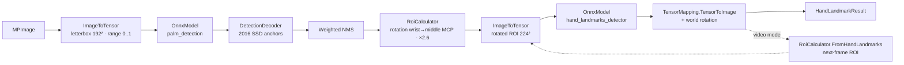

# Architecture

> 🇮🇩 [Baca dalam Bahasa Indonesia](../id/arsitektur.md)

## Layers

```
┌──────────────────────────────────────────────────────────────────────────────┐
│ Tasks API              MediaPipeNet.Tasks.Vision                              │
│   FaceDetector · FaceLandmarker · HandLandmarker · GestureRecognizer ·        │
│   PoseLandmarker · HolisticLandmarker · ImageSegmenter · ObjectDetector ·     │
│   ImageClassifier · LiveStreamProcessor<T> · VisionCalculators               │
├──────────────────────────────────────────────────────────────────────────────┤
│ Graph API              MediaPipeNet.Framework                                 │
│   CalculatorGraph · ICalculatorNode · Packet<T> · GraphConfig (.pbtxt)        │
├──────────────────────────────────────────────────────────────────────────────┤
│ Inference              MediaPipeNet.Inference                                 │
│   OnnxModel / InferenceContext · ExecutionProviderSelector · ModelStore        │
├──────────────────────────────────────────────────────────────────────────────┤
│ Imaging & tensors      MediaPipeNet.Imaging                                   │
│   MPImage · ImageToTensor · TensorMapping · TensorWarp · IFrameSource          │
├──────────────────────────────────────────────────────────────────────────────┤
│ Core                   MediaPipeNet.Core                                      │
│   Timestamp · NormalizedLandmark · Detection · NormalizedRect · telemetry     │
└──────────────────────────────────────────────────────────────────────────────┘
  Add-ons: Visualization (ImageSharp.Drawing) · Video.OpenCv · Extensions.DI · Cli
  Meta packages: MediaPipeNet (CPU) · MediaPipeNet.DirectML · MediaPipeNet.Cuda
```

Dependencies only point downward. `Inference` references just the *managed* ONNX Runtime API; the native runtime
flavor is chosen by the meta package an application references, so CPU, DirectML and CUDA builds never collide.

## A task, step by step (HandLandmarker)



Each box is a public, reusable class in `MediaPipeNet.Tasks.Vision.Processing` / `MediaPipeNet.Imaging`, ported
from the MediaPipe calculator of the same purpose:

| MediaPipe calculator | MediaPipe.NET |
|---|---|
| `ImageToTensorCalculator` | `ImageToTensor.Convert` → `TensorMapping` |
| `SsdAnchorsCalculator` | `SsdAnchors.Generate` (+ `GenerateEfficientDet`) |
| `TensorsToDetectionsCalculator` | `DetectionDecoder.Decode` |
| `NonMaxSuppressionCalculator` | `NonMaxSuppression.Weighted` / `.Hard` |
| `DetectionLetterboxRemovalCalculator`, `LandmarkProjectionCalculator` | `RawDetection.MapToImage`, `TensorMapping.TensorToImage` |
| `DetectionsToRectsCalculator`, `AlignmentPointsRectsCalculator`, `RectTransformationCalculator` | `RoiCalculator.FromDetection`, `.FromAlignmentPoints`, `.Transform` |
| `HandLandmarksToRectCalculator` | `RoiCalculator.FromHandLandmarks` |
| `LandmarksSmoothingCalculator` (One-Euro) | `LandmarkSmoother`, `OneEuroFilter` |
| `WorldLandmarkProjectionCalculator` | rotation of world landmarks by the ROI angle |
| `LandmarksToMatrixCalculator` | `GestureRecognizer` input preparation |
| `FlowLimiterCalculator` | `GraphOptions.MaxInFlight` |

`TensorMapping` is the key abstraction: it records the rotated, letterbox-padded ROI that was sampled, so every
output (keypoints, landmarks, masks) maps back to image coordinates with one call — in pixel space, which keeps
rotations correct on non-square images.

## Running modes

`VisionTaskBase<TResult>` implements the three modes once for every task:

- **Image** — `Process` with `tracking: false`; no state; thread-safe via pooled inference contexts.
- **Video** — `Process` with `tracking: true` under a lock; monotonic timestamps enforced.
- **LiveStream** — the task runs inside a one-node `CalculatorGraph` with `MaxInFlight`; frames are cloned only when
  accepted; results reach the `ResultCallback`.

## Graph engine

`CalculatorGraph` keeps an input queue and a timestamp bound per node input. Scheduling decisions are made under a
single graph lock (cheap — vision graphs carry tens of packets per second), node code runs outside it on the thread
pool. A node is runnable when its smallest candidate timestamp is settled on every input (MediaPipe's
`DefaultInputStreamHandler`); after `Process`, unconnected outputs advance their bound so downstream never stalls.
Graph outputs can be observed (callbacks) or polled (`Channel`). See [Graph API](graph-api.md).

## Solution layout

```
MediaPipeNet.slnx
├── src/        library projects + meta packages + CLI
├── models/     onnx/ + Gravicode.MediaPipeNet.Models.* content packages
├── samples/    BasicUsage · GraphApiDemo · MediaPipeNet.Gallery (Avalonia 11)
├── tests/      Core.Tests · Framework.Tests · Tasks.Tests (+ assets/images, assets/golden)
├── benchmarks/ MediaPipeNet.Benchmarks
├── notebooks/  MediaPipeNet_QuickStart.ipynb
├── tools/      model-conversion · golden · notebook · packaging
└── docs/       en · id · images
```

Build-wide settings live in `Directory.Build.props` (net10.0, nullable, analyzers, package metadata) and
`Directory.Packages.props` (central package versions; ONNX Runtime pinned to one version across CPU/DirectML/CUDA).
