# MediaPipe.Net Gallery

> 🇮🇩 [Baca dalam Bahasa Indonesia](../id/gallery.md)

A cross-platform Avalonia desktop app (Windows, Linux, macOS) that showcases every task: try it on the bundled
samples or your own images and webcam, tune the options, read the results, and copy the C# that produced them.

```bash
dotnet run --project samples/MediaPipeNet.Gallery -c Release
```

The app bundles every model (`Gravicode.MediaPipeNet.Models.All`), so it runs offline. On Windows it references the DirectML
build of ONNX Runtime; the default provider is CPU and can be changed in *Settings*.

## Pages

| Page | What it shows |
|---|---|
| Overview | A live holistic result on the stage and a card per task. |
| Face detection · Object detection | Boxes, keypoints and labels. |
| Face mesh · Hand landmarks · Gesture recognition · Pose landmarks · Holistic | Landmark overlays with the rotated ROI (dashed) the model ran on. |
| Selfie segmentation · Image classification | Mask / blur / backdrop effects; top-K labels. |
| Live camera | Any task on your webcam in video mode: FPS, latency, dropped frames. |
| Graph API | A schematic of a custom graph (parallel face + hand nodes, a join and a custom pixelation node), its output, and an editable `.pbtxt` config you can run. |
| Benchmark | Per-task latency on your machine at 640×480, with the NFR-1 target line. |
| Models | Catalog status, SHA-256 verification, download of missing models. |
| Settings | Execution provider, CPU threads, language (English / Bahasa Indonesia), theme (light / dark), extra model folder, landmark points. |
| About | Credits and licenses. |

Every task page has three tabs: **Preview** (the stage with overlays and an instrument readout: latency ·
provider · image size · summary), **C# code** (a snippet that follows the current option values, with a copy
button) and **JSON** (the serialized result).

## Screenshots

| | |
|---|---|
| 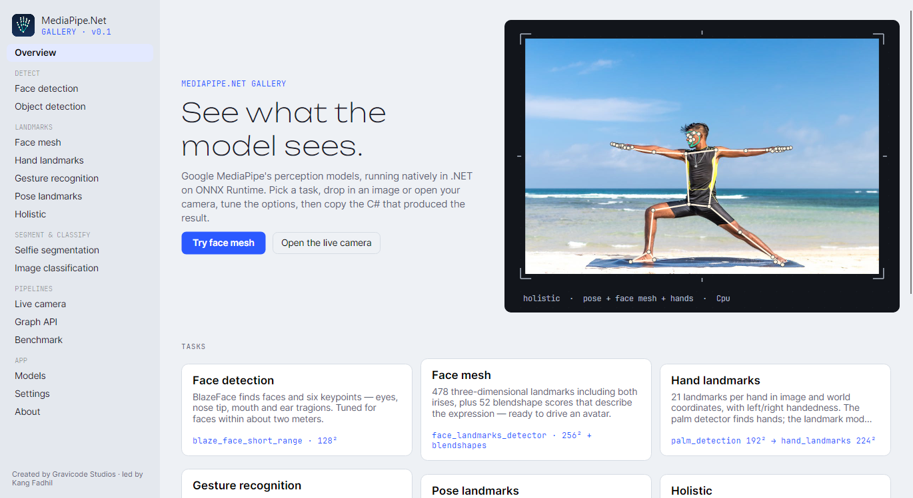 | 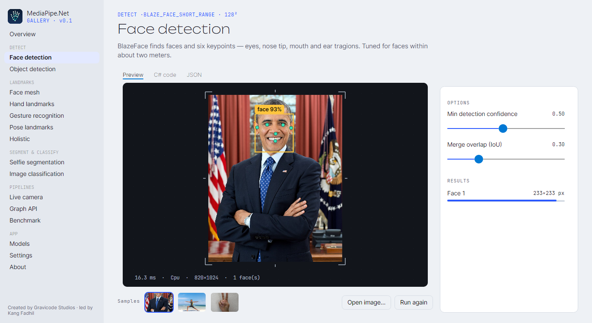 |
|  | 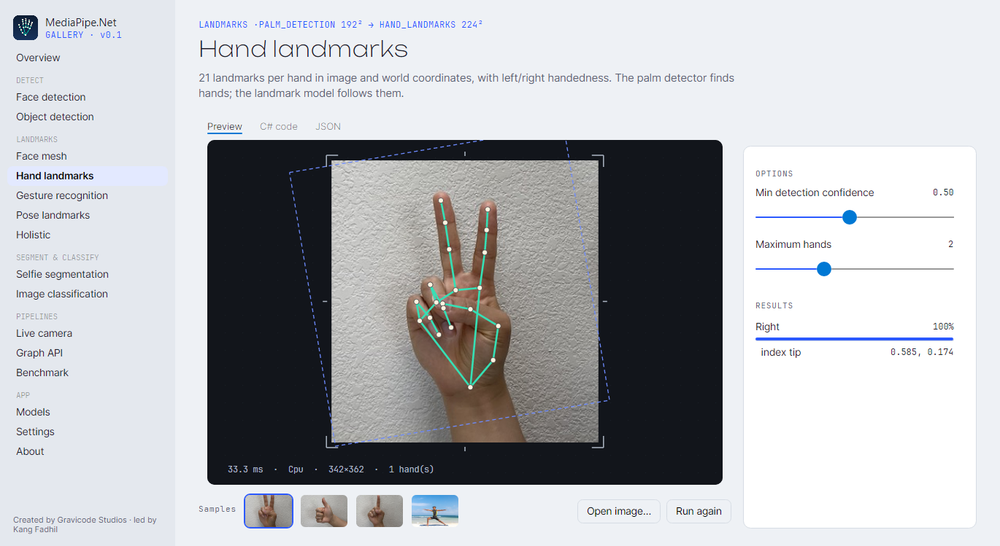 |
| 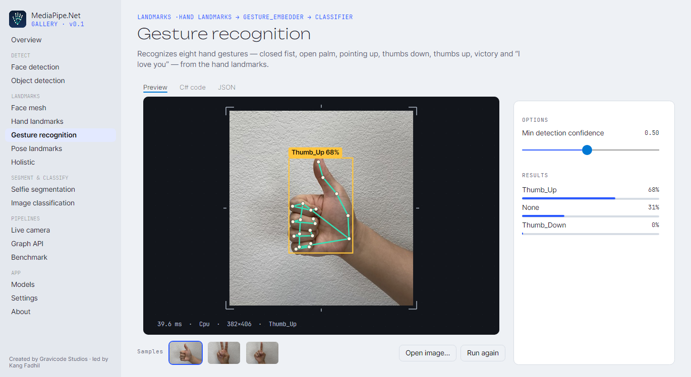 |  |
| 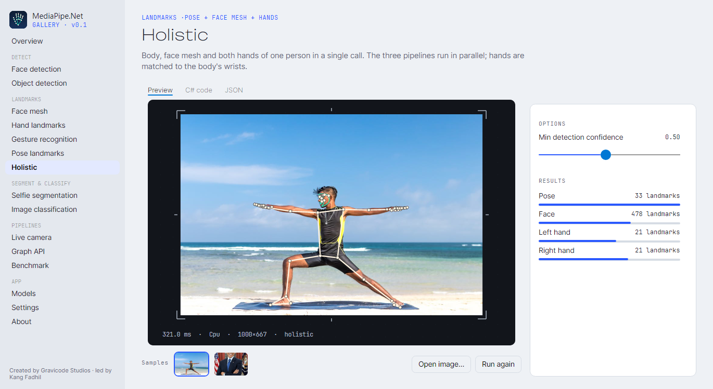 |  |
| 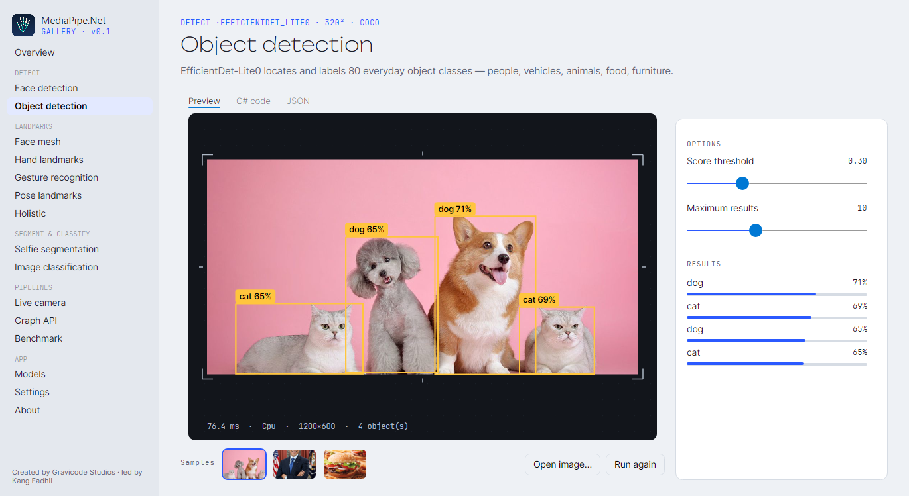 | 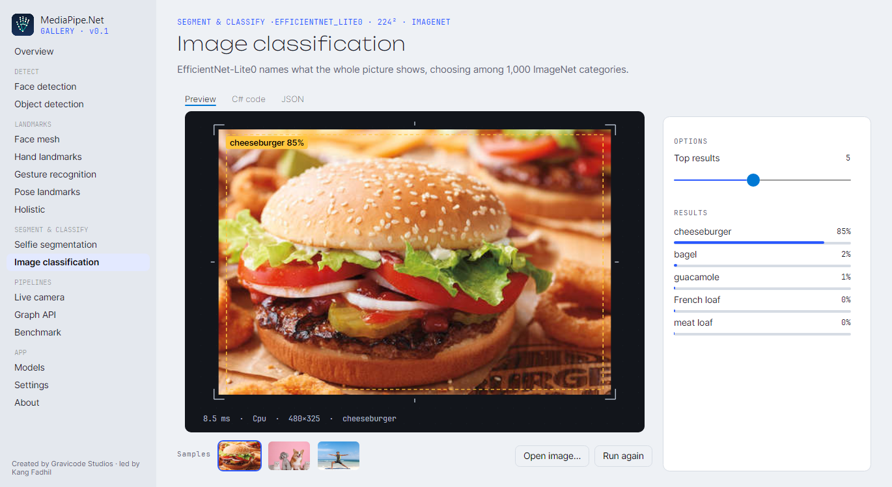 |
|  | 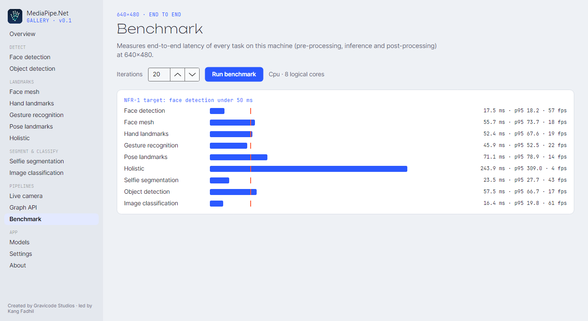 |
| 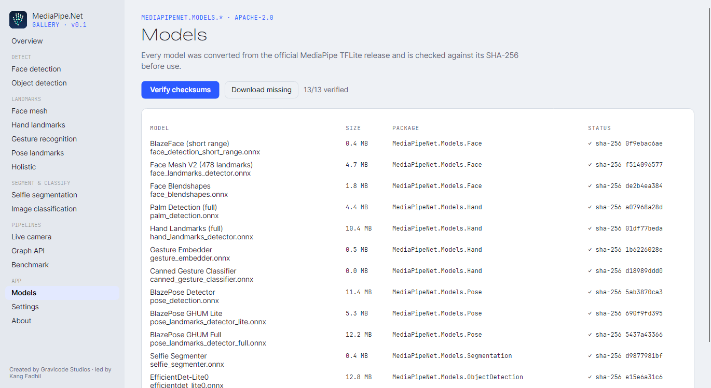 | 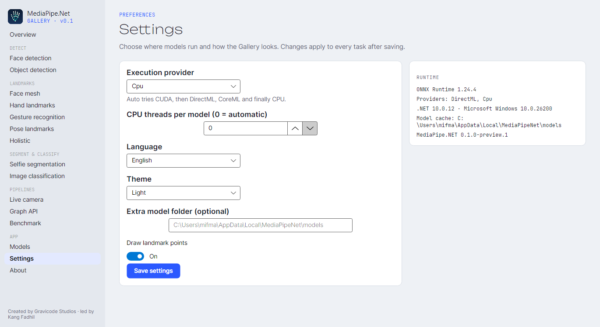 |
|  | 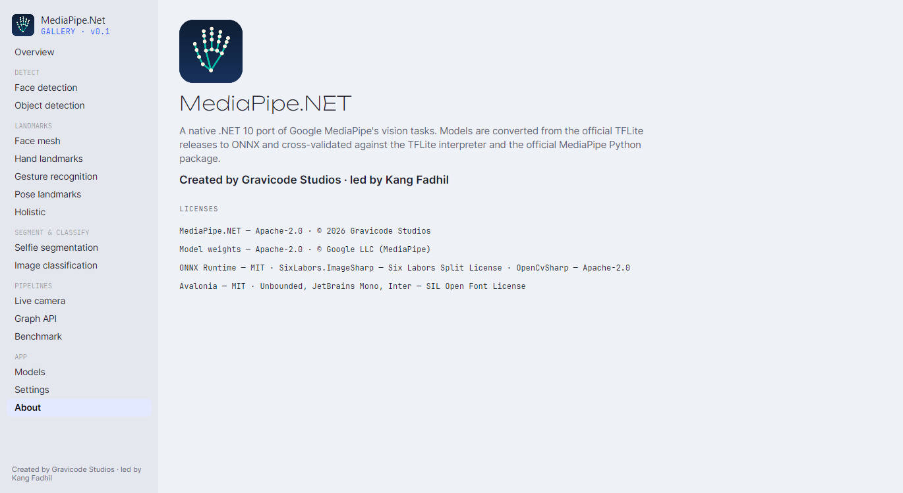 |
|  |  |

## Design

"Optics lab": light chrome around a dark viewfinder stage framed by registration marks, with a monospace readout
strip. Cobalt is the only interface accent; coral and mint are reserved for what the models see. Type: *Unbounded*
for page titles, *Inter* for text, *JetBrains Mono* for data and code (fonts under the SIL Open Font License,
bundled in `Assets/Fonts`).

## Regenerating the screenshots

```bash
dotnet run --project samples/MediaPipeNet.Gallery -- --screenshots docs/images
```

The app visits every page, waits for its results, renders the window to PNG, repeats three pages in the dark theme
and Indonesian, and exits. `--lang id` and `--theme Dark` start the interactive app in those modes without
changing saved settings.

## Code map

| Folder | |
|---|---|
| `Services/TaskCatalog.cs` | The nine task definitions: options, overlay rendering, result rows, code snippet. |
| `Controls/StageView.cs` | The viewfinder control (image fit, vector overlay, registration marks, readout). |
| `Controls/GraphDiagram.cs` | Layered schematic of any `CalculatorGraph` (uses `GetEdges()`). |
| `Views/*` | Pages. `MainWindow.cs` hosts navigation and the screenshot mode. |
| `Services/Loc.cs` | English / Indonesian strings. |
| `Theme/Tokens.axaml`, `Theme/Styles.axaml` | Design tokens (light/dark) and styles. |
