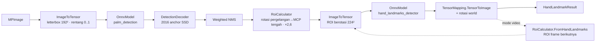

# Arsitektur

> 🇬🇧 [Read in English](../en/architecture.md)

## Lapisan

```
┌──────────────────────────────────────────────────────────────────────────────┐
│ Tasks API              MediaPipeNet.Tasks.Vision                              │
│   FaceDetector · FaceLandmarker · HandLandmarker · GestureRecognizer ·        │
│   PoseLandmarker · HolisticLandmarker · ImageSegmenter · ObjectDetector ·     │
│   ImageClassifier · LiveStreamProcessor<T> · VisionCalculators               │
├──────────────────────────────────────────────────────────────────────────────┤
│ Graph API              MediaPipeNet.Framework                                 │
│   CalculatorGraph · ICalculatorNode · Packet<T> · GraphConfig (.pbtxt)        │
├──────────────────────────────────────────────────────────────────────────────┤
│ Inferensi              MediaPipeNet.Inference                                 │
│   OnnxModel / InferenceContext · ExecutionProviderSelector · ModelStore        │
├──────────────────────────────────────────────────────────────────────────────┤
│ Imaging & tensor       MediaPipeNet.Imaging                                   │
│   MPImage · ImageToTensor · TensorMapping · TensorWarp · IFrameSource          │
├──────────────────────────────────────────────────────────────────────────────┤
│ Core                   MediaPipeNet.Core                                      │
│   Timestamp · NormalizedLandmark · Detection · NormalizedRect · telemetri     │
└──────────────────────────────────────────────────────────────────────────────┘
  Tambahan: Visualization (ImageSharp.Drawing) · Video.OpenCv · Extensions.DI · Cli
  Meta package: MediaPipeNet (CPU) · MediaPipeNet.DirectML · MediaPipeNet.Cuda
```

Dependensi hanya mengarah ke bawah. `Inference` hanya mereferensikan API *managed* ONNX Runtime; varian runtime
native ditentukan oleh meta package yang direferensikan aplikasi, sehingga build CPU, DirectML, dan CUDA tidak
pernah bentrok.

## Satu task, langkah demi langkah (HandLandmarker)



Setiap kotak adalah kelas publik yang bisa dipakai ulang di `MediaPipeNet.Tasks.Vision.Processing` /
`MediaPipeNet.Imaging`, di-port dari kalkulator MediaPipe dengan fungsi yang sama:

| Kalkulator MediaPipe | MediaPipe.NET |
|---|---|
| `ImageToTensorCalculator` | `ImageToTensor.Convert` → `TensorMapping` |
| `SsdAnchorsCalculator` | `SsdAnchors.Generate` (+ `GenerateEfficientDet`) |
| `TensorsToDetectionsCalculator` | `DetectionDecoder.Decode` |
| `NonMaxSuppressionCalculator` | `NonMaxSuppression.Weighted` / `.Hard` |
| `DetectionLetterboxRemovalCalculator`, `LandmarkProjectionCalculator` | `RawDetection.MapToImage`, `TensorMapping.TensorToImage` |
| `DetectionsToRectsCalculator`, `AlignmentPointsRectsCalculator`, `RectTransformationCalculator` | `RoiCalculator.FromDetection`, `.FromAlignmentPoints`, `.Transform` |
| `HandLandmarksToRectCalculator` | `RoiCalculator.FromHandLandmarks` |
| `LandmarksSmoothingCalculator` (One-Euro) | `LandmarkSmoother`, `OneEuroFilter` |
| `WorldLandmarkProjectionCalculator` | rotasi landmark world sebesar sudut ROI |
| `LandmarksToMatrixCalculator` | persiapan input `GestureRecognizer` |
| `FlowLimiterCalculator` | `GraphOptions.MaxInFlight` |

`TensorMapping` adalah abstraksi kuncinya: ia mencatat ROI berotasi (termasuk padding letterbox) yang di-sampling,
sehingga setiap output (keypoint, landmark, mask) dapat dipetakan kembali ke koordinat gambar dengan satu panggilan —
di ruang piksel, agar rotasi tetap benar pada gambar yang tidak persegi.

## Running mode

`VisionTaskBase<TResult>` mengimplementasikan ketiga mode sekali untuk semua task:

- **Image** — `Process` dengan `tracking: false`; tanpa state; thread-safe lewat context inferensi yang di-pool.
- **Video** — `Process` dengan `tracking: true` di bawah lock; timestamp monoton diwajibkan.
- **LiveStream** — task berjalan di dalam `CalculatorGraph` satu-node dengan `MaxInFlight`; frame hanya di-clone bila
  diterima; hasil dikirim ke `ResultCallback`.

## Graph engine

`CalculatorGraph` menyimpan antrean input dan timestamp bound untuk setiap input node. Keputusan penjadwalan diambil
di bawah satu lock graph (murah — graph vision hanya membawa puluhan packet per detik), sedangkan kode node berjalan
di luar lock pada thread pool. Node dapat berjalan ketika timestamp kandidat terkecilnya sudah "settled" di setiap
input (`DefaultInputStreamHandler` MediaPipe); setelah `Process`, output yang tidak mengirim memajukan bound-nya
sehingga hilir tidak pernah macet. Output graph dapat diamati (callback) atau di-poll (`Channel`). Lihat
[Graph API](graph-api.md).

## Struktur solusi

```
MediaPipeNet.slnx
├── src/        proyek library + meta package + CLI
├── models/     onnx/ + paket konten Gravicode.MediaPipeNet.Models.*
├── samples/    BasicUsage · GraphApiDemo · MediaPipeNet.Gallery (Avalonia 11)
├── tests/      Core.Tests · Framework.Tests · Tasks.Tests (+ assets/images, assets/golden)
├── benchmarks/ MediaPipeNet.Benchmarks
├── notebooks/  MediaPipeNet_QuickStart.ipynb
├── tools/      model-conversion · golden · notebook · packaging
└── docs/       en · id · images
```

Pengaturan build tersentral di `Directory.Build.props` (net10.0, nullable, analyzer, metadata paket) dan
`Directory.Packages.props` (versi paket terpusat; ONNX Runtime dikunci ke satu versi untuk CPU/DirectML/CUDA).
