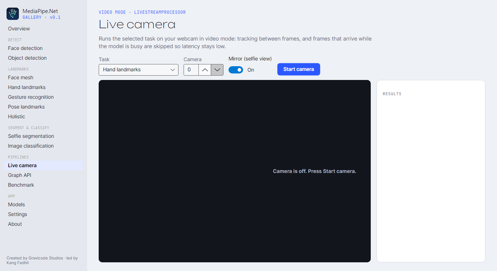

# Running mode & video langsung

> 🇬🇧 [Read in English](../en/video-and-live-stream.md)

## Mode mana yang dipakai?

| Anda punya… | Gunakan | Alasan |
|---|---|---|
| Foto, upload, gambar yang saling lepas | `RunningMode.Image` | Tanpa state dan thread-safe; satu instance melayani banyak request. |
| File video atau frame yang diproses berurutan | `RunningMode.Video` | Tracking: ROI berikutnya berasal dari landmark saat ini, sehingga detektor jarang berjalan; landmark di-smoothing. |
| Kamera, di mana hanya frame terbaru yang penting | `RunningMode.LiveStream` *atau* `Video` + `LiveStreamProcessor<T>` | Frame yang tiba saat model sibuk dibuang, bukan diantre. |

## Mode video

```csharp
using var pose = PoseLandmarker.Create(new PoseLandmarkerOptions { RunningMode = RunningMode.Video });
await using var video = new VideoFileFrameSource("tari.mp4");           // MediaPipeNet.Video.OpenCv
await foreach (var frame in video.ReadFramesAsync())
{
    var result = pose.DetectForVideo(frame.Image, frame.TimestampMs);    // timestamp harus naik
    // frame.Image dipakai ulang oleh source: Clone() bila ingin disimpan.
}
```

Panggil `ResetTracking()` ketika video melompat (seek, pergantian adegan).

## Mode live-stream (gaya MediaPipe)

```csharp
using var hands = HandLandmarker.Create(new HandLandmarkerOptions
{
    RunningMode = RunningMode.LiveStream,
    ResultCallback = (result, frame, timestampMs) => Console.WriteLine($"{timestampMs}: {result.Hands.Count} tangan"),
    MaxInFlightFrames = 1,                 // default: buang frame baru selama satu frame masih diproses
});

// dari callback kamera Anda:
bool diterima = hands.DetectLiveStream(frame, timestampMs);   // frame hanya disalin bila diterima
Console.WriteLine($"dibuang sejauh ini: {hands.DroppedFrames}");
```

Secara internal task berjalan di dalam `CalculatorGraph` kecil yang batas `MaxInFlight`-nya mengimplementasikan
semantik flow-limiter MediaPipe. Callback berjalan di worker thread; argumen `frame` hanya valid selama pemanggilan.

## `LiveStreamProcessor<T>` (disarankan untuk aplikasi)

`LiveStreamProcessor<T>` mengalirkan `IFrameSource` apa pun melalui fungsi apa pun di background thread, dengan slot
"frame terbaru menang", frame double-buffer (tanpa alokasi per frame), dan statistik langsung:

```csharp
using var gestures = GestureRecognizer.Create(new() { RunningMode = RunningMode.Video });
await using var camera = new WebcamFrameSource(deviceIndex: 0, width: 1280, height: 720);
await using var live = new LiveStreamProcessor<GestureRecognitionResult>(
    camera, (frame, ts) => gestures.RecognizeForVideo(frame, ts),
    new LiveStreamProcessorOptions { MirrorFrames = true });

live.ResultReady += (_, r) =>
{
    // r.Frame valid selama handler; r.Stats berisi CaptureFps, ProcessingFps, LastLatencyMs, FramesDropped
    Console.WriteLine($"{r.Stats.ProcessingFps:F1} fps, {r.Latency.TotalMilliseconds:F0} ms, {r.Result.Hands.Count} tangan");
};
live.ProcessingFailed += (_, e) => Console.Error.WriteLine(e.Message);
await live.RunAsync(cancellationToken);
```

Dengan source non-live (file) setiap frame diproses (`DropFramesWhenBusy` default-nya `source.IsLive`).

## Frame source

| Source | Paket | Catatan |
|---|---|---|
| `ImageFileFrameSource` | Imaging | Satu atau lebih gambar diam; `FromDirectory(dir)`; bisa looping. |
| `MemoryFrameSource` | Imaging | Frame yang sudah Anda decode; `realTime: true` mensimulasikan kamera. |
| `WebcamFrameSource` | Video.OpenCv | Kamera berdasarkan indeks (DirectShow di Windows); `ListCameras()`. |
| `VideoFileFrameSource` | Video.OpenCv | Format apa pun yang bisa di-decode OpenCV/FFmpeg. |

Implementasikan `IFrameSource` untuk sumber lain (RTSP, capture card, frame dari game engine…).

`MediaPipeNet.Video.OpenCv` membutuhkan runtime native OpenCvSharp untuk OS Anda: `OpenCvSharp4.runtime.win` di
Windows, `OpenCvSharp4.official.runtime.linux-x64` di Linux; di macOS pasang OpenCV lewat Homebrew.


