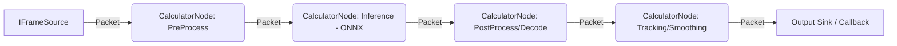

# MediaPipe.NET — Dokumen Desain / Design Document

**Versi / Version:** 0.1.0-draft
**Target Framework:** .NET 10 (C# 13)
**Lisensi / License:** Apache License 2.0 (mengikuti lisensi asli Google MediaPipe)
**Status:** Proposal / Draft desain awal

---

## Daftar Isi / Table of Contents

1. [Bagian I — Bahasa Indonesia](#bagian-i--bahasa-indonesia)
   - Ringkasan
   - Latar Belakang & Tujuan
   - Requirement
   - Daftar Fitur
   - Arsitektur
   - Struktur Repositori
   - Strategi Pengujian
   - Pertimbangan Performa
   - Roadmap
2. [Part II — English](#part-ii--english)
   - Overview
   - Background & Goals
   - Requirements
   - Feature List
   - Architecture
   - Repository Structure
   - Testing Strategy
   - Performance Considerations
   - Roadmap

---

# BAGIAN I — BAHASA INDONESIA

## 1. Ringkasan

**MediaPipe.NET** adalah proyek port/rewrite dari [Google MediaPipe](https://ai.google.dev/edge/mediapipe) ke ekosistem **.NET 10**. Tujuannya adalah menyediakan pustaka (library) native C#/.NET yang memungkinkan pengembang .NET membangun aplikasi *computer vision* dan *perception* (deteksi wajah, pelacakan tangan, estimasi pose, segmentasi, dsb.) tanpa harus melakukan interop langsung ke pustaka C++ Google MediaPipe atau bergantung pada binding Python.

MediaPipe.NET mengadopsi dua lapisan API yang sama seperti MediaPipe asli:

- **Task API (high-level)** — API sederhana berorientasi tugas (`FaceDetector`, `HandLandmarker`, `PoseLandmarker`, dst.) yang cukup dipanggil dengan beberapa baris kode.
- **Graph API (low-level)** — Model *Calculator Graph* yang dapat dikomposisi (graph node-based, streaming, packet-based) untuk kasus penggunaan lanjutan (pipeline kustom, multi-model, sinkronisasi multi-stream).

## 2. Latar Belakang & Tujuan

### 2.1 Latar Belakang
- MediaPipe asli ditulis dalam C++ dengan binding resmi untuk Python, JavaScript (Web/WASM), Android (Kotlin/Java), dan iOS (Swift/Obj-C). **Tidak ada binding resmi untuk .NET/C#.**
- Pengembang .NET (termasuk tim di Gravicode Studios) sering membutuhkan kemampuan computer vision (misalnya untuk integrasi perangkat medis, sistem monitoring, atau aplikasi klien) namun harus menulis P/Invoke manual atau menggunakan proses terpisah (Python subprocess) yang tidak efisien dan sulit di-maintain.
- Model-model MediaPipe (BlazeFace, BlazePose, Hand Landmark, Selfie Segmentation, dll.) sudah tersedia dalam format **TFLite**, yang dapat dikonversi ke **ONNX** dan dijalankan secara efisien menggunakan **ONNX Runtime**, yang punya binding resmi dan matang untuk .NET (`Microsoft.ML.OnnxRuntime`).

### 2.2 Tujuan
1. Menyediakan pustaka .NET native (tanpa dependensi Python) untuk menjalankan model-model vision MediaPipe.
2. Mendukung eksekusi di CPU maupun GPU (via `DirectML`, `CUDA`, atau `CoreML` melalui backend ONNX Runtime yang sesuai platform).
3. Menyediakan abstraksi graph/pipeline mirip MediaPipe asli agar pengguna yang familiar dengan MediaPipe C++/Python dapat bermigrasi konsep dengan mudah.
4. Cross-platform: Windows, Linux, dan macOS (x64 & ARM64), termasuk dukungan untuk *headless server* (tanpa GPU/tanpa layar) untuk skenario backend/API.
5. Mudah dipasang sebagai paket NuGet, dengan model-model pretrained yang diunduh otomatis atau disertakan sebagai *content package* terpisah.
6. Dokumentasi dan sample lengkap (README dwibahasa, dokumentasi API, contoh kode, dan notebook interaktif).

### 2.3 Non-Tujuan (Out of Scope untuk v1)
- Tidak mem-port ulang seluruh 100% *calculator* dari MediaPipe C++ (ratusan calculator internal Google). Fokus awal pada *task/solution* yang paling umum dipakai.
- Tidak menyediakan training pipeline (MediaPipe.NET adalah *inference-only* library pada v1).
- Tidak menyasar target WebAssembly/Blazor WASM pada rilis awal (dapat menjadi target masa depan).

## 3. Requirement

### 3.1 Functional Requirements (FR)

| ID | Requirement |
|----|-------------|
| FR-1 | Pustaka harus dapat memuat model ONNX hasil konversi dari model MediaPipe (TFLite → ONNX) dan menjalankan inferensi. |
| FR-2 | Pustaka harus menyediakan Task API tingkat tinggi minimal untuk: Face Detection, Face Mesh (landmark wajah), Hand Landmark Detection, Pose Landmark Detection, Selfie Segmentation, Object Detection. |
| FR-3 | Pustaka harus mendukung input berupa: file gambar (jpg/png/bmp), byte array/`Stream`, `Image<Rgba32>` (ImageSharp), dan frame video (webcam/file) via abstraksi `IFrameSource`. |
| FR-4 | Pustaka harus menyediakan Graph API yang memungkinkan pengguna menyusun pipeline dari node-node (`ICalculatorNode`) yang terhubung melalui *input/output stream* bertipe `Packet<T>`. |
| FR-5 | Pustaka harus mendukung eksekusi *streaming* (video real-time) dengan overhead rendah, termasuk mekanisme *timestamp* dan *packet dropping* seperti MediaPipe asli. |
| FR-6 | Pustaka harus dapat mengekspor hasil deteksi/landmark sebagai struktur data terketik kuat (strongly-typed), bukan array mentah, agar mudah dipakai dan di-*serialize* (JSON). |
| FR-7 | Pustaka harus menyediakan utilitas visualisasi (menggambar landmark, bounding box, mask segmentasi) di atas gambar untuk keperluan debug/demo. |
| FR-8 | Pustaka harus dapat berjalan tanpa GPU (fallback CPU) dan otomatis mendeteksi *execution provider* terbaik yang tersedia. |
| FR-9 | Pustaka harus menyediakan mekanisme manajemen model (download otomatis dari model registry / cache lokal / model yang disertakan dalam paket NuGet terpisah `MediaPipeNet.Models.*`). |
| FR-10 | API publik harus mendukung penggunaan asinkron (`async/await`) dan sinkron. |

### 3.2 Non-Functional Requirements (NFR)

| ID | Requirement |
|----|-------------|
| NFR-1 | **Performa**: latensi inferensi single-frame untuk Face Detection pada CPU modern (x64, 8 core) harus < 50ms per frame pada resolusi 640×480. |
| NFR-2 | **Portabilitas**: harus berjalan di .NET 10 pada Windows 10/11, Ubuntu 22.04+, dan macOS 13+ tanpa modifikasi kode. |
| NFR-3 | **Keandalan**: seluruh public API harus memiliki unit test dengan cakupan (coverage) minimal 70% untuk modul inti (Core, Tasks). |
| NFR-4 | **Kompatibilitas biner**: mengikuti semantic versioning; breaking change hanya pada major version. |
| NFR-5 | **Keamanan memori**: penggunaan `Span<T>`/`Memory<T>` untuk manipulasi buffer gambar guna meminimalkan alokasi dan *GC pressure* pada pipeline real-time. |
| NFR-6 | **Observability**: mendukung `ILogger` (Microsoft.Extensions.Logging) dan metrik dasar (FPS, waktu inferensi) yang dapat diekspos ke `System.Diagnostics.Metrics`. |
| NFR-7 | **Lisensi & kepatuhan**: model pretrained wajib mencantumkan atribusi lisensi asal (Apache-2.0 dari Google MediaPipe), tidak boleh menyertakan model dengan lisensi non-komersial tanpa disclaimer. |
| NFR-8 | **Dokumentasi**: seluruh public API harus memiliki XML doc comment (untuk IntelliSense) dan didokumentasikan dalam dua bahasa (ID/EN) pada situs dokumentasi. |

## 4. Daftar Fitur

### 4.1 Fitur Inti (Core)
- **Graph Engine** — model kalkulator/graph mirip MediaPipe (`CalculatorGraph`, `CalculatorNode`, `Packet<T>`, `Timestamp`).
- **Tensor & Image Abstraction** — wrapper di atas `DenseTensor<float>` (ONNX Runtime) dan `Image<Rgba32>` (ImageSharp) dengan konversi otomatis (resize, normalize, letterbox/pad, colorspace conversion RGB/BGR).
- **Model Loader & Registry** — pemuatan model ONNX dari path lokal, embedded resource, atau unduhan otomatis (dengan checksum verification) via `IModelProvider`.
- **Execution Provider Selector** — deteksi otomatis backend terbaik: CUDA → DirectML → CoreML → CPU (fallback), dapat dikonfigurasi manual.
- **Frame Source Abstraction** — `IFrameSource` dengan implementasi bawaan: `ImageFileFrameSource`, `WebcamFrameSource` (via `OpenCvSharp.VideoCapture` opsional), `VideoFileFrameSource`.

### 4.2 Solutions / Tasks (High-Level API)
| Task | Model dasar (mengacu MediaPipe asli) | Output |
|------|----------------------------------------|--------|
| `FaceDetector` | BlazeFace (short/full range) | Bounding box wajah + 6 keypoint |
| `FaceLandmarker` (Face Mesh) | Face Mesh 468 landmark (+ iris opsional) | 468/478 landmark 3D wajah, blendshapes |
| `HandLandmarker` | Palm Detection + Hand Landmark | 21 landmark 3D per tangan, handedness |
| `PoseLandmarker` | BlazePose (Lite/Full/Heavy) | 33 landmark 3D tubuh + segmentation mask opsional |
| `HolisticLandmarker` | Gabungan Face + Hand + Pose | Landmark gabungan wajah, tangan kiri/kanan, pose |
| `SelfieSegmenter` | Selfie Segmentation (general/landscape) | Mask segmentasi biner/alpha |
| `ObjectDetector` | EfficientDet-Lite | Bounding box + label + skor untuk objek umum (COCO) |
| `ImageClassifier` | MobileNet/EfficientNet | Top-K label klasifikasi gambar |
| `GestureRecognizer` | Hand Landmark + gesture classifier | Label gestur tangan (thumbs up, victory, dst.) |

### 4.3 Fitur Pendukung
- **Visualization Utilities** — `LandmarkDrawer`, `BoundingBoxDrawer`, `SegmentationMaskOverlay` untuk menggambar hasil di atas `Image<Rgba32>`.
- **Serialization** — hasil deteksi (`FaceDetectionResult`, `HandLandmarkResult`, dst.) mendukung `System.Text.Json` serialization out-of-the-box.
- **Streaming Pipeline Helper** — `LiveStreamProcessor<TResult>` untuk memudahkan pemrosesan webcam/video real-time dengan *frame skipping* otomatis saat inferensi lebih lambat dari frame rate sumber.
- **Dependency Injection Integration** — extension method `IServiceCollection.AddMediaPipeNet(...)` untuk registrasi task sebagai service (cocok untuk ASP.NET Core / Worker Service).
- **Metrics & Logging** — integrasi `ILogger<T>` dan meter OpenTelemetry-compatible.
- **CLI Tool (opsional)** — `mediapipenet-cli` (dotnet tool) untuk menjalankan task dari command line tanpa menulis kode, cocok untuk pengujian cepat.

## 5. Arsitektur

### 5.1 Lapisan (Layers)

```
┌─────────────────────────────────────────────────────────┐
│  Tasks API (high-level)                                  │
│  MediaPipeNet.Tasks.Vision.*  (FaceDetector, dll.)        │
├─────────────────────────────────────────────────────────┤
│  Graph API (mid-level)                                    │
│  MediaPipeNet.Framework  (CalculatorGraph, Packet<T>)      │
├─────────────────────────────────────────────────────────┤
│  Inference Layer                                           │
│  MediaPipeNet.Inference  (ONNX Runtime wrapper, EP select) │
├─────────────────────────────────────────────────────────┤
│  Imaging & Tensor Layer                                     │
│  MediaPipeNet.Imaging  (ImageSharp interop, tensor utils)   │
├─────────────────────────────────────────────────────────┤
│  Core / Primitives                                          │
│  MediaPipeNet.Core  (Timestamp, Rect, Point3D, Options)     │
└─────────────────────────────────────────────────────────┘
```

### 5.2 Diagram Graph Engine (mermaid)



### 5.3 Konsep Kunci
- **Packet<T>** — pembungkus data ber-*timestamp* yang mengalir antar node, meniru `mediapipe::Packet`.
- **CalculatorNode** — unit pemrosesan dengan `Process(CalculatorContext ctx)`, memiliki *input stream* dan *output stream* bernama.
- **CalculatorGraph** — kumpulan node + edge (stream) yang divalidasi saat build (topological sort, deteksi siklus).
- **SidePacket** — data konfigurasi statis yang di-inject sekali di awal graph (mis. path model, threshold).
- **Task** — pembungkus siap pakai di atas `CalculatorGraph` dengan graph pre-built yang sudah dioptimalkan untuk skenario umum (single image / video / live stream), menyediakan 3 mode seperti MediaPipe asli: `IMAGE`, `VIDEO`, `LIVE_STREAM`.

### 5.4 Struktur Proyek (Solution Layout)

```
MediaPipeNet.sln
├── src/
│   ├── MediaPipeNet.Core/            # primitives: Timestamp, Rect, NormalizedLandmark, Options
│   ├── MediaPipeNet.Imaging/         # ImageSharp <-> Tensor conversion, resize/pad/normalize
│   ├── MediaPipeNet.Inference/       # ONNX Runtime wrapper, execution provider selection
│   ├── MediaPipeNet.Framework/       # Graph engine: CalculatorGraph, Packet<T>, CalculatorNode
│   ├── MediaPipeNet.Tasks.Vision/    # FaceDetector, HandLandmarker, PoseLandmarker, dst.
│   ├── MediaPipeNet.Tasks.Audio/     # (roadmap) audio classification, VAD
│   ├── MediaPipeNet.Extensions.DI/   # DI integration untuk ASP.NET Core/Worker
│   └── MediaPipeNet.Cli/             # dotnet tool CLI
├── models/
│   └── MediaPipeNet.Models.*/        # paket NuGet terpisah per model (agar core package tetap ringan)
├── samples/
│   ├── BasicUsage/                   # console app: task API dasar
│   └── GraphApiDemo/                 # console app: custom graph
├── notebooks/
│   └── MediaPipeNet_QuickStart.ipynb # Polyglot Notebook (.NET Interactive)
├── tests/
│   ├── MediaPipeNet.Core.Tests/
│   ├── MediaPipeNet.Framework.Tests/
│   └── MediaPipeNet.Tasks.Tests/
├── docs/
│   ├── id/                           # dokumentasi Bahasa Indonesia
│   └── en/                           # English documentation
├── README.md
└── DESIGN.md
```

### 5.5 Teknologi & Dependensi
| Komponen | Pilihan |
|----------|---------|
| Runtime target | .NET 10 (LTS berikutnya setelah .NET 8; C# 13) |
| Inferensi | `Microsoft.ML.OnnxRuntime` (+ `.Gpu`, `.DirectML` sesuai platform) |
| Imaging | `SixLabors.ImageSharp` (cross-platform, tanpa dependensi native System.Drawing) |
| Video capture (opsional) | `OpenCvSharp4` (untuk webcam/video, opt-in via package terpisah) |
| Testing | `xUnit` + `FluentAssertions` |
| Benchmark | `BenchmarkDotNet` |
| Notebook | Polyglot Notebooks (`.NET Interactive`) — kernel C# |
| CI/CD | GitHub Actions (build matrix: win-x64, linux-x64, osx-arm64) |
| Dokumentasi | DocFX atau Markdown statis + mkdocs (dwibahasa via i18n folder) |

## 6. Strategi Pengujian
1. **Unit test** murni logika (Core, Framework graph validation, tensor conversion) — tanpa model, cepat dijalankan di CI.
2. **Golden-image test** — menjalankan task pada sekumpulan gambar tetap (fixture) dan membandingkan landmark/bounding box terhadap hasil referensi (dengan toleransi epsilon), untuk mendeteksi regresi numerik akibat perubahan versi ONNX Runtime.
3. **Cross-validation dengan MediaPipe Python** — sebagai bagian dari proses port awal, hasil MediaPipe.NET dibandingkan terhadap output MediaPipe Python resmi pada dataset sampel untuk memvalidasi akurasi konversi model.
4. **Performance benchmark** — menggunakan BenchmarkDotNet untuk mengukur FPS/latensi per task, dijalankan otomatis di CI pada setiap rilis minor.
5. **Integration test streaming** — mensimulasikan input video untuk memverifikasi *timestamp monotonicity* dan *packet dropping* pada mode `LIVE_STREAM`.

## 7. Pertimbangan Performa
- Gunakan `ArrayPool<byte>`/`Memory<T>` untuk buffer gambar agar meminimalkan tekanan GC pada loop video real-time.
- Reuse `InferenceSession` (ONNX Runtime) — sesi model dibuat sekali dan dipakai berulang, bukan per-frame.
- Preallocate tensor input/output berdasarkan ukuran model tetap.
- Opsi *model quantization* (INT8/FP16) untuk skenario CPU-bound atau edge device.
- Dukungan *batching* opsional untuk skenario non-real-time (memproses banyak gambar sekaligus).

## 8. Roadmap

| Fase | Cakupan | Estimasi |
|------|---------|----------|
| **M0 — Fondasi** | `MediaPipeNet.Core`, `MediaPipeNet.Imaging`, wrapper ONNX Runtime dasar | 4 minggu |
| **M1 — Face & Hand** | `FaceDetector`, `FaceLandmarker`, `HandLandmarker` + sample + notebook | 6 minggu |
| **M2 — Pose & Segmentation** | `PoseLandmarker`, `SelfieSegmenter`, `HolisticLandmarker` | 6 minggu |
| **M3 — Graph API Publik** | `CalculatorGraph` dapat dikustomisasi penuh oleh pengguna, dokumentasi lanjutan | 4 minggu |
| **M4 — Object Detection & Classification** | `ObjectDetector`, `ImageClassifier`, `GestureRecognizer` | 4 minggu |
| **M5 — Tooling & DX** | CLI tool, DI integration, benchmark publik, dokumentasi situs (mkdocs) | 3 minggu |
| **M6 — Stabilisasi v1.0** | Hardening, cross-platform testing, audit performa & lisensi | 3 minggu |

---

# PART II — ENGLISH

## 1. Overview

**MediaPipe.NET** is a port/rewrite of [Google MediaPipe](https://ai.google.dev/edge/mediapipe) for the **.NET 10** ecosystem. Its goal is to provide a native C#/.NET library that lets .NET developers build computer vision and perception applications (face detection, hand tracking, pose estimation, segmentation, etc.) without direct interop into Google's C++ MediaPipe library or reliance on Python bindings.

MediaPipe.NET adopts the same two API layers as the original MediaPipe:

- **Task API (high-level)** — a simple, task-oriented API (`FaceDetector`, `HandLandmarker`, `PoseLandmarker`, etc.) callable in a few lines of code.
- **Graph API (low-level)** — a composable *Calculator Graph* model (node-based, streaming, packet-based) for advanced use cases (custom pipelines, multi-model, multi-stream synchronization).

## 2. Background & Goals

### 2.1 Background
- Original MediaPipe is written in C++ with official bindings for Python, JavaScript (Web/WASM), Android (Kotlin/Java), and iOS (Swift/Obj-C). **There is no official .NET/C# binding.**
- .NET developers (including the team at Gravicode Studios) often need computer vision capability (e.g., for medical device integration, monitoring systems, or client-facing apps) but end up writing manual P/Invoke or spawning separate Python processes, which is inefficient and hard to maintain.
- MediaPipe's models (BlazeFace, BlazePose, Hand Landmark, Selfie Segmentation, etc.) already ship as **TFLite**, which can be converted to **ONNX** and run efficiently via **ONNX Runtime**, which has mature, official .NET bindings (`Microsoft.ML.OnnxRuntime`).

### 2.2 Goals
1. Provide a native .NET library (no Python dependency) to run MediaPipe's vision models.
2. Support both CPU and GPU execution (via `DirectML`, `CUDA`, or `CoreML` through the appropriate ONNX Runtime backend per platform).
3. Provide a graph/pipeline abstraction similar to the original MediaPipe so users familiar with MediaPipe C++/Python can migrate concepts easily.
4. Cross-platform: Windows, Linux, and macOS (x64 & ARM64), including headless server scenarios (no GPU/no display) for backend/API use cases.
5. Easy to install as a NuGet package, with pretrained models either auto-downloaded or shipped as separate content packages.
6. Complete documentation and samples (bilingual README, API docs, code samples, interactive notebook).

### 2.3 Non-Goals (Out of Scope for v1)
- Not porting 100% of the C++ calculators (hundreds of internal Google calculators). Initial focus is on the most commonly used tasks/solutions.
- No training pipeline (MediaPipe.NET is inference-only in v1).
- No WebAssembly/Blazor WASM target in the initial release (potential future target).

## 3. Requirements

### 3.1 Functional Requirements (FR)

| ID | Requirement |
|----|-------------|
| FR-1 | The library must be able to load ONNX models converted from MediaPipe models (TFLite → ONNX) and run inference. |
| FR-2 | The library must provide a high-level Task API for at least: Face Detection, Face Mesh (facial landmarks), Hand Landmark Detection, Pose Landmark Detection, Selfie Segmentation, Object Detection. |
| FR-3 | The library must support input as: image files (jpg/png/bmp), byte array/`Stream`, `Image<Rgba32>` (ImageSharp), and video frames (webcam/file) via an `IFrameSource` abstraction. |
| FR-4 | The library must provide a Graph API allowing users to compose pipelines out of nodes (`ICalculatorNode`) connected via typed `Packet<T>` input/output streams. |
| FR-5 | The library must support streaming (real-time video) execution with low overhead, including timestamp and packet-dropping mechanisms similar to the original MediaPipe. |
| FR-6 | The library must export detection/landmark results as strongly-typed data structures rather than raw arrays, for ease of use and JSON serialization. |
| FR-7 | The library must provide visualization utilities (drawing landmarks, bounding boxes, segmentation masks) on top of images for debugging/demo purposes. |
| FR-8 | The library must run without a GPU (CPU fallback) and automatically detect the best available execution provider. |
| FR-9 | The library must provide model management (auto-download from a model registry / local cache / models shipped in separate `MediaPipeNet.Models.*` NuGet packages). |
| FR-10 | The public API must support both asynchronous (`async/await`) and synchronous usage. |

### 3.2 Non-Functional Requirements (NFR)

| ID | Requirement |
|----|-------------|
| NFR-1 | **Performance**: single-frame inference latency for Face Detection on a modern x64 8-core CPU must be < 50ms per frame at 640×480. |
| NFR-2 | **Portability**: must run on .NET 10 on Windows 10/11, Ubuntu 22.04+, and macOS 13+ without code changes. |
| NFR-3 | **Reliability**: all public APIs must have unit tests with at least 70% coverage for core modules (Core, Tasks). |
| NFR-4 | **Binary compatibility**: follows semantic versioning; breaking changes only on major version bumps. |
| NFR-5 | **Memory safety**: use `Span<T>`/`Memory<T>` for image buffer manipulation to minimize allocations and GC pressure in real-time pipelines. |
| NFR-6 | **Observability**: supports `ILogger` (Microsoft.Extensions.Logging) and basic metrics (FPS, inference time) exposable via `System.Diagnostics.Metrics`. |
| NFR-7 | **Licensing & compliance**: pretrained models must retain attribution to the original license (Apache-2.0 from Google MediaPipe); no non-commercial-licensed models without a disclaimer. |
| NFR-8 | **Documentation**: all public APIs must have XML doc comments (for IntelliSense) and be documented bilingually (ID/EN) on the documentation site. |

## 4. Feature List

### 4.1 Core Features
- **Graph Engine** — a calculator/graph model similar to MediaPipe (`CalculatorGraph`, `CalculatorNode`, `Packet<T>`, `Timestamp`).
- **Tensor & Image Abstraction** — wrapper over `DenseTensor<float>` (ONNX Runtime) and `Image<Rgba32>` (ImageSharp) with automatic conversion (resize, normalize, letterbox/pad, RGB/BGR colorspace conversion).
- **Model Loader & Registry** — loading ONNX models from a local path, embedded resource, or auto-download (with checksum verification) via `IModelProvider`.
- **Execution Provider Selector** — automatic detection of the best backend: CUDA → DirectML → CoreML → CPU (fallback), manually configurable.
- **Frame Source Abstraction** — `IFrameSource` with built-in implementations: `ImageFileFrameSource`, `WebcamFrameSource` (via optional `OpenCvSharp.VideoCapture`), `VideoFileFrameSource`.

### 4.2 Solutions / Tasks (High-Level API)
| Task | Underlying model (per original MediaPipe) | Output |
|------|--------------------------------------------|--------|
| `FaceDetector` | BlazeFace (short/full range) | Face bounding box + 6 keypoints |
| `FaceLandmarker` (Face Mesh) | Face Mesh 468 landmarks (+ optional iris) | 468/478 3D face landmarks, blendshapes |
| `HandLandmarker` | Palm Detection + Hand Landmark | 21 3D landmarks per hand, handedness |
| `PoseLandmarker` | BlazePose (Lite/Full/Heavy) | 33 3D body landmarks + optional segmentation mask |
| `HolisticLandmarker` | Combined Face + Hand + Pose | Combined face, left/right hand, and pose landmarks |
| `SelfieSegmenter` | Selfie Segmentation (general/landscape) | Binary/alpha segmentation mask |
| `ObjectDetector` | EfficientDet-Lite | Bounding box + label + score for common (COCO) objects |
| `ImageClassifier` | MobileNet/EfficientNet | Top-K image classification labels |
| `GestureRecognizer` | Hand Landmark + gesture classifier | Hand gesture labels (thumbs up, victory, etc.) |

### 4.3 Supporting Features
- **Visualization Utilities** — `LandmarkDrawer`, `BoundingBoxDrawer`, `SegmentationMaskOverlay` for drawing results on top of `Image<Rgba32>`.
- **Serialization** — detection results (`FaceDetectionResult`, `HandLandmarkResult`, etc.) support `System.Text.Json` serialization out of the box.
- **Streaming Pipeline Helper** — `LiveStreamProcessor<TResult>` for easy real-time webcam/video processing with automatic frame skipping when inference is slower than the source frame rate.
- **Dependency Injection Integration** — `IServiceCollection.AddMediaPipeNet(...)` extension method to register tasks as services (suited for ASP.NET Core / Worker Service).
- **Metrics & Logging** — `ILogger<T>` integration and an OpenTelemetry-compatible meter.
- **CLI Tool (optional)** — `mediapipenet-cli` (dotnet tool) to run a task from the command line without writing code, useful for quick testing.

## 5. Architecture

### 5.1 Layers

```
┌─────────────────────────────────────────────────────────┐
│  Tasks API (high-level)                                  │
│  MediaPipeNet.Tasks.Vision.*  (FaceDetector, etc.)        │
├─────────────────────────────────────────────────────────┤
│  Graph API (mid-level)                                    │
│  MediaPipeNet.Framework  (CalculatorGraph, Packet<T>)      │
├─────────────────────────────────────────────────────────┤
│  Inference Layer                                           │
│  MediaPipeNet.Inference  (ONNX Runtime wrapper, EP select) │
├─────────────────────────────────────────────────────────┤
│  Imaging & Tensor Layer                                     │
│  MediaPipeNet.Imaging  (ImageSharp interop, tensor utils)   │
├─────────────────────────────────────────────────────────┤
│  Core / Primitives                                          │
│  MediaPipeNet.Core  (Timestamp, Rect, Point3D, Options)     │
└─────────────────────────────────────────────────────────┘
```

### 5.2 Graph Engine Diagram (mermaid)


### 5.3 Key Concepts
- **Packet<T>** — a timestamped data wrapper flowing between nodes, mirroring `mediapipe::Packet`.
- **CalculatorNode** — a processing unit with `Process(CalculatorContext ctx)`, with named input and output streams.
- **CalculatorGraph** — a set of nodes + edges (streams) validated at build time (topological sort, cycle detection).
- **SidePacket** — static configuration data injected once at graph startup (e.g., model path, threshold).
- **Task** — a ready-to-use wrapper over a `CalculatorGraph` with a pre-built, optimized graph for common scenarios (single image / video / live stream), offering the same 3 modes as the original MediaPipe: `IMAGE`, `VIDEO`, `LIVE_STREAM`.

### 5.4 Repository / Solution Layout

```
MediaPipeNet.sln
├── src/
│   ├── MediaPipeNet.Core/            # primitives: Timestamp, Rect, NormalizedLandmark, Options
│   ├── MediaPipeNet.Imaging/         # ImageSharp <-> Tensor conversion, resize/pad/normalize
│   ├── MediaPipeNet.Inference/       # ONNX Runtime wrapper, execution provider selection
│   ├── MediaPipeNet.Framework/       # Graph engine: CalculatorGraph, Packet<T>, CalculatorNode
│   ├── MediaPipeNet.Tasks.Vision/    # FaceDetector, HandLandmarker, PoseLandmarker, etc.
│   ├── MediaPipeNet.Tasks.Audio/     # (roadmap) audio classification, VAD
│   ├── MediaPipeNet.Extensions.DI/   # DI integration for ASP.NET Core/Worker
│   └── MediaPipeNet.Cli/             # dotnet tool CLI
├── models/
│   └── MediaPipeNet.Models.*/        # separate NuGet package per model (keeps core package lightweight)
├── samples/
│   ├── BasicUsage/                   # console app: basic Task API
│   └── GraphApiDemo/                 # console app: custom graph
├── notebooks/
│   └── MediaPipeNet_QuickStart.ipynb # Polyglot Notebook (.NET Interactive)
├── tests/
│   ├── MediaPipeNet.Core.Tests/
│   ├── MediaPipeNet.Framework.Tests/
│   └── MediaPipeNet.Tasks.Tests/
├── docs/
│   ├── id/                           # Indonesian documentation
│   └── en/                           # English documentation
├── README.md
└── DESIGN.md
```

### 5.5 Technology & Dependencies
| Component | Choice |
|-----------|--------|
| Target runtime | .NET 10 (next LTS after .NET 8; C# 13) |
| Inference | `Microsoft.ML.OnnxRuntime` (+ `.Gpu`, `.DirectML` per platform) |
| Imaging | `SixLabors.ImageSharp` (cross-platform, no native System.Drawing dependency) |
| Video capture (optional) | `OpenCvSharp4` (for webcam/video, opt-in via separate package) |
| Testing | `xUnit` + `FluentAssertions` |
| Benchmarking | `BenchmarkDotNet` |
| Notebook | Polyglot Notebooks (`.NET Interactive`) — C# kernel |
| CI/CD | GitHub Actions (build matrix: win-x64, linux-x64, osx-arm64) |
| Documentation | DocFX or static Markdown + mkdocs (bilingual via i18n folders) |

## 6. Testing Strategy
1. **Unit tests** for pure logic (Core, Framework graph validation, tensor conversion) — model-free, fast to run in CI.
2. **Golden-image tests** — run tasks against a fixed set of fixture images and compare landmarks/bounding boxes against reference outputs (with epsilon tolerance) to catch numerical regressions from ONNX Runtime version changes.
3. **Cross-validation against MediaPipe Python** — as part of the initial porting process, MediaPipe.NET outputs are compared against official MediaPipe Python outputs on a sample dataset to validate conversion accuracy.
4. **Performance benchmarking** — using BenchmarkDotNet to measure FPS/latency per task, run automatically in CI on every minor release.
5. **Streaming integration tests** — simulate video input to verify timestamp monotonicity and packet dropping in `LIVE_STREAM` mode.

## 7. Performance Considerations
- Use `ArrayPool<byte>`/`Memory<T>` for image buffers to minimize GC pressure in real-time video loops.
- Reuse the ONNX Runtime `InferenceSession` — created once and reused, not per frame.
- Preallocate input/output tensors based on fixed model shapes.
- Optional model quantization (INT8/FP16) for CPU-bound or edge-device scenarios.
- Optional batching support for non-real-time scenarios (processing many images at once).

## 8. Roadmap

| Phase | Scope | Estimate |
|-------|-------|----------|
| **M0 — Foundation** | `MediaPipeNet.Core`, `MediaPipeNet.Imaging`, basic ONNX Runtime wrapper | 4 weeks |
| **M1 — Face & Hand** | `FaceDetector`, `FaceLandmarker`, `HandLandmarker` + sample + notebook | 6 weeks |
| **M2 — Pose & Segmentation** | `PoseLandmarker`, `SelfieSegmenter`, `HolisticLandmarker` | 6 weeks |
| **M3 — Public Graph API** | Fully user-customizable `CalculatorGraph`, extended docs | 4 weeks |
| **M4 — Object Detection & Classification** | `ObjectDetector`, `ImageClassifier`, `GestureRecognizer` | 4 weeks |
| **M5 — Tooling & DX** | CLI tool, DI integration, public benchmarks, docs site (mkdocs) | 3 weeks |
| **M6 — v1.0 Stabilization** | Hardening, cross-platform testing, performance & license audit | 3 weeks |

Notes:
- gunakan .NET 10
- Semua UI UX aplikasi buat yang keren dan user friendly dengan bantuan skill 'frontend-design'
- Untuk sample apps 'MediaPipe.Net Gallery' dengan Avalonia UI Multiplatform, berisi berbagai contoh use case penggunaan, terdapat sample code setiap case, ada settings page.
- optimasi koding agar dapat performa terbaik dan memory efisien
- gunakan naming convention standard c#
- readme dan docs dalam bahasa Indonesia dan English
- dokumentasi lengkap di folder docs
- Progress.md untuk tracking development, PLAN.md untuk roadmap pengembangan
- jika ada hal-hal yang penting perlu ditambahkan, silakan ditambahkan langsung biar lengkap.
- di aplikasi dan dokumentasi tambahkan informasi dibuat oleh Gravicode Studios dipimpin Kang Fadhil
- untuk publish nuget, api key ada di 'C:\Users\mifma\Documents\CodeSandbox\PackageCredentials.txt'
- screenshot-screenshot tambahkan pada dokumentasi dan readme
